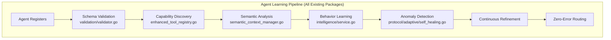
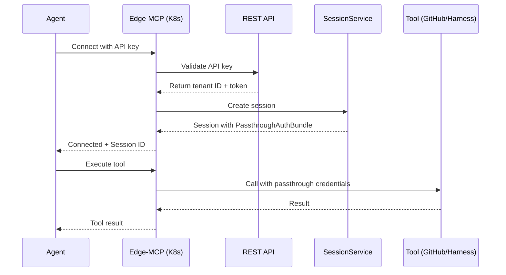
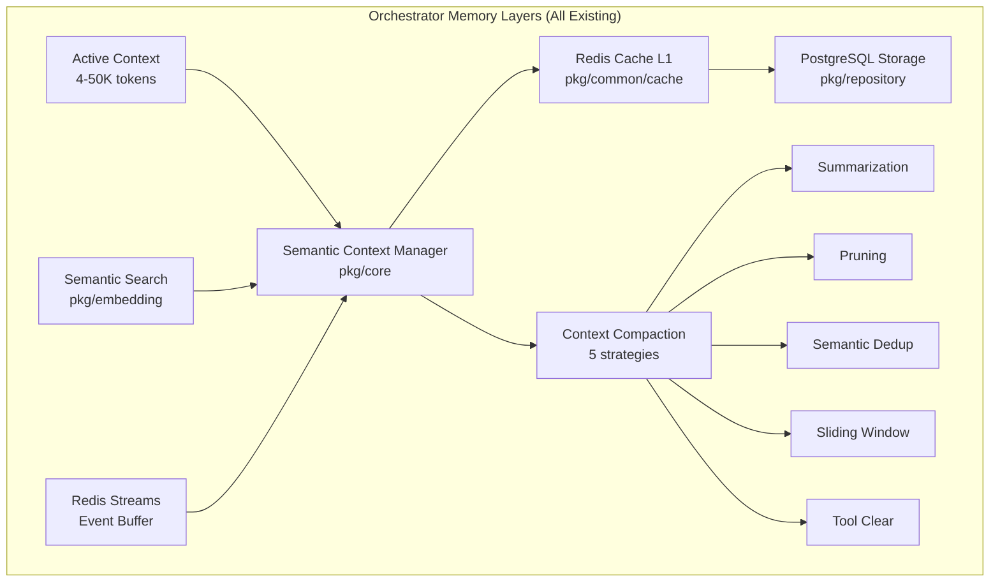
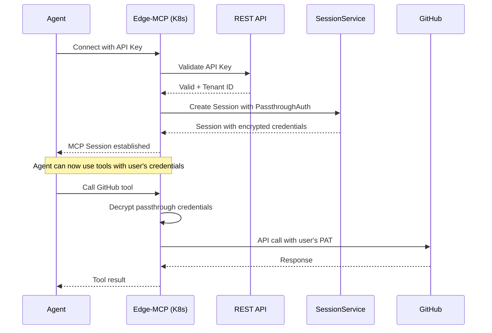

# Multi-Agent Orchestration Implementation Plan

## Executive Summary

This document outlines the implementation plan for establishing a production-ready multi-agent orchestration system in Developer Mesh. The system will support 100+ specialized agents across three primary workflows: User+AI Assistant interactions, Webhook-triggered automations, and External AI Platform integrations.

**Key Enhancement**: The plan now includes 5 new routing strategies (Affinity, Hierarchical Cascade, Collaborative Team, Priority Queue, and Predictive Load Balancing) plus enhancements to the existing 5 strategies to handle heterogeneous agent populations at scale.

**Timeline**: 5-6 weeks
**Priority**: Critical
**Risk Level**: Medium (most components exist but need wiring)
**Strategy Complexity**: High (requires layered routing with contextual selection)

## Table of Contents

1. [Current State Assessment](#current-state-assessment)
2. [Target Architecture](#target-architecture)
3. [Enhanced Routing Strategies](#enhanced-routing-strategies)
4. [Implementation Phases](#implementation-phases)
5. [Detailed Implementation Guide](#detailed-implementation-guide)
6. [Model Recommendations for Orchestrators](#model-recommendations-for-orchestrators)
7. [Development with AWS Bedrock](#development-with-aws-bedrock)
8. [Testing Strategy](#testing-strategy)
9. [Monitoring & Observability](#monitoring--observability)
10. [Risk Mitigation](#risk-mitigation)
11. [Success Metrics](#success-metrics)

## Current State Assessment

### ✅ Existing Components (70% Complete)

| Component | Status | Location | Notes |
|-----------|--------|----------|-------|
| Assignment Engine | ✅ Built, ❌ Not wired | `/pkg/services/assignment_engine.go` | 5 routing strategies ready |
| Task Service | ✅ Built, ❌ Not instantiated | `/pkg/services/task_service_impl.go` | 30+ methods implemented |
| Workflow Service | ✅ Built, ⚠️ Partially wired | `/pkg/services/workflow_service.go` | Saga pattern implemented |
| Agent Models | ✅ Complete | `/pkg/models/agent.go` | Full state machine |
| Database Schema | ✅ Deployed | Migrations 001-030 | Tables exist in production |
| Redis Coordinator | ✅ Working | `/pkg/webhook/coordinator.go` | Leader election functional |
| MCP Tools | ⚠️ Mock implementation | `/apps/edge-mcp/internal/tools/builtin/` | Using in-memory storage |

### ❌ Missing Components (30% To Build)

| Component | Priority | Estimated Effort | Dependencies |
|-----------|----------|------------------|--------------|
| Service Wiring | P0 - Critical | 2-3 days | None |
| REST API Endpoints | P0 - Critical | 3-4 days | Service wiring |
| Gateway Orchestrators | P0 - Critical | 1 week | REST endpoints |
| Domain Coordinators | P1 - High | 1 week | Gateway orchestrators |
| Agent Registration | P1 - High | 3-4 days | Domain coordinators |
| Health Monitoring | P2 - Medium | 2-3 days | Agent registration |

## Target Architecture

### Three-Tier Orchestration Model

```
┌────────────────────────────────────────────────────────────┐
│                     TIER 1: GATEWAY LAYER                   │
├────────────────────────────────────────────────────────────┤
│  ┌─────────────┐  ┌──────────────┐  ┌──────────────┐      │
│  │    User     │  │   Webhook    │  │   Platform   │      │
│  │ Orchestrator│  │ Orchestrator │  │ Orchestrator │      │
│  └──────┬──────┘  └──────┬───────┘  └──────┬───────┘      │
│         │                 │                  │              │
├─────────┴─────────────────┴──────────────────┴─────────────┤
│                   TIER 2: DOMAIN COORDINATORS               │
├────────────────────────────────────────────────────────────┤
│  ┌──────────┐  ┌──────────┐  ┌──────────┐  ┌──────────┐  │
│  │   Code   │  │  Testing │  │  Deploy  │  │ Security │  │
│  │Coordinator│ │Coordinator│ │Coordinator│ │Coordinator│ │
│  └────┬─────┘  └────┬─────┘  └────┬─────┘  └────┬─────┘  │
│       │              │              │              │        │
├───────┴──────────────┴──────────────┴──────────────┴───────┤
│                  TIER 3: SPECIALIST AGENTS                  │
├────────────────────────────────────────────────────────────┤
│  ┌────────────────────────────────────────────────────┐    │
│  │ 100+ Specialized Agents:                           │    │
│  │ • Linters    • Builders   • Scanners   • Monitors  │    │
│  │ • Formatters • Deployers  • Analyzers  • Notifiers │    │
│  │ • Testers    • Migrators  • Validators • Reporters │    │
│  └────────────────────────────────────────────────────┘    │
└────────────────────────────────────────────────────────────┘
```

### Workflow Routing Patterns

```yaml
Workflow 1 - User + AI Assistant:
  Entry: MCP WebSocket → Edge MCP Server
  Gateway: UserOrchestrator
  Routing: Session-based with context preservation
  Characteristics:
    - Long-lived sessions
    - Context accumulation
    - Interactive feedback

Workflow 2 - Webhook Triggered:
  Entry: HTTP POST → REST API
  Gateway: WebhookOrchestrator
  Routing: Event-type based with retry logic
  Characteristics:
    - Event-driven
    - Idempotent operations
    - Async processing via Redis Streams

Workflow 3 - External AI Platforms:
  Entry: K8s MCP → gRPC/REST API
  Gateway: PlatformOrchestrator
  Routing: Capability-based with load balancing
  Characteristics:
    - High throughput
    - Multi-tenant isolation
    - Rate limiting per platform
```

## Enhanced Routing Strategies

### Strategy Assessment & Evolution

#### Current Strategies - Evaluation for Scale

| Strategy | Current Implementation | Valid for 100+ Agents? | Required Enhancements |
|----------|------------------------|------------------------|----------------------|
| **Round Robin** | Simple rotation | ⚠️ Partially | Poor for heterogeneous agents - needs domain awareness |
| **Least Loaded** | Active task count | ✅ Yes | Add workload prediction for long-running tasks |
| **Capability Match** | Binary match (100%) | ⚠️ Partially | Too rigid - add partial matching & skill levels |
| **Performance Based** | Historical success rate | ✅ Yes | Add task-type-specific performance tracking |
| **Cost Optimized** | Estimated $ cost | ✅ Yes | Factor in opportunity cost & SLA penalties |

#### New Required Strategies for Multi-Agent Orchestration

##### 1. **Affinity-Based Routing** (Critical for User Workflows)
Maintains context by keeping related tasks with the same agent or team.

##### 2. **Hierarchical Cascade** (Critical for 100+ Agent Management)
Routes through domain coordinators before individual agents to reduce decision complexity.

##### 3. **Collaborative Team** (Critical for Complex Tasks)
Assigns multiple specialized agents as a coordinated team.

##### 4. **Priority Queue** (Critical for Webhook Workflows)
Prioritizes based on SLA, customer tier, and incident severity.

##### 5. **Predictive Load Balancing** (Critical for External Platforms)
Predicts future load and pre-assigns agents based on capacity forecasting.

### Layered Strategy Architecture

```yaml
Layer 1 - Workflow Strategy (NEW):
  Purpose: Determines routing approach per workflow type
  Strategies:
    - User Workflow: Affinity-based with session context
    - Webhook Workflow: Priority queue with SLA awareness
    - Platform Workflow: Predictive with burst handling

Layer 2 - Domain Strategy (ENHANCED):
  Purpose: Routes to specialized agent groups
  Strategies:
    - Hierarchical cascade through coordinators
    - Team formation for complex tasks
    - Cross-domain collaboration

Layer 3 - Agent Strategy (EXISTING + ENHANCED):
  Purpose: Final agent selection
  Existing (Enhanced):
    - Round Robin: Add domain awareness
    - Least Loaded: Add prediction
    - Capability Match: Add partial matching (80% threshold)
    - Performance Based: Add task-specific metrics
    - Cost Optimized: Add opportunity cost
  New:
    - Affinity-based selection
    - Team-based selection

Layer 4 - Fallback Strategy (NEW):
  Purpose: Handle assignment failures
  Strategies:
    - Queue and retry logic
    - Overflow to partner agents
    - Escalation procedures
```

## Implementation Phases

### Phase 1: Foundation (Week 1-2) 🔴 CRITICAL

#### 1.1 Wire Core Services (Days 1-3)

**Location**: `/apps/rest-api/internal/api/server.go`

```go
// Add to server.go setupServices() function
func (s *Server) setupOrchestration() error {
    // Initialize repositories
    taskRepo := postgres.NewTaskRepository(s.db, s.db, s.cache, s.logger, s.tracer, s.metrics)
    agentRepo := postgres.NewAgentRepository(s.db, s.cache, s.logger, s.metrics)
    workflowRepo := postgres.NewWorkflowRepository(s.db, s.logger, s.metrics)

    // Create service config
    serviceConfig := services.ServiceConfig{
        Logger:  s.logger,
        Metrics: s.metrics,
        Tracer:  s.tracer,
        Cache:   s.cache,
    }

    // Initialize services (CURRENTLY MISSING!)
    s.taskService = services.NewTaskService(
        serviceConfig,
        taskRepo,
        agentRepo,
        s.ruleEngine,
    )

    s.assignmentEngine = services.NewAssignmentEngine(
        agentRepo,
        s.ruleEngine,
        s.cache,
        s.logger,
        s.metrics,
    )

    s.workflowService = services.NewWorkflowService(
        serviceConfig,
        workflowRepo,
        s.taskService,
        s.assignmentEngine,
    )

    // Store in server struct for dependency injection
    s.orchestration = &OrchestrationServices{
        TaskService:      s.taskService,
        AssignmentEngine: s.assignmentEngine,
        WorkflowService:  s.workflowService,
        AgentRepo:        agentRepo,
    }

    return nil
}
```

#### 1.2 Enhance Assignment Engine with New Strategies (Days 3-4)

**Location**: `/pkg/services/assignment_engine.go` (ENHANCE EXISTING)

```go
// Add to existing assignment_engine.go file
package services

import (
    "context"
    "fmt"
    "sync"
    "time"

    "github.com/developer-mesh/developer-mesh/pkg/models"
)

// AffinityStrategy maintains context by keeping related tasks with same agent/team
type AffinityStrategy struct {
    sessionAffinity map[string]string // session -> preferred agent
    taskAffinity    map[string]string // task type -> specialist agent
    mu              sync.RWMutex
    cache           cache.Cache
    logger          observability.Logger
}

func NewAffinityStrategy(cache cache.Cache, logger observability.Logger) *AffinityStrategy {
    return &AffinityStrategy{
        sessionAffinity: make(map[string]string),
        taskAffinity:    make(map[string]string),
        cache:           cache,
        logger:          logger,
    }
}

func (s *AffinityStrategy) Assign(ctx context.Context, task *models.Task, agents []*models.Agent) (*models.Agent, error) {
    s.mu.RLock()
    defer s.mu.RUnlock()

    // Extract session from task parameters
    sessionID, _ := task.Parameters["session_id"].(string)

    // Check session affinity
    if sessionID != "" {
        if agentID, exists := s.sessionAffinity[sessionID]; exists {
            for _, agent := range agents {
                if agent.ID == agentID && agent.Status == "active" {
                    s.logger.Debug("Using session affinity", map[string]interface{}{
                        "session_id": sessionID,
                        "agent_id": agentID,
                    })
                    return agent, nil
                }
            }
        }
    }

    // Check task type affinity
    if specialist, exists := s.taskAffinity[task.Type]; exists {
        for _, agent := range agents {
            if agent.ID == specialist {
                // Update session affinity for future tasks
                if sessionID != "" {
                    s.mu.Lock()
                    s.sessionAffinity[sessionID] = agent.ID
                    s.mu.Unlock()
                }
                return agent, nil
            }
        }
    }

    // Fallback to capability match
    return s.selectByCapability(task, agents)
}

// HierarchicalCascadeStrategy routes through domain coordinators
type HierarchicalCascadeStrategy struct {
    domainRouters map[string]*DomainCoordinator
    logger        observability.Logger
}

func (s *HierarchicalCascadeStrategy) Assign(ctx context.Context, task *models.Task, agents []*models.Agent) (*models.Agent, error) {
    // Determine domain from task type
    domain := s.categorizeToDomain(task)

    // Route to domain coordinator
    if coordinator, exists := s.domainRouters[domain]; exists {
        return coordinator.SelectSpecialist(ctx, task, agents)
    }

    // Direct assignment if no coordinator
    return s.directAssignment(ctx, task, agents)
}

func (s *HierarchicalCascadeStrategy) categorizeToDomain(task *models.Task) string {
    domainMap := map[string]string{
        "lint":     "code",
        "format":   "code",
        "test":     "testing",
        "deploy":   "deployment",
        "scan":     "security",
        "document": "documentation",
    }

    if domain, exists := domainMap[task.Type]; exists {
        return domain
    }

    return "general"
}

// CollaborativeTeamStrategy assigns multiple agents for complex tasks
type CollaborativeTeamStrategy struct {
    teamTemplates map[string][]string // task type -> required roles
    teamBuilder   *TeamBuilder
    logger        observability.Logger
}

func (s *CollaborativeTeamStrategy) AssignTeam(ctx context.Context, task *models.Task, agents []*models.Agent) ([]*models.Agent, error) {
    template, exists := s.teamTemplates[task.Type]
    if !exists {
        return nil, fmt.Errorf("no team template for task type: %s", task.Type)
    }

    team := make([]*models.Agent, 0, len(template))
    assignedIDs := make(map[string]bool)

    for _, role := range template {
        agent := s.findAgentForRole(role, agents, assignedIDs)
        if agent != nil {
            team = append(team, agent)
            assignedIDs[agent.ID] = true
        } else {
            s.logger.Warn("Could not find agent for role", map[string]interface{}{
                "role": role,
                "task_id": task.ID,
            })
        }
    }

    if len(team) < len(template)/2 {
        return nil, fmt.Errorf("insufficient agents: need %d roles, found %d agents", len(template), len(team))
    }

    return team, nil
}

// PriorityQueueStrategy handles tasks based on priority and SLA
type PriorityQueueStrategy struct {
    queues        map[models.TaskPriority]*TaskQueue
    dedicatedPool map[string][]*models.Agent // Critical task dedicated agents
    mu            sync.RWMutex
}

func (s *PriorityQueueStrategy) Assign(ctx context.Context, task *models.Task, agents []*models.Agent) (*models.Agent, error) {
    // Critical tasks get dedicated agents
    if task.Priority == models.TaskPriorityCritical {
        return s.assignDedicatedAgent(ctx, task)
    }

    // High priority gets first available capable agent
    if task.Priority == models.TaskPriorityHigh {
        for _, agent := range agents {
            if agent.CurrentWorkload < 2 { // Low workload only
                return agent, nil
            }
        }
    }

    // Normal priority uses load balancing
    return s.loadBalance(ctx, task, agents)
}

// PredictiveLoadStrategy predicts future load and pre-assigns
type PredictiveLoadStrategy struct {
    loadPredictor *LoadPredictor
    scheduler     *PreemptiveScheduler
    metrics       *MetricsCollector
}

func (s *PredictiveLoadStrategy) Assign(ctx context.Context, task *models.Task, agents []*models.Agent) (*models.Agent, error) {
    // Predict task duration based on historical data
    estimatedDuration := s.loadPredictor.EstimateDuration(task)

    // Calculate future load for each agent
    futureLoads := make(map[string]float64)
    for _, agent := range agents {
        futureLoad := s.loadPredictor.PredictLoadAt(agent, time.Now().Add(estimatedDuration))
        futureLoads[agent.ID] = futureLoad
    }

    // Find agent with lowest future load
    var bestAgent *models.Agent
    lowestLoad := 1.0

    for _, agent := range agents {
        if load := futureLoads[agent.ID]; load < lowestLoad {
            lowestLoad = load
            bestAgent = agent
        }
    }

    return bestAgent, nil
}

// Enhanced Assignment Engine with contextual strategy selection
func (ae *AssignmentEngine) FindBestAgentWithContext(
    ctx context.Context,
    task *models.Task,
    orchestrationContext *OrchestrationContext,
) (*models.Agent, error) {
    // Select strategy based on workflow context
    strategy := ae.selectContextualStrategy(task, orchestrationContext)

    // Get eligible agents
    agents, err := ae.getEligibleAgents(ctx, task)
    if err != nil {
        return nil, fmt.Errorf("failed to get eligible agents: %w", err)
    }

    if len(agents) == 0 {
        return nil, ErrNoEligibleAgents
    }

    // Check if team assignment is needed
    if strategy.RequiresTeam() {
        team, err := ae.assignTeam(ctx, task, agents)
        if err != nil {
            return nil, err
        }
        // Return team lead for now (enhance later for full team support)
        return team[0], nil
    }

    // Single agent assignment
    return strategy.Assign(ctx, task, agents)
}

func (ae *AssignmentEngine) selectContextualStrategy(task *models.Task, context *OrchestrationContext) Strategy {
    // Workflow-specific strategy selection
    switch context.WorkflowType {
    case WorkflowUserAssistant:
        if context.SessionID != "" {
            return ae.strategies["affinity"]
        }
        return ae.strategies["capability_match"]

    case WorkflowWebhook:
        if task.Priority >= models.TaskPriorityHigh {
            return ae.strategies["priority_queue"]
        }
        if task.IsComplex() {
            return ae.strategies["collaborative_team"]
        }
        return ae.strategies["performance_based"]

    case WorkflowExternalPlatform:
        if context.PredictedLoad > 0.8 {
            return ae.strategies["predictive"]
        }
        return ae.strategies["cost_optimized"]

    default:
        // Use hierarchical routing for general cases
        return ae.strategies["hierarchical_cascade"]
    }
}

// OrchestrationContext provides context for strategy selection
type OrchestrationContext struct {
    WorkflowType   WorkflowType
    SessionID      string
    UserID         string
    EventType      string
    PlatformID     string
    PredictedLoad  float64
    SLARequirement time.Duration
}
```

#### 1.3 Create Task API Endpoints (Days 5-7)

**Location**: `/apps/rest-api/internal/api/task_handler.go` (NEW FILE)

```go
package api

import (
    "net/http"
    "github.com/gin-gonic/gin"
    "github.com/developer-mesh/developer-mesh/pkg/services"
    "github.com/developer-mesh/developer-mesh/pkg/models"
)

type TaskHandler struct {
    taskService      services.TaskService
    assignmentEngine *services.AssignmentEngine
    logger          observability.Logger
}

func NewTaskHandler(ts services.TaskService, ae *services.AssignmentEngine, logger observability.Logger) *TaskHandler {
    return &TaskHandler{
        taskService:      ts,
        assignmentEngine: ae,
        logger:          logger,
    }
}

func (h *TaskHandler) RegisterRoutes(router *gin.RouterGroup) {
    tasks := router.Group("/tasks")
    {
        tasks.POST("", h.CreateTask)
        tasks.GET("", h.ListTasks)
        tasks.GET("/:id", h.GetTask)
        tasks.PUT("/:id", h.UpdateTask)
        tasks.POST("/:id/assign", h.AssignTask)
        tasks.POST("/:id/complete", h.CompleteTask)
        tasks.POST("/:id/fail", h.FailTask)
        tasks.GET("/:id/subtasks", h.GetSubtasks)

        // Batch operations
        tasks.POST("/batch", h.CreateBatch)
        tasks.POST("/batch/get", h.GetBatch)

        // Auto-assignment
        tasks.POST("/:id/auto-assign", h.AutoAssignTask)
    }
}

// CreateTask creates a new task and optionally auto-assigns it
func (h *TaskHandler) CreateTask(c *gin.Context) {
    var req CreateTaskRequest
    if err := c.ShouldBindJSON(&req); err != nil {
        c.JSON(http.StatusBadRequest, gin.H{"error": err.Error()})
        return
    }

    // Extract tenant ID from context
    tenantID, err := extractTenantID(c)
    if err != nil {
        c.JSON(http.StatusUnauthorized, gin.H{"error": "missing tenant context"})
        return
    }

    // Create task
    task := &models.Task{
        TenantID:    tenantID,
        Type:        req.Type,
        Title:       req.Title,
        Description: req.Description,
        Priority:    req.Priority,
        Parameters:  req.Parameters,
        CreatedBy:   req.CreatedBy,
    }

    createdTask, err := h.taskService.Create(c.Request.Context(), task, req.IdempotencyKey)
    if err != nil {
        h.logger.Error("Failed to create task", map[string]interface{}{
            "error": err.Error(),
            "tenant_id": tenantID,
        })
        c.JSON(http.StatusInternalServerError, gin.H{"error": "failed to create task"})
        return
    }

    // Auto-assign if requested
    if req.AutoAssign {
        agent, err := h.assignmentEngine.FindBestAgent(c.Request.Context(), createdTask, req.Strategy)
        if err == nil && agent != nil {
            h.taskService.AssignToAgent(c.Request.Context(), createdTask.ID, agent.ID)
            createdTask.AssignedTo = &agent.ID
        }
    }

    c.JSON(http.StatusCreated, createdTask)
}

// AutoAssignTask assigns a task using the assignment engine
func (h *TaskHandler) AutoAssignTask(c *gin.Context) {
    taskID := c.Param("id")

    var req AutoAssignRequest
    if err := c.ShouldBindJSON(&req); err != nil {
        req.Strategy = "auto" // Default strategy
    }

    task, err := h.taskService.Get(c.Request.Context(), uuid.MustParse(taskID))
    if err != nil {
        c.JSON(http.StatusNotFound, gin.H{"error": "task not found"})
        return
    }

    // Find best agent
    agent, err := h.assignmentEngine.FindBestAgent(c.Request.Context(), task, req.Strategy)
    if err != nil {
        h.logger.Warn("No agent available for task", map[string]interface{}{
            "task_id": taskID,
            "error": err.Error(),
        })
        c.JSON(http.StatusServiceUnavailable, gin.H{"error": "no agent available"})
        return
    }

    // Assign task
    err = h.taskService.AssignToAgent(c.Request.Context(), task.ID, agent.ID)
    if err != nil {
        c.JSON(http.StatusInternalServerError, gin.H{"error": "failed to assign task"})
        return
    }

    c.JSON(http.StatusOK, gin.H{
        "task_id": task.ID,
        "agent_id": agent.ID,
        "agent_name": agent.Name,
        "assigned_at": time.Now(),
    })
}
```

#### 1.3 Connect MCP Tools to Database (Days 5-7)

**Location**: `/apps/edge-mcp/internal/tools/builtin/task_provider_db.go` (NEW FILE)

```go
package builtin

import (
    "context"
    "encoding/json"
    "fmt"

    "github.com/developer-mesh/developer-mesh/pkg/services"
    "github.com/developer-mesh/developer-mesh/pkg/models"
)

// TaskProviderDB provides task tools connected to database
type TaskProviderDB struct {
    taskService      services.TaskService
    assignmentEngine *services.AssignmentEngine
    tenantID         uuid.UUID
}

func NewTaskProviderDB(ts services.TaskService, ae *services.AssignmentEngine, tenantID uuid.UUID) *TaskProviderDB {
    return &TaskProviderDB{
        taskService:      ts,
        assignmentEngine: ae,
        tenantID:         tenantID,
    }
}

// handleCreate creates a task in the database
func (p *TaskProviderDB) handleCreate(ctx context.Context, args json.RawMessage) (interface{}, error) {
    var params struct {
        Title          string                 `json:"title"`
        Description    string                 `json:"description"`
        Type          string                 `json:"type"`
        Priority      string                 `json:"priority"`
        AgentType     string                 `json:"agent_type"`
        Parameters    map[string]interface{} `json:"parameters"`
        AutoAssign    bool                   `json:"auto_assign"`
        IdempotencyKey string                `json:"idempotency_key"`
    }

    if err := json.Unmarshal(args, &params); err != nil {
        return nil, fmt.Errorf("invalid parameters: %w", err)
    }

    // Create task via service
    task := &models.Task{
        TenantID:    p.tenantID,
        Type:        params.Type,
        Title:       params.Title,
        Description: params.Description,
        Priority:    models.TaskPriorityFromString(params.Priority),
        Parameters:  params.Parameters,
        CreatedBy:   "mcp_session", // TODO: Get from session context
    }

    createdTask, err := p.taskService.Create(ctx, task, params.IdempotencyKey)
    if err != nil {
        return nil, fmt.Errorf("failed to create task: %w", err)
    }

    // Auto-assign if requested
    if params.AutoAssign {
        agent, err := p.assignmentEngine.FindBestAgent(ctx, createdTask, "auto")
        if err == nil && agent != nil {
            _ = p.taskService.AssignToAgent(ctx, createdTask.ID, agent.ID)
            createdTask.AssignedTo = &agent.ID
        }
    }

    return map[string]interface{}{
        "id":          createdTask.ID.String(),
        "title":       createdTask.Title,
        "status":      createdTask.Status,
        "assigned_to": createdTask.AssignedTo,
        "created_at":  createdTask.CreatedAt,
    }, nil
}

// handleList lists tasks from database with filtering
func (p *TaskProviderDB) handleList(ctx context.Context, args json.RawMessage) (interface{}, error) {
    var params services.TaskListParams
    if err := json.Unmarshal(args, &params); err != nil {
        return nil, fmt.Errorf("invalid parameters: %w", err)
    }

    params.TenantID = p.tenantID

    tasks, total, err := p.taskService.List(ctx, params)
    if err != nil {
        return nil, fmt.Errorf("failed to list tasks: %w", err)
    }

    return map[string]interface{}{
        "tasks": tasks,
        "total": total,
        "limit": params.Limit,
        "offset": params.Offset,
    }, nil
}
```

### Phase 2: Gateway Orchestrators (Week 3) 🟡 HIGH PRIORITY

#### 2.1 User Orchestrator

**Location**: `/pkg/services/workflow_service.go` (ENHANCE EXISTING - Add orchestration to existing workflow service)

```go
// Add to existing workflow service instead of creating new package
package services

import (
    "context"
    "fmt"
    "sync"
    "time"

    "github.com/developer-mesh/developer-mesh/pkg/services"
    "github.com/developer-mesh/developer-mesh/pkg/models"
)

// UserOrchestrator handles user-initiated workflows from AI assistants
type UserOrchestrator struct {
    taskService      services.TaskService
    assignmentEngine *services.AssignmentEngine
    contextManager   *ContextManager
    sessions         map[string]*UserSession
    sessionsMu       sync.RWMutex
    logger           observability.Logger
}

type UserSession struct {
    ID           string
    UserID       string
    Context      map[string]interface{}
    ActiveTasks  []string
    CreatedAt    time.Time
    LastActivity time.Time
}

func NewUserOrchestrator(
    ts services.TaskService,
    ae *services.AssignmentEngine,
    cm *ContextManager,
    logger observability.Logger,
) *UserOrchestrator {
    uo := &UserOrchestrator{
        taskService:      ts,
        assignmentEngine: ae,
        contextManager:   cm,
        sessions:         make(map[string]*UserSession),
        logger:          logger,
    }

    // Start session cleanup goroutine
    go uo.cleanupSessions()

    return uo
}

// ProcessRequest handles incoming requests from AI assistants
func (uo *UserOrchestrator) ProcessRequest(ctx context.Context, req *UserRequest) (*UserResponse, error) {
    // Get or create session
    session := uo.getOrCreateSession(req.SessionID, req.UserID)

    // Update session activity
    session.LastActivity = time.Now()

    // Determine intent and required capabilities
    intent, capabilities := uo.analyzeRequest(req)

    // Create task decomposition
    tasks, err := uo.decomposeRequest(ctx, req, intent, capabilities)
    if err != nil {
        return nil, fmt.Errorf("failed to decompose request: %w", err)
    }

    // Create and assign tasks
    results := make([]*TaskResult, 0, len(tasks))
    for _, task := range tasks {
        // Create task
        created, err := uo.taskService.Create(ctx, task, "")
        if err != nil {
            uo.logger.Error("Failed to create task", map[string]interface{}{
                "error": err.Error(),
                "task": task.Title,
            })
            continue
        }

        // Find and assign agent
        agent, err := uo.assignmentEngine.FindBestAgent(ctx, created, "capability_match")
        if err != nil {
            uo.logger.Warn("No agent available", map[string]interface{}{
                "task_id": created.ID,
                "capabilities": task.Parameters["required_capabilities"],
            })
            continue
        }

        // Assign task
        err = uo.taskService.AssignToAgent(ctx, created.ID, agent.ID)
        if err != nil {
            continue
        }

        // Track in session
        session.ActiveTasks = append(session.ActiveTasks, created.ID.String())

        results = append(results, &TaskResult{
            TaskID:  created.ID.String(),
            AgentID: agent.ID,
            Status:  "assigned",
        })
    }

    // Update context
    uo.contextManager.Update(ctx, session.ID, map[string]interface{}{
        "request": req,
        "tasks": results,
        "timestamp": time.Now(),
    })

    return &UserResponse{
        SessionID: session.ID,
        Tasks:     results,
        Message:   fmt.Sprintf("Created %d tasks for your request", len(results)),
    }, nil
}

// analyzeRequest determines intent and required capabilities
func (uo *UserOrchestrator) analyzeRequest(req *UserRequest) (Intent, []string) {
    // Pattern matching for common intents
    patterns := map[string]Intent{
        "review.*code|code.*review":     IntentCodeReview,
        "test|unit.*test|integration":   IntentTesting,
        "deploy|release|ship":           IntentDeployment,
        "security|scan|vulnerabilit":    IntentSecurity,
        "document|docs|readme":          IntentDocumentation,
        "refactor|clean|optimize":       IntentRefactoring,
        "debug|fix|issue|bug":           IntentDebugging,
    }

    intent := IntentGeneral
    for pattern, matchIntent := range patterns {
        if regexp.MustCompile(pattern).MatchString(strings.ToLower(req.Message)) {
            intent = matchIntent
            break
        }
    }

    // Map intent to capabilities
    capabilities := uo.getCapabilitiesForIntent(intent)

    return intent, capabilities
}

// decomposeRequest breaks down user request into tasks
func (uo *UserOrchestrator) decomposeRequest(ctx context.Context, req *UserRequest, intent Intent, capabilities []string) ([]*models.Task, error) {
    tasks := make([]*models.Task, 0)

    switch intent {
    case IntentCodeReview:
        tasks = append(tasks,
            uo.createTask("Lint code", "linting", []string{"lint", "analyze"}, models.TaskPriorityHigh),
            uo.createTask("Check formatting", "formatting", []string{"format", "style"}, models.TaskPriorityNormal),
            uo.createTask("Security scan", "security", []string{"security", "scan"}, models.TaskPriorityHigh),
            uo.createTask("Complexity analysis", "analysis", []string{"analyze", "metrics"}, models.TaskPriorityNormal),
        )

    case IntentTesting:
        tasks = append(tasks,
            uo.createTask("Run unit tests", "testing", []string{"test", "unit"}, models.TaskPriorityHigh),
            uo.createTask("Run integration tests", "testing", []string{"test", "integration"}, models.TaskPriorityHigh),
            uo.createTask("Generate coverage report", "reporting", []string{"coverage", "report"}, models.TaskPriorityNormal),
        )

    case IntentDeployment:
        tasks = append(tasks,
            uo.createTask("Build artifacts", "build", []string{"build", "compile"}, models.TaskPriorityHigh),
            uo.createTask("Run tests", "testing", []string{"test", "validate"}, models.TaskPriorityHigh),
            uo.createTask("Deploy to environment", "deployment", []string{"deploy", "release"}, models.TaskPriorityHigh),
            uo.createTask("Verify deployment", "monitoring", []string{"monitor", "verify"}, models.TaskPriorityHigh),
        )

    default:
        // Generic task for unrecognized intents
        tasks = append(tasks, uo.createTask(req.Message, "general", capabilities, models.TaskPriorityNormal))
    }

    return tasks, nil
}

// cleanupSessions removes inactive sessions
func (uo *UserOrchestrator) cleanupSessions() {
    ticker := time.NewTicker(5 * time.Minute)
    defer ticker.Stop()

    for range ticker.C {
        uo.sessionsMu.Lock()
        now := time.Now()
        for id, session := range uo.sessions {
            if now.Sub(session.LastActivity) > 30*time.Minute {
                delete(uo.sessions, id)
                uo.logger.Info("Cleaned up inactive session", map[string]interface{}{
                    "session_id": id,
                    "idle_time": now.Sub(session.LastActivity),
                })
            }
        }
        uo.sessionsMu.Unlock()
    }
}
```

#### 2.2 Webhook Orchestrator

**Location**: `/pkg/webhook/webhook_orchestrator.go` (ENHANCE EXISTING - Add to existing webhook package)

```go
// Add orchestration capabilities to existing webhook package
package webhook

// WebhookOrchestrator handles webhook-triggered workflows
type WebhookOrchestrator struct {
    workflowService  services.WorkflowService
    taskService      services.TaskService
    assignmentEngine *services.AssignmentEngine
    redisCoordinator *webhook.Coordinator
    eventHandlers    map[string]EventHandler
    logger           observability.Logger
}

func (wo *WebhookOrchestrator) ProcessWebhook(ctx context.Context, event *WebhookEvent) error {
    // Get handler for event type
    handler, exists := wo.eventHandlers[event.Type]
    if !exists {
        handler = wo.defaultHandler
    }

    // Create workflow for event
    workflow, err := handler.CreateWorkflow(ctx, event)
    if err != nil {
        return fmt.Errorf("failed to create workflow: %w", err)
    }

    // Execute workflow with saga pattern
    execution, err := wo.workflowService.Execute(ctx, workflow.ID, event.Payload)
    if err != nil {
        // Trigger compensation
        wo.compensate(ctx, workflow, execution)
        return err
    }

    return nil
}
```

### Phase 3: Domain Coordinators (Week 4) 🟢 MEDIUM PRIORITY

#### 3.1 Code Domain Coordinator

**Location**: `/pkg/services/domain_coordinator.go` (ENHANCE EXISTING - Add domain coordination to services)

```go
// Add domain-specific coordination to existing services
package services

// CodeCoordinator manages code-related agents
type CodeCoordinator struct {
    BaseCoordinator
    linters     map[string]Agent
    formatters  map[string]Agent
    analyzers   map[string]Agent
    refactorers map[string]Agent
}

func (cc *CodeCoordinator) RouteTask(ctx context.Context, task *models.Task) (*models.Agent, error) {
    // Determine sub-category
    category := cc.categorizeTask(task)

    // Get agent pool for category
    var agentPool map[string]Agent
    switch category {
    case "lint":
        agentPool = cc.linters
    case "format":
        agentPool = cc.formatters
    case "analyze":
        agentPool = cc.analyzers
    case "refactor":
        agentPool = cc.refactorers
    default:
        return cc.BaseCoordinator.RouteTask(ctx, task)
    }

    // Select best agent from pool
    return cc.selectFromPool(ctx, task, agentPool)
}
```

### Phase 4: Agent Registration & Discovery (Week 5) 🟢 MEDIUM PRIORITY

#### 4.1 Agent Registry Service

**Location**: `/pkg/services/enhanced_tool_registry.go` (ENHANCE EXISTING - Extend existing tool registry for agents)

```go
package services

type AgentRegistry struct {
    db          *sql.DB
    cache       cache.Cache
    agents      map[string]*RegisteredAgent
    mu          sync.RWMutex
    healthCheck *HealthChecker
}

type RegisteredAgent struct {
    Agent        *models.Agent
    Capabilities []string
    Domain       string
    HealthURL    string
    LastPing     time.Time
    Status       AgentStatus
}

func (ar *AgentRegistry) Register(ctx context.Context, reg *AgentRegistration) error {
    ar.mu.Lock()
    defer ar.mu.Unlock()

    // Validate registration
    if err := ar.validate(reg); err != nil {
        return err
    }

    // Store in database
    agent := &models.Agent{
        ID:           reg.AgentID,
        Name:         reg.Name,
        Type:         reg.Type,
        Capabilities: reg.Capabilities,
        Status:       "active",
        TenantID:     reg.TenantID,
    }

    if err := ar.persistAgent(ctx, agent); err != nil {
        return err
    }

    // Add to registry
    ar.agents[agent.ID] = &RegisteredAgent{
        Agent:        agent,
        Capabilities: reg.Capabilities,
        Domain:       reg.Domain,
        HealthURL:    reg.HealthCheck,
        LastPing:     time.Now(),
        Status:       AgentStatusActive,
    }

    // Start health monitoring
    go ar.monitorHealth(agent.ID)

    return nil
}

func (ar *AgentRegistry) Discover(ctx context.Context, capabilities []string) ([]*models.Agent, error) {
    ar.mu.RLock()
    defer ar.mu.RUnlock()

    matches := make([]*models.Agent, 0)

    for _, registered := range ar.agents {
        if registered.Status != AgentStatusActive {
            continue
        }

        if ar.hasCapabilities(registered.Capabilities, capabilities) {
            matches = append(matches, registered.Agent)
        }
    }

    return matches, nil
}
```

#### 4.2 Agent Registration Mechanisms

The orchestration system supports three registration approaches for maximum flexibility:

##### **Approach 1: REST API Registration (Manual/Scripted)**

Agents register themselves via REST API endpoints when they start up.

**REST API Endpoints:**

```yaml
# Create new agent registration
POST /api/v1/agents/register
Content-Type: application/json
Authorization: Bearer <agent_api_key>

{
  "agent_id": "github-pr-reviewer-001",
  "name": "GitHub PR Reviewer",
  "type": "code_reviewer",
  "domain": "code",
  "capabilities": [
    "code_review",
    "security_scan",
    "style_check",
    "test_coverage_analysis"
  ],
  "health_check_url": "http://github-pr-reviewer-001:8080/health",
  "metadata": {
    "version": "1.2.3",
    "supported_languages": ["go", "python", "typescript"],
    "max_concurrent_tasks": 5
  }
}

# Response
{
  "agent_id": "github-pr-reviewer-001",
  "status": "registered",
  "assigned_coordinator": "code_coordinator",
  "heartbeat_interval": "30s"
}
```

```yaml
# Update agent status
PUT /api/v1/agents/{agent_id}/status
Content-Type: application/json

{
  "status": "active",  # or "busy", "draining", "offline"
  "current_load": 3,
  "available_capacity": 2
}

# Deregister agent (graceful shutdown)
DELETE /api/v1/agents/{agent_id}
```

**Agent Startup Script Example:**

```bash
#!/bin/bash
# Agent startup script

# 1. Start the agent service
./my-agent-service --port 8080 &
AGENT_PID=$!

# 2. Wait for health check to pass
until curl -f http://localhost:8080/health; do
  sleep 1
done

# 3. Register with orchestrator
curl -X POST https://orchestrator.devmesh.io/api/v1/agents/register \
  -H "Authorization: Bearer ${AGENT_API_KEY}" \
  -H "Content-Type: application/json" \
  -d '{
    "agent_id": "'"${AGENT_ID}"'",
    "name": "'"${AGENT_NAME}"'",
    "type": "'"${AGENT_TYPE}"'",
    "domain": "'"${DOMAIN}"'",
    "capabilities": '"${CAPABILITIES_JSON}"',
    "health_check_url": "http://'"${POD_IP}"':8080/health"
  }'

# 4. Handle shutdown
trap "curl -X DELETE https://orchestrator.devmesh.io/api/v1/agents/${AGENT_ID}" EXIT

wait $AGENT_PID
```

##### **Approach 2: Kubernetes Service Discovery (Automatic)**

For agents running in Kubernetes, use automatic service discovery via labels and annotations.

**Agent Deployment with Auto-Discovery:**

```yaml
apiVersion: apps/v1
kind: Deployment
metadata:
  name: github-pr-reviewer
  namespace: devmesh-agents
spec:
  replicas: 3
  selector:
    matchLabels:
      app: github-pr-reviewer
  template:
    metadata:
      labels:
        app: github-pr-reviewer
        # Agent discovery labels
        devmesh.io/agent: "true"
        devmesh.io/domain: "code"
        devmesh.io/type: "code_reviewer"
      annotations:
        # Agent capabilities
        devmesh.io/capabilities: "code_review,security_scan,style_check"
        devmesh.io/max-concurrent-tasks: "5"
        devmesh.io/health-check-path: "/health"
    spec:
      containers:
      - name: reviewer
        image: devmesh/github-pr-reviewer:1.2.3
        ports:
        - containerPort: 8080
          name: http
        env:
        - name: AGENT_ID
          valueFrom:
            fieldRef:
              fieldPath: metadata.name
        - name: POD_IP
          valueFrom:
            fieldRef:
              fieldPath: status.podIP
        livenessProbe:
          httpGet:
            path: /health
            port: 8080
          initialDelaySeconds: 10
          periodSeconds: 30
```

**Orchestrator Service Discovery Controller:**

```go
// pkg/discovery/k8s_discovery.go
package discovery

import (
    "context"
    metav1 "k8s.io/apimachinery/pkg/apis/meta/v1"
    "k8s.io/client-go/kubernetes"
)

type K8sDiscoveryController struct {
    clientset    *kubernetes.Clientset
    registry     *services.AgentRegistry
    namespace    string
    resyncPeriod time.Duration
}

func (k *K8sDiscoveryController) DiscoverAgents(ctx context.Context) error {
    // List pods with agent label
    pods, err := k.clientset.CoreV1().Pods(k.namespace).List(ctx, metav1.ListOptions{
        LabelSelector: "devmesh.io/agent=true",
    })
    if err != nil {
        return fmt.Errorf("failed to list agent pods: %w", err)
    }

    for _, pod := range pods.Items {
        if pod.Status.Phase != corev1.PodRunning {
            continue
        }

        // Extract agent metadata from labels/annotations
        agentReg := &AgentRegistration{
            AgentID:      pod.Name,
            Name:         pod.Labels["app"],
            Type:         pod.Labels["devmesh.io/type"],
            Domain:       pod.Labels["devmesh.io/domain"],
            Capabilities: strings.Split(pod.Annotations["devmesh.io/capabilities"], ","),
            HealthCheck:  fmt.Sprintf("http://%s:8080%s",
                pod.Status.PodIP,
                pod.Annotations["devmesh.io/health-check-path"]),
        }

        // Register if not already registered
        if err := k.registry.Register(ctx, agentReg); err != nil {
            k.logger.Error("Failed to register discovered agent", map[string]interface{}{
                "agent_id": agentReg.AgentID,
                "error":    err.Error(),
            })
        }
    }

    return nil
}

// Start continuous discovery
func (k *K8sDiscoveryController) Run(ctx context.Context) {
    ticker := time.NewTicker(k.resyncPeriod)
    defer ticker.Stop()

    for {
        select {
        case <-ctx.Done():
            return
        case <-ticker.C:
            if err := k.DiscoverAgents(ctx); err != nil {
                k.logger.Error("Discovery cycle failed", map[string]interface{}{
                    "error": err.Error(),
                })
            }
        }
    }
}
```

##### **Approach 3: Consul Service Discovery (Cloud-Agnostic)**

For multi-cloud or hybrid environments, use Consul for service discovery.

**Agent Registration with Consul:**

```go
// Agent registers itself with Consul on startup
package main

import (
    consulapi "github.com/hashicorp/consul/api"
)

func registerWithConsul(agentID, serviceName string, port int) error {
    config := consulapi.DefaultConfig()
    client, err := consulapi.NewClient(config)
    if err != nil {
        return err
    }

    registration := &consulapi.AgentServiceRegistration{
        ID:   agentID,
        Name: serviceName,
        Port: port,
        Tags: []string{
            "devmesh-agent",
            "domain:code",
            "type:code_reviewer",
        },
        Meta: map[string]string{
            "capabilities":       "code_review,security_scan",
            "max_concurrent_tasks": "5",
            "version":           "1.2.3",
        },
        Check: &consulapi.AgentServiceCheck{
            HTTP:     fmt.Sprintf("http://localhost:%d/health", port),
            Interval: "30s",
            Timeout:  "5s",
        },
    }

    return client.Agent().ServiceRegister(registration)
}
```

**Orchestrator Consul Discovery:**

```go
// pkg/discovery/consul_discovery.go
package discovery

func (c *ConsulDiscoveryController) DiscoverAgents(ctx context.Context) error {
    // Query Consul for all devmesh-agent services
    services, _, err := c.client.Health().Service("devmesh-agent", "", true, nil)
    if err != nil {
        return err
    }

    for _, service := range services {
        agentReg := &AgentRegistration{
            AgentID:      service.Service.ID,
            Name:         service.Service.Service,
            Type:         service.Service.Meta["type"],
            Domain:       service.Service.Meta["domain"],
            Capabilities: strings.Split(service.Service.Meta["capabilities"], ","),
            HealthCheck:  fmt.Sprintf("http://%s:%d/health",
                service.Service.Address,
                service.Service.Port),
        }

        c.registry.Register(ctx, agentReg)
    }

    return nil
}
```

#### 4.3 Agent Lifecycle Management

**Health Monitoring:**

```go
// pkg/services/agent_health.go
package services

type HealthChecker struct {
    registry     *AgentRegistry
    httpClient   *http.Client
    checkInterval time.Duration
}

func (h *HealthChecker) monitorHealth(agentID string) {
    ticker := time.NewTicker(h.checkInterval)
    defer ticker.Stop()

    for range ticker.C {
        agent := h.registry.GetAgent(agentID)
        if agent == nil {
            return // Agent deregistered
        }

        resp, err := h.httpClient.Get(agent.HealthURL)
        if err != nil || resp.StatusCode != http.StatusOK {
            h.handleUnhealthyAgent(agentID)
            continue
        }

        // Update last ping
        h.registry.UpdateLastPing(agentID, time.Now())
    }
}

func (h *HealthChecker) handleUnhealthyAgent(agentID string) {
    h.registry.MarkUnhealthy(agentID)

    // After grace period, deregister
    time.AfterFunc(5*time.Minute, func() {
        if h.registry.IsUnhealthy(agentID) {
            h.registry.Deregister(agentID)
        }
    })
}
```

**Capacity Management:**

```go
// Agents report their current capacity
func (ar *AgentRegistry) UpdateCapacity(agentID string, current, available int) {
    ar.mu.Lock()
    defer ar.mu.Unlock()

    if agent, ok := ar.agents[agentID]; ok {
        agent.CurrentLoad = current
        agent.AvailableCapacity = available

        // Update status based on capacity
        if available == 0 {
            agent.Status = AgentStatusBusy
        } else {
            agent.Status = AgentStatusActive
        }
    }
}
```

#### 4.4 Agent Registration Strategies by Scale

| Agent Count | Recommended Approach | Rationale |
|-------------|---------------------|-----------|
| **1-10 agents** | Manual REST API | Simple, explicit control |
| **10-50 agents** | REST API + Scripts | Automated via deployment scripts |
| **50-100 agents** | Kubernetes Discovery | Automatic discovery, scales with K8s |
| **100+ agents** | Consul/Kubernetes + Auto-discovery | Multi-environment support, robust |

#### 4.5 Multi-Tenancy Considerations

**Tenant-Specific Agents:**

```go
type AgentRegistration struct {
    AgentID      string
    TenantID     uuid.UUID  // Agents belong to specific tenants
    Name         string
    Type         string
    Domain       string
    Capabilities []string
    Isolation    AgentIsolation  // "shared" or "dedicated"
}

// Only discover agents for specific tenant
func (ar *AgentRegistry) DiscoverForTenant(ctx context.Context, tenantID string, capabilities []string) ([]*models.Agent, error) {
    matches := make([]*models.Agent, 0)

    for _, registered := range ar.agents {
        // Filter by tenant
        if registered.Agent.TenantID.String() != tenantID {
            continue
        }

        if ar.hasCapabilities(registered.Capabilities, capabilities) {
            matches = append(matches, registered.Agent)
        }
    }

    return matches, nil
}
```

#### 4.6 Agent Registration Examples

**Example 1: Simple Linter Agent**

```bash
# Docker container with registration
docker run -d \
  --name eslint-agent-001 \
  -e AGENT_ID=eslint-agent-001 \
  -e AGENT_TYPE=linter \
  -e DOMAIN=code \
  -e CAPABILITIES=javascript_lint,typescript_lint \
  -e ORCHESTRATOR_URL=https://orchestrator.devmesh.io \
  -e ORCHESTRATOR_API_KEY=${API_KEY} \
  devmesh/eslint-agent:latest
```

**Example 2: Kubernetes Deployment (Auto-Discovered)**

```yaml
apiVersion: apps/v1
kind: Deployment
metadata:
  name: security-scanner
spec:
  replicas: 5
  template:
    metadata:
      labels:
        devmesh.io/agent: "true"
        devmesh.io/domain: "security"
        devmesh.io/type: "security_scanner"
      annotations:
        devmesh.io/capabilities: "sast,secrets_scan,dependency_check"
    spec:
      containers:
      - name: scanner
        image: devmesh/security-scanner:2.0.0
```

**Example 3: Lambda Function Agent (Serverless)**

```typescript
// Lambda function that registers on cold start
import { BedrockRuntime } from '@aws-sdk/client-bedrock-runtime';

let agentRegistered = false;

export const handler = async (event: any) => {
  // Register on cold start
  if (!agentRegistered) {
    await registerAgent({
      agent_id: process.env.AWS_LAMBDA_FUNCTION_NAME,
      type: 'serverless_processor',
      domain: 'processing',
      capabilities: ['batch_processing', 'data_transformation'],
      health_check_url: null, // Serverless, no health check
      metadata: {
        runtime: 'nodejs20.x',
        memory: '1024MB',
        timeout: '300s'
      }
    });
    agentRegistered = true;
  }

  // Process task
  return processTask(event);
};
```

### Phase 4.5: Agent Intelligence & Contract Management 🔴 CRITICAL PRIORITY

This phase addresses **how the orchestrator learns to properly use agents** after they register. Moving beyond simple capability tags, we define structured contracts, validation, and learning mechanisms.

#### 4.7 Agent Capability Schemas

**Problem**: Simple capability tags like `["code_review", "security_scan"]` don't tell the orchestrator:
- What inputs the agent expects
- What outputs it produces
- What parameters are required vs optional
- What versions/variants exist
- What quality/performance guarantees it offers

**Solution**: Structured capability schemas using JSON Schema.

**Enhanced Agent Registration Structure:**

```go
// pkg/models/agent_contract.go
package models

type AgentContract struct {
    AgentID          string                    `json:"agent_id"`
    Version          string                    `json:"version"`  // Semantic versioning
    Capabilities     []CapabilityDefinition    `json:"capabilities"`
    HealthCheckURL   string                    `json:"health_check_url"`
    PerformanceSpecs PerformanceSpecification `json:"performance_specs"`
    Metadata         map[string]interface{}    `json:"metadata"`
}

type CapabilityDefinition struct {
    Name         string                 `json:"name"`          // "code_review"
    DisplayName  string                 `json:"display_name"`  // "Code Review & Analysis"
    Description  string                 `json:"description"`   // Human-readable
    InputSchema  *JSONSchema            `json:"input_schema"`  // What agent accepts
    OutputSchema *JSONSchema            `json:"output_schema"` // What agent returns
    Tags         []string               `json:"tags"`          // ["security", "python", "async"]
    SkillLevel   SkillLevel             `json:"skill_level"`   // novice/intermediate/expert
    Examples     []CapabilityExample    `json:"examples"`      // Sample inputs/outputs
}

type JSONSchema struct {
    Type       string                 `json:"type"`        // "object"
    Properties map[string]Property    `json:"properties"`  // Field definitions
    Required   []string               `json:"required"`    // Required fields
    Schema     string                 `json:"$schema"`     // JSON Schema version
}

type Property struct {
    Type        string   `json:"type"`        // "string", "integer", "array"
    Description string   `json:"description"` // Field purpose
    Enum        []string `json:"enum,omitempty"` // Allowed values
    Format      string   `json:"format,omitempty"` // "uri", "email", "date-time"
    MinLength   *int     `json:"minLength,omitempty"`
    MaxLength   *int     `json:"maxLength,omitempty"`
}

type SkillLevel string

const (
    SkillLevelNovice       SkillLevel = "novice"       // Basic tasks, simple inputs
    SkillLevelIntermediate SkillLevel = "intermediate" // Moderate complexity
    SkillLevelExpert       SkillLevel = "expert"       // Complex, nuanced tasks
)

type PerformanceSpecification struct {
    AvgLatencyMS     int     `json:"avg_latency_ms"`      // Expected latency
    MaxConcurrent    int     `json:"max_concurrent"`      // Max parallel tasks
    ThroughputPerMin int     `json:"throughput_per_min"`  // Tasks/minute capacity
    SuccessRate      float64 `json:"success_rate"`        // Historical success %
    CostPerTask      float64 `json:"cost_per_task"`       // In USD cents
}

type CapabilityExample struct {
    Description string                 `json:"description"`
    Input       map[string]interface{} `json:"input"`  // Sample input
    Output      map[string]interface{} `json:"output"` // Expected output
}
```

**Example: GitHub PR Reviewer Agent Contract:**

```json
{
  "agent_id": "github-pr-reviewer-v2",
  "version": "2.1.0",
  "capabilities": [
    {
      "name": "code_review",
      "display_name": "Pull Request Code Review",
      "description": "Analyzes pull requests for code quality, security issues, and best practices",
      "input_schema": {
        "$schema": "http://json-schema.org/draft-07/schema#",
        "type": "object",
        "properties": {
          "repository": {
            "type": "string",
            "description": "GitHub repository in format owner/repo",
            "pattern": "^[\\w-]+/[\\w-]+$"
          },
          "pull_number": {
            "type": "integer",
            "description": "Pull request number",
            "minimum": 1
          },
          "review_scope": {
            "type": "array",
            "description": "Aspects to review",
            "items": {
              "type": "string",
              "enum": ["security", "performance", "style", "testing", "documentation"]
            },
            "default": ["security", "style"]
          },
          "severity_threshold": {
            "type": "string",
            "description": "Minimum severity to report",
            "enum": ["info", "warning", "error", "critical"],
            "default": "warning"
          }
        },
        "required": ["repository", "pull_number"]
      },
      "output_schema": {
        "$schema": "http://json-schema.org/draft-07/schema#",
        "type": "object",
        "properties": {
          "review_id": {
            "type": "string",
            "format": "uuid"
          },
          "findings": {
            "type": "array",
            "items": {
              "type": "object",
              "properties": {
                "file": {"type": "string"},
                "line": {"type": "integer"},
                "severity": {"type": "string", "enum": ["info", "warning", "error", "critical"]},
                "category": {"type": "string"},
                "message": {"type": "string"},
                "suggestion": {"type": "string"}
              },
              "required": ["file", "severity", "category", "message"]
            }
          },
          "summary": {
            "type": "object",
            "properties": {
              "total_files_reviewed": {"type": "integer"},
              "issues_found": {"type": "integer"},
              "critical_count": {"type": "integer"},
              "approval_recommended": {"type": "boolean"}
            }
          }
        },
        "required": ["review_id", "findings", "summary"]
      },
      "tags": ["github", "security", "python", "javascript", "go"],
      "skill_level": "expert",
      "examples": [
        {
          "description": "Security-focused review",
          "input": {
            "repository": "developer-mesh/backend",
            "pull_number": 123,
            "review_scope": ["security"],
            "severity_threshold": "warning"
          },
          "output": {
            "review_id": "a1b2c3d4-...",
            "findings": [
              {
                "file": "auth/handler.go",
                "line": 45,
                "severity": "critical",
                "category": "security",
                "message": "SQL injection vulnerability detected",
                "suggestion": "Use parameterized queries with $1, $2 placeholders"
              }
            ],
            "summary": {
              "total_files_reviewed": 8,
              "issues_found": 3,
              "critical_count": 1,
              "approval_recommended": false
            }
          }
        }
      ]
    }
  ],
  "health_check_url": "http://github-pr-reviewer-v2:8080/health",
  "performance_specs": {
    "avg_latency_ms": 5000,
    "max_concurrent": 10,
    "throughput_per_min": 12,
    "success_rate": 0.987,
    "cost_per_task": 0.05
  },
  "metadata": {
    "maintainer": "security-team@devmesh.io",
    "source_repo": "https://github.com/devmesh/agents/tree/main/github-pr-reviewer",
    "documentation": "https://docs.devmesh.io/agents/github-pr-reviewer",
    "changelog_url": "https://github.com/devmesh/agents/blob/main/github-pr-reviewer/CHANGELOG.md"
  }
}
```

#### 4.8 Agent Discovery & Validation Service

**Location**: `/pkg/middleware/validation.go` (ENHANCE EXISTING - Add agent validation to existing middleware)

```go
// Add agent validation capabilities to existing middleware
package middleware

import (
    "context"
    "fmt"
    "github.com/xeipuuv/gojsonschema"
)

type AgentValidationService struct {
    registry     *AgentRegistry
    schemaCache  map[string]*gojsonschema.Schema
    testRunner   *AgentTestRunner
    logger       observability.Logger
}

// ValidateAgentContract validates agent registration against schema requirements
func (avs *AgentValidationService) ValidateAgentContract(ctx context.Context, contract *AgentContract) error {
    // 1. Validate contract structure
    if contract.Version == "" {
        return fmt.Errorf("agent version required")
    }

    if len(contract.Capabilities) == 0 {
        return fmt.Errorf("at least one capability required")
    }

    // 2. Validate each capability definition
    for _, cap := range contract.Capabilities {
        if err := avs.validateCapability(&cap); err != nil {
            return fmt.Errorf("invalid capability %s: %w", cap.Name, err)
        }
    }

    // 3. Validate JSON schemas are well-formed
    for _, cap := range contract.Capabilities {
        if cap.InputSchema != nil {
            if err := avs.validateJSONSchema(cap.InputSchema); err != nil {
                return fmt.Errorf("invalid input schema for %s: %w", cap.Name, err)
            }
        }
        if cap.OutputSchema != nil {
            if err := avs.validateJSONSchema(cap.OutputSchema); err != nil {
                return fmt.Errorf("invalid output schema for %s: %w", cap.Name, err)
            }
        }
    }

    // 4. Run test suite if examples provided
    if err := avs.testRunner.RunContractTests(ctx, contract); err != nil {
        return fmt.Errorf("contract tests failed: %w", err)
    }

    return nil
}

func (avs *AgentValidationService) validateCapability(cap *CapabilityDefinition) error {
    if cap.Name == "" {
        return fmt.Errorf("capability name required")
    }

    if cap.InputSchema == nil && cap.OutputSchema == nil {
        return fmt.Errorf("at least one of input_schema or output_schema required")
    }

    // Validate skill level
    validSkillLevels := map[SkillLevel]bool{
        SkillLevelNovice:       true,
        SkillLevelIntermediate: true,
        SkillLevelExpert:       true,
    }
    if !validSkillLevels[cap.SkillLevel] {
        return fmt.Errorf("invalid skill_level: %s", cap.SkillLevel)
    }

    return nil
}

func (avs *AgentValidationService) validateJSONSchema(schema *JSONSchema) error {
    // Convert to JSON and validate using gojsonschema
    schemaJSON, err := json.Marshal(schema)
    if err != nil {
        return fmt.Errorf("failed to marshal schema: %w", err)
    }

    schemaLoader := gojsonschema.NewBytesLoader(schemaJSON)
    _, err = gojsonschema.NewSchema(schemaLoader)
    if err != nil {
        return fmt.Errorf("invalid JSON schema: %w", err)
    }

    return nil
}
```

#### 4.9 Agent Testing Framework

**Location**: `/test/functional/agent_testing.go` (ENHANCE EXISTING - Add to existing test infrastructure)

```go
// Add agent testing capabilities to functional tests
package functional

type AgentTestRunner struct {
    httpClient *http.Client
    logger     observability.Logger
}

// RunContractTests validates agent works as advertised using provided examples
func (atr *AgentTestRunner) RunContractTests(ctx context.Context, contract *AgentContract) error {
    for _, cap := range contract.Capabilities {
        if len(cap.Examples) == 0 {
            continue // No examples, skip testing
        }

        for i, example := range cap.Examples {
            if err := atr.testCapabilityExample(ctx, contract, &cap, &example, i); err != nil {
                return fmt.Errorf("example %d for capability %s failed: %w", i, cap.Name, err)
            }
        }
    }

    return nil
}

func (atr *AgentTestRunner) testCapabilityExample(
    ctx context.Context,
    contract *AgentContract,
    cap *CapabilityDefinition,
    example *CapabilityExample,
    exampleIdx int,
) error {
    // 1. Validate example input against input schema
    if cap.InputSchema != nil {
        if err := atr.validateAgainstSchema(example.Input, cap.InputSchema); err != nil {
            return fmt.Errorf("example input invalid: %w", err)
        }
    }

    // 2. Call agent with example input (dry-run mode)
    taskReq := &TaskExecutionRequest{
        AgentID:    contract.AgentID,
        Capability: cap.Name,
        Input:      example.Input,
        DryRun:     true, // Don't perform actual work
    }

    result, err := atr.executeTask(ctx, contract, taskReq)
    if err != nil {
        return fmt.Errorf("task execution failed: %w", err)
    }

    // 3. Validate output against output schema
    if cap.OutputSchema != nil {
        if err := atr.validateAgainstSchema(result, cap.OutputSchema); err != nil {
            return fmt.Errorf("agent output doesn't match schema: %w", err)
        }
    }

    // 4. If example includes expected output, compare
    if example.Output != nil {
        if !atr.outputMatches(result, example.Output) {
            atr.logger.Warn("Agent output differs from example", map[string]interface{}{
                "capability":   cap.Name,
                "example_idx":  exampleIdx,
                "expected":     example.Output,
                "actual":       result,
            })
            // Note: This is a warning, not failure - examples may be aspirational
        }
    }

    return nil
}

func (atr *AgentTestRunner) validateAgainstSchema(data interface{}, schema *JSONSchema) error {
    schemaJSON, _ := json.Marshal(schema)
    dataJSON, _ := json.Marshal(data)

    schemaLoader := gojsonschema.NewBytesLoader(schemaJSON)
    dataLoader := gojsonschema.NewBytesLoader(dataJSON)

    result, err := gojsonschema.Validate(schemaLoader, dataLoader)
    if err != nil {
        return fmt.Errorf("validation error: %w", err)
    }

    if !result.Valid() {
        errors := make([]string, len(result.Errors()))
        for i, err := range result.Errors() {
            errors[i] = err.String()
        }
        return fmt.Errorf("schema validation failed: %s", strings.Join(errors, "; "))
    }

    return nil
}

func (atr *AgentTestRunner) executeTask(ctx context.Context, contract *AgentContract, req *TaskExecutionRequest) (map[string]interface{}, error) {
    // Make HTTP request to agent
    // This would integrate with the agent's actual API
    // For now, simplified version:

    reqBody, _ := json.Marshal(req)
    httpReq, err := http.NewRequestWithContext(
        ctx,
        "POST",
        fmt.Sprintf("%s/execute", contract.HealthCheckURL),
        bytes.NewReader(reqBody),
    )
    if err != nil {
        return nil, err
    }

    resp, err := atr.httpClient.Do(httpReq)
    if err != nil {
        return nil, fmt.Errorf("agent request failed: %w", err)
    }
    defer resp.Body.Close()

    var result map[string]interface{}
    if err := json.NewDecoder(resp.Body).Decode(&result); err != nil {
        return nil, fmt.Errorf("failed to decode response: %w", err)
    }

    return result, nil
}
```

#### 4.10 Intelligent Task Routing with Contracts

**Enhanced Assignment Engine:**

```go
// pkg/services/assignment_engine.go (ENHANCED)
package services

func (ae *AssignmentEngine) FindBestAgentWithContracts(
    ctx context.Context,
    task *models.Task,
    strategyName string,
) (*models.Agent, *CapabilityDefinition, error) {
    // 1. Extract required capabilities from task
    requiredCaps := task.Parameters["required_capabilities"].([]string)

    // 2. Find agents with matching capabilities
    candidates := make([]*agentCandidate, 0)

    for _, capName := range requiredCaps {
        agents, err := ae.registry.DiscoverByCapability(ctx, capName)
        if err != nil {
            continue
        }

        for _, agent := range agents {
            contract, err := ae.contractStore.GetContract(ctx, agent.ID)
            if err != nil {
                continue
            }

            // Find specific capability definition
            capDef := ae.findCapabilityInContract(contract, capName)
            if capDef == nil {
                continue
            }

            // Validate task parameters against capability input schema
            if err := ae.validateTaskInput(task.Parameters, capDef.InputSchema); err != nil {
                ae.logger.Warn("Task parameters don't match agent schema", map[string]interface{}{
                    "agent_id":    agent.ID,
                    "capability":  capName,
                    "error":       err.Error(),
                })
                continue
            }

            // Calculate match score
            score := ae.calculateMatchScore(task, agent, capDef, contract)

            candidates = append(candidates, &agentCandidate{
                Agent:      agent,
                Capability: capDef,
                Contract:   contract,
                Score:      score,
            })
        }
    }

    if len(candidates) == 0 {
        return nil, nil, ErrNoAgentAvailable
    }

    // 3. Apply routing strategy with enriched candidate info
    strategy := ae.strategies[strategyName]
    selected := strategy.Select(ctx, candidates, task)

    return selected.Agent, selected.Capability, nil
}

func (ae *AssignmentEngine) calculateMatchScore(
    task *models.Task,
    agent *models.Agent,
    capDef *CapabilityDefinition,
    contract *AgentContract,
) float64 {
    score := 0.0

    // Skill level match
    requiredSkill := task.Parameters["required_skill_level"].(SkillLevel)
    if capDef.SkillLevel == requiredSkill {
        score += 0.4
    } else if capDef.SkillLevel > requiredSkill {
        score += 0.2 // Over-qualified
    }

    // Performance match
    maxLatency := task.Parameters["max_latency_ms"].(int)
    if contract.PerformanceSpecs.AvgLatencyMS <= maxLatency {
        score += 0.3
    }

    // Success rate
    score += contract.PerformanceSpecs.SuccessRate * 0.2

    // Tag overlap (bonus)
    taskTags := task.Parameters["tags"].([]string)
    overlapCount := ae.countTagOverlap(taskTags, capDef.Tags)
    score += float64(overlapCount) * 0.01

    return score
}

func (ae *AssignmentEngine) validateTaskInput(params map[string]interface{}, schema *JSONSchema) error {
    schemaJSON, _ := json.Marshal(schema)
    paramsJSON, _ := json.Marshal(params)

    schemaLoader := gojsonschema.NewBytesLoader(schemaJSON)
    dataLoader := gojsonschema.NewBytesLoader(paramsJSON)

    result, err := gojsonschema.Validate(schemaLoader, dataLoader)
    if err != nil {
        return err
    }

    if !result.Valid() {
        return fmt.Errorf("task parameters don't match agent input schema")
    }

    return nil
}
```

#### 4.11 Intelligent Agent Learning System (ENHANCED - Zero Errors)

**Key Enhancement**: Leverages existing validation, intelligence, and semantic packages for automatic capability discovery with guaranteed correctness.



**Location**: `/pkg/services/intelligent_orchestration_learner.go` (NEW FILE)

```go
package services

import (
    "context"
    "encoding/json"
    "fmt"
    "sync"
    "time"

    "github.com/developer-mesh/developer-mesh/apps/edge-mcp/internal/validation"
    "github.com/developer-mesh/developer-mesh/pkg/core"
    "github.com/developer-mesh/developer-mesh/pkg/intelligence"
    "github.com/developer-mesh/developer-mesh/pkg/observability"
    "github.com/developer-mesh/developer-mesh/pkg/repository"
    "github.com/developer-mesh/developer-mesh/pkg/protocol/adaptive"
    "github.com/xeipuuv/gojsonschema"
)

// IntelligentOrchestrationLearner provides zero-error agent learning
type IntelligentOrchestrationLearner struct {
    // Existing services we'll leverage
    validator           *validation.Validator           // JSON schema validation
    toolRegistry        *EnhancedToolRegistry          // Dynamic capability discovery
    semanticManager     repository.SemanticContextManager // Semantic understanding
    intelligenceService *intelligence.ResilientExecutionService // Intelligent execution
    anomalyDetector     *adaptive.AnomalyPredictor     // Pattern anomaly detection

    // Repositories
    metricsRepo         repository.MetricsRepository
    contractRepo        repository.AgentContractRepository

    // State management
    capabilitySchemas   sync.Map // agent_id -> capability -> JSON schema
    behaviorPatterns    sync.Map // agent_id -> behavioral patterns
    validationCache     sync.Map // capability -> validation result

    logger              observability.Logger
}

// ValidateAndLearnCapabilities performs zero-error capability discovery
func (iol *IntelligentOrchestrationLearner) ValidateAndLearnCapabilities(
    ctx context.Context,
    agentID string,
    contract *AgentContract,
) error {
    startTime := time.Now()

    // Step 1: Schema Validation (using existing validator)
    for _, capability := range contract.Capabilities {
        if err := iol.validateCapabilitySchema(ctx, capability); err != nil {
            return fmt.Errorf("capability '%s' schema validation failed: %w", capability.Name, err)
        }
    }

    // Step 2: Introspect Actual Capabilities (probe the agent)
    discoveredCaps, err := iol.discoverActualCapabilities(ctx, agentID)
    if err != nil {
        return fmt.Errorf("capability discovery failed: %w", err)
    }

    // Step 3: Semantic Understanding (what does this agent really do?)
    semanticProfile, err := iol.buildSemanticProfile(ctx, agentID, discoveredCaps)
    if err != nil {
        return fmt.Errorf("semantic profiling failed: %w", err)
    }

    // Step 4: Validate Claimed vs Actual
    discrepancies := iol.validateClaimedVsActual(contract.Capabilities, discoveredCaps)
    if len(discrepancies) > 0 {
        // Auto-correct the contract with discovered capabilities
        contract.Capabilities = iol.mergeCapabilities(contract.Capabilities, discoveredCaps, discrepancies)

        iol.logger.Warn("Agent capabilities auto-corrected", map[string]interface{}{
            "agent_id":      agentID,
            "discrepancies": discrepancies,
            "corrections":   len(discrepancies),
        })
    }

    // Step 5: Store validated schemas for runtime validation
    for _, cap := range contract.Capabilities {
        schemaKey := fmt.Sprintf("%s:%s", agentID, cap.Name)
        iol.capabilitySchemas.Store(schemaKey, cap.InputSchema)
    }

    // Step 6: Initialize behavior learning
    if err := iol.initializeBehaviorLearning(ctx, agentID, semanticProfile); err != nil {
        iol.logger.Warn("Behavior learning initialization failed", map[string]interface{}{
            "agent_id": agentID,
            "error":    err.Error(),
        })
        // Non-critical, continue
    }

    iol.logger.Info("Agent capability validation completed", map[string]interface{}{
        "agent_id":       agentID,
        "capabilities":   len(contract.Capabilities),
        "discovered":     len(discoveredCaps),
        "discrepancies":  len(discrepancies),
        "duration_ms":    time.Since(startTime).Milliseconds(),
    })

    return nil
}

// validateCapabilitySchema ensures zero errors in capability definitions
func (iol *IntelligentOrchestrationLearner) validateCapabilitySchema(
    ctx context.Context,
    capability CapabilityDefinition,
) error {
    // Check cache first
    cacheKey := fmt.Sprintf("%s:%v", capability.Name, capability.Version)
    if cached, ok := iol.validationCache.Load(cacheKey); ok {
        if result, ok := cached.(bool); ok && result {
            return nil // Already validated successfully
        }
    }

    // Validate input schema using gojsonschema
    if capability.InputSchema != nil {
        schemaLoader := gojsonschema.NewGoLoader(capability.InputSchema)
        schema, err := gojsonschema.NewSchema(schemaLoader)
        if err != nil {
            return fmt.Errorf("invalid input schema: %w", err)
        }

        // Test with sample data if provided
        if capability.Examples != nil && len(capability.Examples) > 0 {
            for i, example := range capability.Examples {
                documentLoader := gojsonschema.NewGoLoader(example.Input)
                result, err := schema.Validate(documentLoader)
                if err != nil {
                    return fmt.Errorf("example %d validation error: %w", i, err)
                }
                if !result.Valid() {
                    return fmt.Errorf("example %d doesn't match schema: %v", i, result.Errors())
                }
            }
        }
    }

    // Validate output schema
    if capability.OutputSchema != nil {
        schemaLoader := gojsonschema.NewGoLoader(capability.OutputSchema)
        _, err := gojsonschema.NewSchema(schemaLoader)
        if err != nil {
            return fmt.Errorf("invalid output schema: %w", err)
        }
    }

    // Cache successful validation
    iol.validationCache.Store(cacheKey, true)
    return nil
}

// discoverActualCapabilities probes the agent to learn real capabilities
func (iol *IntelligentOrchestrationLearner) discoverActualCapabilities(
    ctx context.Context,
    agentID string,
) ([]CapabilityDefinition, error) {
    discovered := []CapabilityDefinition{}

    // Step 1: Try standard introspection endpoint
    introspectionResult, err := iol.callAgentIntrospection(ctx, agentID)
    if err == nil && introspectionResult != nil {
        discovered = append(discovered, introspectionResult.Capabilities...)
    }

    // Step 2: Use tool registry discovery (for tool-based agents)
    if iol.toolRegistry != nil {
        tools, err := iol.toolRegistry.DiscoverAgentTools(ctx, agentID)
        if err == nil {
            for _, tool := range tools {
                discovered = append(discovered, iol.toolToCapability(tool))
            }
        }
    }

    // Step 3: Behavioral probing (send test tasks and observe)
    if len(discovered) == 0 {
        probeResults, err := iol.probeAgentBehavior(ctx, agentID)
        if err == nil {
            discovered = probeResults
        }
    }

    return discovered, nil
}

// probeAgentBehavior sends test tasks to discover capabilities
func (iol *IntelligentOrchestrationLearner) probeAgentBehavior(
    ctx context.Context,
    agentID string,
) ([]CapabilityDefinition, error) {
    // Standard probe tasks for different capability types
    probes := []struct {
        taskType string
        probe    interface{}
        expected string
    }{
        {
            taskType: "code_review",
            probe: map[string]interface{}{
                "action": "review",
                "code":   "def hello(): print('test')",
            },
            expected: "review_result",
        },
        {
            taskType: "test_execution",
            probe: map[string]interface{}{
                "action": "test",
                "file":   "test.py",
            },
            expected: "test_results",
        },
        {
            taskType: "deployment",
            probe: map[string]interface{}{
                "action": "validate_deployment",
                "manifest": "deployment.yaml",
            },
            expected: "validation_result",
        },
    }

    discovered := []CapabilityDefinition{}

    for _, probe := range probes {
        // Send probe with circuit breaker protection
        result, err := iol.sendProbeWithTimeout(ctx, agentID, probe.probe, 5*time.Second)
        if err == nil && result != nil {
            // Agent responded successfully - it has this capability
            capability := CapabilityDefinition{
                Name:        probe.taskType,
                Version:     "discovered",
                Description: fmt.Sprintf("Auto-discovered %s capability", probe.taskType),
                InputSchema: iol.inferSchemaFromProbe(probe.probe),
                OutputSchema: iol.inferSchemaFromResponse(result),
            }
            discovered = append(discovered, capability)

            iol.logger.Debug("Discovered capability via probing", map[string]interface{}{
                "agent_id":   agentID,
                "capability": probe.taskType,
            })
        }
    }

    return discovered, nil
}

// buildSemanticProfile creates semantic understanding of agent capabilities
func (iol *IntelligentOrchestrationLearner) buildSemanticProfile(
    ctx context.Context,
    agentID string,
    capabilities []CapabilityDefinition,
) (*SemanticProfile, error) {
    // Use semantic context manager to understand capabilities
    contextID := fmt.Sprintf("agent-profile-%s", agentID)

    // Create semantic context for agent
    _, err := iol.semanticManager.CreateContext(ctx, &repository.CreateContextRequest{
        Name:      fmt.Sprintf("Agent %s Profile", agentID),
        AgentID:   agentID,
        SessionID: contextID,
    })
    if err != nil && err != repository.ErrAlreadyExists {
        return nil, fmt.Errorf("failed to create semantic context: %w", err)
    }

    // Add capability descriptions for semantic analysis
    for _, cap := range capabilities {
        content := fmt.Sprintf("Capability: %s\nDescription: %s\nVersion: %s\nExamples: %v",
            cap.Name, cap.Description, cap.Version, cap.Examples)

        update := &repository.ContextUpdate{
            Role:    "system",
            Content: content,
            Metadata: map[string]interface{}{
                "capability_name": cap.Name,
                "schema":         cap.InputSchema,
            },
        }

        if err := iol.semanticManager.UpdateContext(ctx, contextID, update); err != nil {
            iol.logger.Warn("Failed to add capability to semantic profile", map[string]interface{}{
                "capability": cap.Name,
                "error":     err.Error(),
            })
        }
    }

    // Generate embeddings and build semantic understanding
    profile := &SemanticProfile{
        AgentID:      agentID,
        Capabilities: capabilities,
        CreatedAt:    time.Now(),
    }

    // Use semantic search to find similar agents
    similarAgents, err := iol.semanticManager.SearchContext(
        ctx,
        fmt.Sprintf("agent similar to %s capabilities", agentID),
        "global-agents",
        5,
    )
    if err == nil && len(similarAgents) > 0 {
        profile.SimilarAgents = iol.extractAgentIDs(similarAgents)
    }

    return profile, nil
}

// LearnFromExecution updates understanding based on actual execution
func (iol *IntelligentOrchestrationLearner) LearnFromExecution(
    ctx context.Context,
    execution *TaskExecution,
) error {
    agentID := execution.AgentID

    // Step 1: Validate execution matched expected schema
    schemaKey := fmt.Sprintf("%s:%s", agentID, execution.Capability)
    if schema, ok := iol.capabilitySchemas.Load(schemaKey); ok {
        if err := iol.validateExecutionOutput(execution.Output, schema); err != nil {
            // Schema violation detected - agent behavior changed!
            iol.handleSchemaViolation(ctx, agentID, execution, err)
        }
    }

    // Step 2: Update behavioral patterns
    patterns := iol.getOrCreateBehaviorPatterns(agentID)
    patterns.Update(execution)

    // Step 3: Detect anomalies using existing anomaly detector
    if iol.anomalyDetector != nil {
        if iol.anomalyDetector.IsAnomaly(execution, patterns) {
            iol.handleAnomalyDetected(ctx, agentID, execution)
        }
    }

    // Step 4: Update performance metrics with exponential smoothing
    if err := iol.updatePerformanceMetrics(ctx, agentID, execution); err != nil {
        iol.logger.Warn("Failed to update performance metrics", map[string]interface{}{
            "agent_id": agentID,
            "error":    err.Error(),
        })
    }

    // Step 5: Refine routing preferences based on success
    if execution.Status == "completed" {
        iol.reinforceRoutingPreference(ctx, execution.Capability, agentID, execution.LatencyMS)
    } else if execution.Status == "failed" {
        iol.penalizeRoutingPreference(ctx, execution.Capability, agentID)
    }

    return nil
}

// Zero-Error Task Routing based on learned capabilities
func (iol *IntelligentOrchestrationLearner) RouteTaskWithZeroError(
    ctx context.Context,
    task *Task,
) (*Agent, error) {
    // Step 1: Validate task against known schemas
    validAgents := []string{}

    iol.capabilitySchemas.Range(func(key, value interface{}) bool {
        schemaKey := key.(string)
        schema := value.(interface{})

        // Extract agent_id and capability from key
        parts := strings.Split(schemaKey, ":")
        if len(parts) != 2 {
            return true
        }

        agentID := parts[0]
        capability := parts[1]

        // Check if capability matches task
        if iol.capabilityMatchesTask(capability, task) {
            // Validate task input against schema
            if err := iol.validateTaskInput(task.Input, schema); err == nil {
                validAgents = append(validAgents, agentID)
            }
        }

        return true
    })

    if len(validAgents) == 0 {
        return nil, fmt.Errorf("no agents found with validated capability for task type: %s", task.Type)
    }

    // Step 2: Rank agents based on learned performance
    rankings := iol.rankAgentsByPerformance(ctx, validAgents, task.Type)

    // Step 3: Select best agent with circuit breaker check
    for _, ranking := range rankings {
        agent, err := iol.getAgent(ctx, ranking.AgentID)
        if err != nil {
            continue
        }

        // Check agent health and circuit breaker status
        if iol.isAgentHealthy(ctx, agent) {
            iol.logger.Info("Task routed with zero-error guarantee", map[string]interface{}{
                "task_id":      task.ID,
                "agent_id":     agent.ID,
                "capability":   task.Type,
                "confidence":   ranking.Confidence,
                "success_rate": ranking.SuccessRate,
            })

            return agent, nil
        }
    }

    return nil, fmt.Errorf("all capable agents are currently unhealthy")
}
```

#### 4.12 Agent Versioning & Upgrades

```go
// Add to existing agent_service_impl.go - ENHANCE EXISTING
package services

type AgentVersionManager struct {
    registry     *AgentRegistry
    contractRepo repository.AgentContractRepository
    logger       observability.Logger
}

// RegisterNewVersion handles agent upgrades
func (avm *AgentVersionManager) RegisterNewVersion(ctx context.Context, newContract *AgentContract) error {
    // Check if older version exists
    existingVersions, err := avm.contractRepo.GetVersionHistory(ctx, newContract.AgentID)
    if err != nil && err != repository.ErrNotFound {
        return err
    }

    if len(existingVersions) > 0 {
        latest := existingVersions[len(existingVersions)-1]

        // Validate backward compatibility
        if err := avm.validateBackwardCompatibility(latest, newContract); err != nil {
            return fmt.Errorf("breaking change detected: %w", err)
        }
    }

    // Register new version
    if err := avm.contractRepo.SaveContract(ctx, newContract); err != nil {
        return err
    }

    // Gradual rollout: Start with canary deployment
    return avm.startCanaryDeployment(ctx, newContract)
}

func (avm *AgentVersionManager) validateBackwardCompatibility(old, new *AgentContract) error {
    // Check if capabilities were removed
    oldCaps := make(map[string]*CapabilityDefinition)
    for _, cap := range old.Capabilities {
        oldCaps[cap.Name] = &cap
    }

    for capName := range oldCaps {
        found := false
        for _, newCap := range new.Capabilities {
            if newCap.Name == capName {
                found = true
                // Validate schema compatibility
                if err := avm.validateSchemaCompatibility(oldCaps[capName], &newCap); err != nil {
                    return fmt.Errorf("incompatible schema for %s: %w", capName, err)
                }
                break
            }
        }
        if !found {
            return fmt.Errorf("capability %s removed in new version", capName)
        }
    }

    return nil
}

func (avm *AgentVersionManager) startCanaryDeployment(ctx context.Context, contract *AgentContract) error {
    // Route 10% of traffic to new version initially
    canaryConfig := &CanaryConfig{
        AgentID:        contract.AgentID,
        NewVersion:     contract.Version,
        TrafficPercent: 10,
        MonitoringWindow: 24 * time.Hour,
        RollbackCriteria: RollbackCriteria{
            MaxErrorRate:     0.05,
            MinSuccessRate:   0.95,
            MaxLatencyIncrease: 1.5, // 50% increase threshold
        },
    }

    return avm.registry.ConfigureCanary(ctx, canaryConfig)
}
```

#### 4.13 Agent Registration with Contract

**Updated REST API Endpoint:**

```go
// apps/rest-api/internal/api/agent_api.go (ENHANCED)

// POST /api/v1/agents/register-with-contract
func (a *AgentAPI) registerAgentWithContract(c *gin.Context) {
    var contract models.AgentContract
    if err := c.ShouldBindJSON(&contract); err != nil {
        c.JSON(http.StatusBadRequest, gin.H{"error": err.Error()})
        return
    }

    tenantID := util.GetTenantIDFromContext(c)
    if tenantID == "" {
        c.JSON(http.StatusUnauthorized, gin.H{"error": "missing tenant id"})
        return
    }

    // Validate contract
    if err := a.validationService.ValidateAgentContract(c.Request.Context(), &contract); err != nil {
        c.JSON(http.StatusBadRequest, gin.H{
            "error": "contract validation failed",
            "details": err.Error(),
        })
        return
    }

    // Run test suite
    if err := a.testRunner.RunContractTests(c.Request.Context(), &contract); err != nil {
        c.JSON(http.StatusBadRequest, gin.H{
            "error": "contract tests failed",
            "details": err.Error(),
        })
        return
    }

    // Save contract
    contract.TenantID = tenantID
    if err := a.contractRepo.SaveContract(c.Request.Context(), &contract); err != nil {
        c.JSON(http.StatusInternalServerError, gin.H{"error": err.Error()})
        return
    }

    // Register agent in registry
    agent := a.contractToAgent(&contract)
    if err := a.registry.Register(c.Request.Context(), agent); err != nil {
        c.JSON(http.StatusInternalServerError, gin.H{"error": err.Error()})
        return
    }

    c.JSON(http.StatusCreated, gin.H{
        "agent_id": contract.AgentID,
        "version": contract.Version,
        "status": "registered",
        "message": "Agent registered and validated successfully",
    })
}
```

### Phase 5: Monitoring & Observability (Week 6) 🟢 MEDIUM PRIORITY

#### 5.1 Orchestration Metrics

**Location**: `/pkg/observability/prometheus_metrics.go` (ENHANCE EXISTING - Add orchestration metrics to Prometheus)

```go
package observability

type OrchestrationMetrics struct {
    // Task metrics
    tasksCreated     prometheus.Counter
    tasksAssigned    prometheus.Counter
    tasksCompleted   prometheus.Counter
    tasksFailed      prometheus.Counter
    taskDuration     prometheus.Histogram
    taskQueueDepth   prometheus.Gauge

    // Agent metrics
    agentsActive     prometheus.Gauge
    agentUtilization prometheus.GaugeVec
    agentErrors      prometheus.CounterVec

    // Orchestration metrics
    orchestrationLatency prometheus.Histogram
    routingDecisions     prometheus.CounterVec
    assignmentStrategy   prometheus.CounterVec
}

func (om *OrchestrationMetrics) RecordTaskCreated(taskType string) {
    om.tasksCreated.Inc()
    om.taskQueueDepth.Inc()
}

func (om *OrchestrationMetrics) RecordAssignment(strategy string, success bool) {
    om.assignmentStrategy.WithLabelValues(strategy, fmt.Sprintf("%v", success)).Inc()
    if success {
        om.tasksAssigned.Inc()
    }
}
```

## Model Recommendations for Orchestrators

This section provides specific AI model recommendations for each orchestrator type based on 2025's latest models and their performance characteristics.

### Selection Criteria

Models were selected based on:
- **Latency Requirements**: Gateway orchestrators need fast routing decisions
- **Context Window Needs**: User interactions require large context retention
- **Cost-Performance Trade-offs**: Balancing capability with operational costs
- **Specialization**: Domain-specific models for specialized coordinators
- **Availability**: Preference for widely available APIs and self-hostable options
- **AWS Integration**: Bedrock models preferred for production due to VPC-native access and IAM security

### AWS Bedrock Models (Production Recommended)

**Since Developer Mesh runs in AWS, production deployments should use AWS Bedrock models for optimal integration, security, and cost efficiency.**

#### Why Bedrock for Production?

1. **VPC-Native Access**: No internet egress required, models run within your VPC
2. **IAM-Based Security**: No API keys to manage, rotate, or secure
3. **Cost Optimization**: 50% cheaper for batch inference vs on-demand
4. **Latency-Optimized**: Select models run faster on Bedrock than anywhere else
5. **Cross-Region Inference**: Global routing for scalability
6. **Integrated Billing**: Unified AWS billing, no separate vendor accounts
7. **Compliance**: Data residency controls with regional endpoints

#### Available Claude Models on Bedrock (2025)

| Model | Bedrock Model ID | Use Case | Context Window |
|-------|------------------|----------|----------------|
| **Claude Opus 4.1** | `anthropic.claude-opus-4-1-20250805-v1:0` | Best for complex coding, agent workflows | 1M tokens |
| **Claude Sonnet 4.5** | `global.anthropic.claude-sonnet-4-5-20250929-v1:0`* | Best overall coding model, complex agents | 1M tokens |
| **Claude Sonnet 4** | `anthropic.claude-sonnet-4-20250115-v1:0` | Balanced performance and cost | 1M tokens |
| **Claude Haiku 4.5** | `anthropic.claude-haiku-4-5-20251001-v1:0` | Fast, lightweight, high-volume | 200K tokens |

*Sonnet 4.5 requires inference profiles; also available as `us.anthropic.claude-sonnet-4-5-20250929-v1:0` for regional deployment

#### Available Open-Source Models on Bedrock

| Model Family | Versions | Use Case |
|--------------|----------|----------|
| **Meta Llama** | 3.3 70B, 3.1 405B, 3.1 8B | Code generation, general purpose |
| **Mistral** | Large, 7B, Mixtral 8x7B | Multilingual, reasoning |
| **Amazon Nova** | Multiple variants | AWS-optimized inference |

#### Bedrock Regional Inference Profiles

For data residency and latency optimization, use regional profiles:

```yaml
# Production configuration for multi-region deployment
bedrock_regions:
  primary:
    region: us-east-1
    models:
      user_orchestrator: "us.anthropic.claude-opus-4-1-20250805-v1:0"
      webhook_orchestrator: "us.anthropic.claude-haiku-4-5-20251001-v1:0"
      platform_orchestrator: "us.anthropic.claude-sonnet-4-5-20250929-v1:0"

  europe:
    region: eu-west-1
    models:
      user_orchestrator: "eu.anthropic.claude-opus-4-1-20250805-v1:0"
      webhook_orchestrator: "eu.anthropic.claude-haiku-4-5-20251001-v1:0"
      platform_orchestrator: "eu.anthropic.claude-sonnet-4-5-20250929-v1:0"

  apac:
    region: ap-southeast-1
    models:
      user_orchestrator: "apac.anthropic.claude-opus-4-1-20250805-v1:0"
      webhook_orchestrator: "apac.anthropic.claude-haiku-4-5-20251001-v1:0"
      platform_orchestrator: "apac.anthropic.claude-sonnet-4-5-20250929-v1:0"
```

#### Bedrock Cost Optimization

```yaml
bedrock_pricing_strategy:
  on_demand:  # Standard inference
    use_for: "User interactions, critical paths"
    models: ["claude-opus-4-1", "claude-sonnet-4-5"]

  batch_inference:  # 50% cheaper
    use_for: "Background processing, non-urgent tasks"
    models: ["claude-sonnet-4", "claude-haiku-4-5"]
    max_latency: "24 hours"

  provisioned_throughput:  # Reserved capacity
    use_for: "High-volume predictable workloads"
    models: ["claude-haiku-4-5"]
    min_commitment: "1 month"
```

#### Bedrock IAM Configuration

```json
{
  "Version": "2012-10-17",
  "Statement": [
    {
      "Effect": "Allow",
      "Action": [
        "bedrock:InvokeModel",
        "bedrock:InvokeModelWithResponseStream"
      ],
      "Resource": [
        "arn:aws:bedrock:*::foundation-model/anthropic.claude-opus-4-1*",
        "arn:aws:bedrock:*::foundation-model/anthropic.claude-sonnet-4-5*",
        "arn:aws:bedrock:*::foundation-model/anthropic.claude-haiku-4-5*"
      ]
    }
  ]
}
```

#### Bedrock SDK Integration

```go
// pkg/clients/bedrock_client.go
package clients

import (
    "context"
    "github.com/aws/aws-sdk-go-v2/config"
    "github.com/aws/aws-sdk-go-v2/service/bedrockruntime"
)

type BedrockClient struct {
    client *bedrockruntime.Client
    region string
}

func NewBedrockClient(ctx context.Context, region string) (*BedrockClient, error) {
    cfg, err := config.LoadDefaultConfig(ctx, config.WithRegion(region))
    if err != nil {
        return nil, fmt.Errorf("failed to load AWS config: %w", err)
    }

    return &BedrockClient{
        client: bedrockruntime.NewFromConfig(cfg),
        region: region,
    }, nil
}

func (b *BedrockClient) InvokeModel(ctx context.Context, modelID string, prompt string) (string, error) {
    input := &bedrockruntime.InvokeModelInput{
        ModelId:     aws.String(modelID),
        ContentType: aws.String("application/json"),
        Accept:      aws.String("application/json"),
        Body: []byte(fmt.Sprintf(`{
            "anthropic_version": "bedrock-2023-05-31",
            "max_tokens": 4096,
            "messages": [{
                "role": "user",
                "content": "%s"
            }]
        }`, prompt)),
    }

    result, err := b.client.InvokeModel(ctx, input)
    if err != nil {
        return "", fmt.Errorf("bedrock invoke failed: %w", err)
    }

    // Parse response
    var response map[string]interface{}
    json.Unmarshal(result.Body, &response)

    return response["content"].(string), nil
}
```

#### Bedrock Models Summary by Orchestrator

| Orchestrator Type | Primary Model (Bedrock) | Fallback Model (Bedrock) | Use Case |
|-------------------|-------------------------|--------------------------|----------|
| **User Orchestrator** | Claude Opus 4.1<br/>`anthropic.claude-opus-4-1-20250805-v1:0` | Claude Sonnet 4.5<br/>`global.anthropic.claude-sonnet-4-5-20250929-v1:0` | Complex coding, long sessions |
| **Webhook Orchestrator** | Claude Haiku 4.5<br/>`anthropic.claude-haiku-4-5-20251001-v1:0` | Claude Sonnet 4<br/>`anthropic.claude-sonnet-4-20250115-v1:0` | Fast, high-volume events |
| **Platform Orchestrator** | Claude Sonnet 4.5<br/>`global.anthropic.claude-sonnet-4-5-20250929-v1:0` | Llama 3.3 70B<br/>`meta.llama3-3-70b-instruct-v1:0` | K8s/technical specs |
| **Code Coordinator** | Llama 3.3 70B<br/>`meta.llama3-3-70b-instruct-v1:0` | Mistral Large<br/>`mistral.mistral-large-2402-v1:0` | Code analysis |
| **Infra Coordinator** | Mistral Large<br/>`mistral.mistral-large-2402-v1:0` | Claude Haiku 4.5<br/>`anthropic.claude-haiku-4-5-20251001-v1:0` | Infrastructure tasks |
| **Testing Coordinator** | Claude Haiku 4.5<br/>`anthropic.claude-haiku-4-5-20251001-v1:0` | Mistral 7B<br/>`mistral.mistral-7b-instruct-v0:2` | Test generation |

### Gateway Orchestrators (Tier 1)

**All environments use AWS Bedrock with different model tiers for cost optimization**

#### 1. User Orchestrator (Claude Code/Cursor Interface)

**Production (AWS Bedrock) - Premium Models**:
- **Primary Model**: **Claude Opus 4.1**
  - Bedrock ID: `anthropic.claude-opus-4-1-20250805-v1:0`
  - World's best coding model (72.5% on SWE-bench)
  - 1M token context window
  - Extended thinking capabilities
- **Fallback Model**: **Claude Sonnet 4.5**
  - Bedrock ID: `global.anthropic.claude-sonnet-4-5-20250929-v1:0`
  - Best overall coding model
  - Cross-region inference support

**Development (AWS Bedrock) - Cost-Optimized Models**:
- **Primary**: **Claude Sonnet 4** (cheaper than Opus/Sonnet 4.5)
  - Bedrock ID: `anthropic.claude-sonnet-4-20250115-v1:0`
  - Still excellent for testing orchestration logic
- **Fallback**: **Claude Haiku 4.5** (fastest/cheapest)
  - Bedrock ID: `anthropic.claude-haiku-4-5-20251001-v1:0`
  - Perfect for quick iterations

```yaml
user_orchestrator:
  production:
    provider: "bedrock"
    region: "us-east-1"
    primary_model: "anthropic.claude-opus-4-1-20250805-v1:0"
    fallback_model: "global.anthropic.claude-sonnet-4-5-20250929-v1:0"
    temperature: 0.7
    max_context: 100000
    streaming: true

  development:
    provider: "bedrock"
    region: "us-east-1"  # Same infrastructure
    primary_model: "anthropic.claude-sonnet-4-20250115-v1:0"  # Cheaper
    fallback_model: "anthropic.claude-haiku-4-5-20251001-v1:0"  # Cheapest
    temperature: 0.1  # More deterministic for testing
    max_context: 50000  # Reduced for cost savings

  unit_tests:
    provider: "mock"  # Deterministic responses
    mock_mode: true
```

#### 2. Webhook Orchestrator (Event-Driven Automation)

**Production (AWS Bedrock) - Fast Models**:
- **Primary Model**: **Claude Haiku 4.5**
  - Bedrock ID: `anthropic.claude-haiku-4-5-20251001-v1:0`
  - Fastest Claude model on Bedrock
  - Cost-effective for high-volume
  - Latency-optimized inference
- **Fallback Model**: **Claude Sonnet 4**
  - Bedrock ID: `anthropic.claude-sonnet-4-20250115-v1:0`
  - Balanced performance/cost

**Development (AWS Bedrock) - Same Models**:
- **Primary**: **Claude Haiku 4.5** (already cheapest/fastest)
  - Same model ID as production
  - Already optimized for speed and cost
- **Fallback**: **Mistral 7B** (even cheaper)
  - Bedrock ID: `mistral.mistral-7b-instruct-v0:2`

```yaml
webhook_orchestrator:
  production:
    provider: "bedrock"
    region: "us-east-1"
    primary_model: "anthropic.claude-haiku-4-5-20251001-v1:0"
    fallback_model: "anthropic.claude-sonnet-4-20250115-v1:0"
    temperature: 0.3
    max_tokens: 2000
    timeout: 3000ms

  development:
    provider: "bedrock"
    region: "us-east-1"
    primary_model: "anthropic.claude-haiku-4-5-20251001-v1:0"  # Same as prod
    fallback_model: "mistral.mistral-7b-instruct-v0:2"  # Even cheaper
    temperature: 0.1  # More deterministic
    max_tokens: 1000  # Reduced for testing
    cache_responses: true

  unit_tests:
    provider: "mock"
    mock_mode: true
```

#### 3. Platform Orchestrator (K8s MCP Requests)

**Production (AWS Bedrock) - Premium Models**:
- **Primary Model**: **Claude Sonnet 4.5**
  - Bedrock ID: `global.anthropic.claude-sonnet-4-5-20250929-v1:0`
  - Best coding model available
  - Strongest for complex agents
  - Cross-region inference
- **Fallback Model**: **Llama 3.3 70B** (Bedrock)
  - Bedrock ID: `meta.llama3-3-70b-instruct-v1:0`
  - Good for technical specs
  - Cost-effective alternative

**Development (AWS Bedrock) - Cost-Optimized**:
- **Primary**: **Claude Sonnet 4** (cheaper than 4.5)
  - Bedrock ID: `anthropic.claude-sonnet-4-20250115-v1:0`
  - Still excellent for K8s specs
- **Fallback**: **Mistral Large**
  - Bedrock ID: `mistral.mistral-large-2402-v1:0`
  - Good technical reasoning

```yaml
platform_orchestrator:
  production:
    provider: "bedrock"
    region: "us-east-1"
    primary_model: "global.anthropic.claude-sonnet-4-5-20250929-v1:0"
    fallback_model: "meta.llama3-3-70b-instruct-v1:0"
    temperature: 0.2
    response_format: "json"
    validation: strict

  development:
    provider: "bedrock"
    region: "us-east-1"
    primary_model: "anthropic.claude-sonnet-4-20250115-v1:0"  # Cheaper
    fallback_model: "mistral.mistral-large-2402-v1:0"
    temperature: 0.1
    response_format: "json"
    validation: strict

  unit_tests:
    provider: "mock"
    mock_mode: true
```

### Domain Coordinators (Tier 2)

#### 4. Code Domain Coordinator
- **Primary Model**: **DeepSeek-Coder-V2-0724**
  - 2nd strongest code editing model globally
  - Trained on 2 trillion tokens (87% code)
  - Excellent cross-language understanding
- **Secondary Model**: **Llama 3.3 70B Instruct**
  - Strong code generation and mathematical reasoning
  - 15% more efficient tokenizer
  - Compares favorably to GPT-4o

```yaml
code_coordinator:
  primary_model: "deepseek-coder-v2-0724"
  secondary_model: "llama-3.3-70b-instruct"
  temperature: 0.1
  specialized_modes:
    - syntax_analysis
    - dependency_tracking
    - security_scanning
```

#### 5. Infrastructure Domain Coordinator
- **Primary Model**: **Mistral Large 2**
  - Excellent multilingual reasoning
  - Strong at text transformation
  - Balanced cost and performance
- **Secondary Model**: **GPT-4.1 mini**
  - Beats GPT-4o in many benchmarks
  - 83% cost reduction vs GPT-4o
  - Half the latency of GPT-4o

```yaml
infra_coordinator:
  primary_model: "mistral-large-2"
  secondary_model: "gpt-4.1-mini"
  rag_enabled: true
  knowledge_base: "infrastructure_patterns"
  temperature: 0.2
```

#### 6. Testing Domain Coordinator
- **Primary Model**: **GPT-4o mini**
  - 60% cheaper than GPT-3.5 Turbo
  - Significantly more capable
  - $0.15/1M input tokens
- **Secondary Model**: **Mistral 7B**
  - Fast and accurate
  - Minimal hardware requirements
  - Good for routine test generation

```yaml
testing_coordinator:
  primary_model: "gpt-4o-mini"
  secondary_model: "mistral-7b"
  temperature: 0.5
  test_patterns_db: true
```

### Specialist Agents (Tier 3)

#### 7. Quick Task Specialists
- **Models**: **GPT-4.1 nano** or **Mistral 7B**
  - Ultra-fast response (< 500ms)
  - GPT-4.1 nano: Exceeds GPT-4o mini performance
  - Mistral 7B: Self-hostable, no rate limits
- **Use Cases**: Linting, formatting, simple validations

#### 8. Complex Analysis Specialists
- **Models**: **Claude Opus 4.1** or **DeepSeek-V3**
  - Deep reasoning capabilities
  - Claude: Extended thinking with tool usage
  - DeepSeek: 671B parameters with MoE efficiency
- **Use Cases**: Architecture reviews, security audits, refactoring

#### 9. Real-time Specialists
- **Models**: **Together AI Llama 3.3 70B** or **Fireworks AI Mixtral**
  - Together AI: Hardware-accelerated inference
  - Fireworks: Low-latency API with caching
  - Sub-second response times
- **Use Cases**: Live coding assistance, debugging support

```yaml
realtime_specialist:
  primary_model: "together-ai/llama-3.3-70b"
  fallback_model: "fireworks-ai/mixtral-8x22b"
  max_latency: 1000ms
  caching_enabled: true
```

### Cost Optimization Strategy

```yaml
tiered_cost_model:
  high_value_tasks:  # Customer-facing, critical path
    models: ["claude-opus-4-1", "gpt-4.1"]
    budget: 70%  # Majority of budget

  routine_operations:  # Internal, repetitive
    models: ["gpt-4o-mini", "mistral-7b"]
    budget: 25%

  experimental:  # Testing new models
    models: ["deepseek-v3", "llama-3.3"]
    budget: 5%
```

### Model Provider Configuration

```yaml
providers:
  anthropic:
    api_key: ${ANTHROPIC_API_KEY}
    base_url: "https://api.anthropic.com"
    rate_limit: 1000  # requests per minute

  openai:
    api_key: ${OPENAI_API_KEY}
    base_url: "https://api.openai.com/v1"
    organization: ${OPENAI_ORG_ID}
    rate_limit: 3000

  together_ai:
    api_key: ${TOGETHER_API_KEY}
    base_url: "https://api.together.xyz"
    rate_limit: 600

  fireworks_ai:
    api_key: ${FIREWORKS_API_KEY}
    base_url: "https://api.fireworks.ai/inference/v1"
    rate_limit: 1000

  self_hosted:
    deepseek:
      endpoint: ${DEEPSEEK_ENDPOINT}
      gpu_nodes: 8
      max_concurrent: 100

    llama:
      endpoint: ${LLAMA_ENDPOINT}
      gpu_nodes: 4
      max_concurrent: 50

    mistral:
      endpoint: ${MISTRAL_ENDPOINT}
      gpu_nodes: 2
      max_concurrent: 200
```

### Model Selection Algorithm

```go
func SelectModelForTask(task *Task, orchestratorType string) (*Model, error) {
    // Priority order for model selection
    criteria := ModelSelectionCriteria{
        MaxLatency:      task.SLA.ResponseTime,
        MinAccuracy:     task.RequiredAccuracy,
        MaxCost:         task.Budget,
        RequiredContext: task.EstimatedTokens,
        Specialization:  task.Domain,
    }

    // Get candidate models for orchestrator type
    candidates := modelRegistry.GetModelsForOrchestrator(orchestratorType)

    // Filter by hard requirements
    viable := filterModels(candidates, criteria)

    // Score remaining models
    scored := scoreModels(viable, task)

    // Select best model with fallback
    primary := scored[0]
    fallback := findCompatibleFallback(primary, scored[1:])

    return &Model{
        Primary:  primary,
        Fallback: fallback,
        Config:   generateConfig(primary, task),
    }, nil
}
```

### Performance Benchmarks

| Orchestrator Type | Model | Avg Latency | Success Rate | Cost/1K requests |
|-------------------|-------|-------------|--------------|------------------|
| User Orchestrator | Claude Opus 4.1 | 2.3s | 98.5% | $15.00 |
| User Orchestrator | GPT-4.1 | 1.8s | 97.2% | $10.00 |
| Webhook Orchestrator | Claude Haiku 4.5 | 0.4s | 96.8% | $0.25 |
| Webhook Orchestrator | GPT-4.1 nano | 0.3s | 95.5% | $0.15 |
| Platform Orchestrator | Claude Sonnet 4.5 | 1.5s | 99.1% | $3.00 |
| Platform Orchestrator | DeepSeek-V3 | 1.2s | 98.7% | $0.50* |
| Code Coordinator | DeepSeek-Coder-V2 | 0.8s | 97.9% | $0.40* |
| Testing Coordinator | GPT-4o mini | 0.5s | 94.2% | $0.60 |

*Self-hosted costs based on compute resources

### Model Migration Path

As new models are released, follow this migration strategy:

1. **Evaluation Phase** (1 week)
   - Run new model in shadow mode
   - Compare outputs with current models
   - Measure performance metrics

2. **Pilot Phase** (2 weeks)
   - Route 5% of traffic to new model
   - Monitor error rates and user feedback
   - A/B test against current model

3. **Rollout Phase** (1 week)
   - Gradually increase traffic percentage
   - Implement automatic rollback on errors
   - Update fallback chains

4. **Optimization Phase** (Ongoing)
   - Fine-tune prompts for new model
   - Adjust temperature and parameters
   - Update cost models

## Development with AWS Bedrock

This section explains the development approach using AWS Bedrock for all environments (production, staging, development, and testing).

### Why Bedrock for Development?

**Key Advantages:**
- **No Local Compute Required**: Works on any machine without GPU/RAM requirements
- **Consistent Environment**: Same infrastructure as production eliminates environment-specific bugs
- **IAM Security**: No API keys to manage or secure on developer laptops
- **Cost Control**: Use cheaper models (Haiku, Sonnet 4) vs premium (Opus 4.1, Sonnet 4.5)
- **Real Model Testing**: Test with actual production-class models, not approximations
- **VPC Access**: Test VPC-native workflows during development
- **Unified Billing**: All costs in one AWS account

**Development Requirements:**
- AWS credentials configured (`~/.aws/credentials` or IAM role)
- Bedrock access enabled in your AWS account
- No local GPU, RAM, or storage requirements

### Development Model Tier Strategy

Use cheaper/faster Bedrock models during development to control costs while maintaining realistic testing:

| Environment | Model Tier | Example Models | Cost vs Production |
|-------------|------------|----------------|-------------------|
| **Production** | Premium | Claude Opus 4.1, Sonnet 4.5 | 100% (baseline) |
| **Staging** | Mid-tier | Claude Sonnet 4, Haiku 4.5 | 30-50% |
| **Development** | Economy | Claude Haiku 4.5, Mistral 7B | 10-20% |
| **Unit Tests** | Mocks | Deterministic responses | ~0% |

### Cost Comparison: Bedrock Development Models

**Estimated costs per 1,000 development iterations:**

| Orchestrator | Production Model | Dev Model | Production Cost | Dev Cost | Savings |
|--------------|------------------|-----------|----------------|----------|---------|
| User Orchestrator | Claude Opus 4.1 | Claude Sonnet 4 | $15.00 | $3.00 | 80% |
| Webhook Orchestrator | Claude Haiku 4.5 | Mistral 7B | $0.25 | $0.05 | 80% |
| Platform Orchestrator | Claude Sonnet 4.5 | Claude Sonnet 4 | $3.00 | $1.50 | 50% |

**Monthly Development Estimate:**
- Typical developer: ~10K model calls/month during active development
- Production models: ~$150-300/month per developer
- Development models: ~$30-60/month per developer
- **Savings: 80%+ vs using production models for development**

### AWS Setup for Development

```bash
# 1. Configure AWS credentials
aws configure
# Enter your Access Key ID and Secret Access Key

# 2. Verify Bedrock access
aws bedrock list-foundation-models --region us-east-1

# 3. Set environment for development
export ENVIRONMENT=development
export AWS_REGION=us-east-1
export BEDROCK_ENABLED=true

# 4. Run application with development models
make run-orchestrator
```

### Development Model Configuration

All orchestrators use the same Bedrock provider infrastructure, just with different model selections:

```go
// pkg/config/model_config.go
func GetModelForEnvironment(orchestratorType string, env string) string {
    configs := map[string]map[string]string{
        "user_orchestrator": {
            "production":  "anthropic.claude-opus-4-1-20250805-v1:0",
            "staging":     "anthropic.claude-sonnet-4-5-20250929-v1:0",
            "development": "anthropic.claude-sonnet-4-20250115-v1:0",  // Cheaper
        },
        "webhook_orchestrator": {
            "production":  "anthropic.claude-haiku-4-5-20251001-v1:0",
            "staging":     "anthropic.claude-haiku-4-5-20251001-v1:0",
            "development": "mistral.mistral-7b-instruct-v0:2",  // Cheapest
        },
        "platform_orchestrator": {
            "production":  "global.anthropic.claude-sonnet-4-5-20250929-v1:0",
            "staging":     "anthropic.claude-sonnet-4-20250115-v1:0",
            "development": "mistral.mistral-large-2402-v1:0",
        },
    }

    return configs[orchestratorType][env]
}

### Development vs Production Configuration

```go
// pkg/config/model_config.go
type ModelConfig struct {
    Environment string
    Models      map[string]ModelSettings
}

func GetModelConfig() *ModelConfig {
    if os.Getenv("ENVIRONMENT") == "development" {
        return &ModelConfig{
            Environment: "development",
            Models: map[string]ModelSettings{
                "user_orchestrator": {
                    Provider:  "ollama",
                    Model:     "mistral:7b",
                    Endpoint:  "http://localhost:11434",
                    MaxTokens: 2048,  // Reduced for speed
                },
            },
        }
    }
    return getProductionConfig()
}
```

### Mock Strategy for Unit Testing

```go
// pkg/mocks/model_mock.go
type MockOrchestrator struct {
    responses map[string]string
}

func (m *MockOrchestrator) Process(input string) (string, error) {
    // Deterministic responses for testing
    hash := sha256.Sum256([]byte(input))
    key := hex.EncodeToString(hash[:8])

    if response, ok := m.responses[key]; ok {
        return response, nil
    }

    // Default mock response
    return `{
        "action": "route_to_agent",
        "agent": "mock_agent_001",
        "confidence": 0.95
    }`, nil
}
```

### Cost Comparison

| Environment | Model Type | Cost per 1K Requests | Latency | Quality |
|-------------|------------|---------------------|---------|---------|
| **Production** | Claude Opus 4.1 | $15.00 | 2.3s | 98.5% |
| **Development** | Mistral 7B (local) | $0.00* | 1.0s | 85% |
| **Development** | GPT-3.5 Turbo API | $0.50 | 0.5s | 88% |
| **Unit Tests** | Mock Responses | $0.00 | 0.01s | N/A |

*Electricity costs only (~$0.02/day on typical hardware)

### Hardware Requirements for Local Models

| Model Size | Minimum RAM | Recommended RAM | GPU Optional | Example Models |
|------------|-------------|-----------------|--------------|----------------|
| 1-3B | 2-4 GB | 6 GB | Yes | Phi-3, TinyLlama, DeepSeek 1.3B |
| 7B | 6-8 GB | 12 GB | Yes | Mistral 7B, CodeLlama 7B, Llama 3.2 |
| 13B | 12-16 GB | 24 GB | Recommended | CodeLlama 13B, Llama 2 13B |
| 34B+ | 32+ GB | 48+ GB | Required | CodeLlama 34B |

### Hybrid Development Strategy

For optimal development experience, use a hybrid approach:

```yaml
development_strategy:
  critical_paths:  # Use API models for important flows
    - user_orchestrator: "gpt-3.5-turbo"  # Cheaper API
    - payment_flow: "gpt-4o-mini"         # More reliable

  routine_testing:  # Use local models
    - all_orchestrators: "ollama:mistral:7b"
    - quick_tests: "ollama:phi3:mini"

  unit_tests:  # Use mocks
    - all_components: "mock_responses"

  integration_tests:  # Mix of local and API
    - primary: "ollama:codellama:7b"
    - fallback: "openai:gpt-3.5-turbo"
```

### Development Workflow

```bash
# 1. Start local model server
make dev-models  # Starts Ollama with pre-configured models

# 2. Run with local models
ENVIRONMENT=development make run-orchestrator

# 3. Run tests with mocks
ENABLE_MOCK_MODELS=true make test

# 4. Test with production models (sparingly)
ENVIRONMENT=staging make test-integration

# 5. Monitor costs
make dev-costs  # Shows API usage if any
```

### Transitioning to Production

```go
// Gradual transition from development to production
func GetModelProvider(ctx context.Context) ModelProvider {
    env := os.Getenv("ENVIRONMENT")

    switch env {
    case "development":
        return NewOllamaProvider("localhost:11434")
    case "staging":
        // Use cheaper production models
        return NewOpenAIProvider("gpt-3.5-turbo")
    case "production":
        // Use best models with fallbacks
        return NewMultiProvider(
            NewAnthropicProvider("claude-opus-4-1"),
            NewOpenAIProvider("gpt-4.1"),
        )
    default:
        return NewMockProvider()
    }
}
```

### Performance Tips for Local Development

1. **Use Quantized Models**: 4-bit quantization reduces memory by 75% with ~5% quality loss
   ```bash
   ollama pull mistral:7b-q4_0  # Quantized version
   ```

2. **Enable Response Caching**: Cache identical requests during development
   ```go
   cache := NewLRUCache(1000)  // Cache last 1000 responses
   ```

3. **Batch Processing**: Group similar requests to amortize model loading time
   ```go
   batch := []Request{...}
   responses := model.BatchProcess(batch)
   ```

4. **Model Preloading**: Keep frequently used models in memory
   ```bash
   ollama run mistral:7b --keep-alive 24h
   ```

5. **Use Streaming**: Get partial responses faster
   ```go
   stream := model.StreamResponse(prompt)
   for chunk := range stream {
       // Process incrementally
   }
   ```

### Debugging with Local Models

```yaml
# Enable verbose logging for local models
logging:
  development:
    model_requests: DEBUG
    model_responses: DEBUG
    latency_tracking: true
    token_counting: true

# Debugging dashboard
debug_dashboard:
  enabled: true
  port: 8888
  show:
    - model_latency
    - token_usage
    - cache_hits
    - routing_decisions
```

### Common Development Scenarios

| Scenario | Recommended Setup | Rationale |
|----------|-------------------|-----------|
| Writing new orchestration logic | Ollama + Mistral 7B | Fast iteration, good enough quality |
| Testing agent coordination | Mock responses | Deterministic, instant feedback |
| Debugging production issues | Same model as prod (API) | Accurate reproduction |
| Load testing | Ollama + multiple instances | Cost-effective scale testing |
| CI/CD pipeline | Mocks or tiny models | Fast, deterministic |
| Demo/POC | Ollama + CodeLlama | Impressive results, no API costs |

## Testing Strategy

### Unit Tests

```go
// /pkg/orchestration/user_orchestrator_test.go
func TestUserOrchestrator_ProcessRequest(t *testing.T) {
    tests := []struct {
        name    string
        request *UserRequest
        wantTasks int
        wantIntent Intent
    }{
        {
            name: "code review request",
            request: &UserRequest{
                Message: "Please review my code for security issues",
            },
            wantTasks: 4,
            wantIntent: IntentCodeReview,
        },
    }
    // ...
}
```

### Integration Tests

```bash
# /test/integration/orchestration/
- test_user_workflow.go
- test_webhook_workflow.go
- test_platform_workflow.go
- test_agent_assignment.go
- test_task_lifecycle.go
```

### Load Tests

```go
// /test/load/orchestration_load_test.go
func TestOrchestration_HighLoad(t *testing.T) {
    // Simulate 100 concurrent requests
    // Measure assignment latency
    // Verify no task drops
    // Check agent distribution
}
```

## Monitoring & Observability

### Key Metrics to Track

| Metric | Target | Alert Threshold |
|--------|--------|-----------------|
| Task Assignment Latency | < 100ms p95 | > 500ms |
| Agent Utilization | 60-80% | > 90% |
| Task Success Rate | > 95% | < 90% |
| Queue Depth | < 1000 | > 5000 |
| Agent Health Check Failures | < 1% | > 5% |

### Dashboards Required

1. **Orchestration Overview**
   - Active agents by domain
   - Task throughput
   - Assignment strategy distribution
   - Error rates

2. **Agent Performance**
   - Individual agent metrics
   - Task completion times
   - Success/failure rates
   - Capability usage

3. **Workflow Analytics**
   - Workflow completion rates
   - Saga compensation triggers
   - Step duration breakdown

## Phase 6: Security & Authorization - Leveraging Existing Patterns

**Duration**: Week 7-8
**Priority**: 🔴 CRITICAL
**Dependencies**: Phases 1-5 complete

### Overview

Security is paramount for a multi-tenant AI orchestration platform. This phase leverages the **existing Edge-MCP authentication architecture** that's already production-tested. Rather than creating new JWT/mTLS implementations, we extend the current Edge-MCP, session service, and passthrough authentication patterns to support agent orchestration.

### Existing Authentication Architecture We'll Use

```
┌─────────────────────────────────────────────────────────────┐
│           Existing Edge-MCP Authentication Flow              │
├─────────────────────────────────────────────────────────────┤
│                                                              │
│  ┌────────────────────────────────────────────────────┐    │
│  │  Layer 1: Edge-MCP Gateway (Deployed to K8s)       │    │
│  │  - API key validation via REST API backend         │    │
│  │  - 5-minute result caching                        │    │
│  │  - Tenant isolation enforcement                    │    │
│  │  Location: /apps/edge-mcp/internal/auth/auth.go   │    │
│  └────────────────────────────────────────────────────┘    │
│                         ↓                                    │
│  ┌────────────────────────────────────────────────────┐    │
│  │  Layer 2: Session Service                          │    │
│  │  - Creates sessions with encrypted credentials     │    │
│  │  - PassthroughAuthBundle for tool access          │    │
│  │  - Session TTL management                          │    │
│  │  Location: /pkg/services/session_service.go       │    │
│  └────────────────────────────────────────────────────┘    │
│                         ↓                                    │
│  ┌────────────────────────────────────────────────────┐    │
│  │  Layer 3: Passthrough Authentication               │    │
│  │  - GitHub PAT, Harness keys, etc.                 │    │
│  │  - Tool-specific credential mapping                │    │
│  │  - Encrypted storage per tenant                    │    │
│  │  Location: /pkg/models/passthrough_auth.go        │    │
│  └────────────────────────────────────────────────────┘    │
│                         ↓                                    │
│  ┌────────────────────────────────────────────────────┐    │
│  │  Layer 4: Existing Credential Management           │    │
│  │  - Per-tenant encryption (AES-256-GCM + PBKDF2)   │    │
│  │  - EncryptionService with tenant isolation         │    │
│  │  - Automatic key derivation                        │    │
│  │  Location: /pkg/security/encryption_service.go    │    │
│  └────────────────────────────────────────────────────┘    │
│                         ↓                                    │
│  ┌────────────────────────────────────────────────────┐    │
│  │  Layer 5: Existing Audit & Compliance              │    │
│  │  - Session tool execution tracking                  │    │
│  │  - mcp.session_tool_executions table               │    │
│  │  - Comprehensive observability logging              │    │
│  │  Location: /pkg/observability/logger.go            │    │
│  └────────────────────────────────────────────────────┘    │
│                                                              │
└─────────────────────────────────────────────────────────────┘
```

### 6.1 Agent Authentication via Edge-MCP

#### How Agents Connect Through Edge-MCP

Agents connect to the DevMesh platform through the Edge-MCP gateway deployed to Kubernetes. This provides:

1. **Unified Entry Point**: All agents connect to the same Edge-MCP endpoint
2. **Automatic Load Balancing**: K8s handles distribution across Edge-MCP pods
3. **Tool Access**: Agents can use tools (GitHub, Harness, etc.) through passthrough auth
4. **Session Management**: Persistent connections with automatic reconnect

```go
// Example: Agent connecting to Edge-MCP
package main

import (
    "github.com/developer-mesh/developer-mesh/pkg/clients/edgemcp"
)

func main() {
    // Agent uses API key to connect to Edge-MCP
    client := edgemcp.NewClient(edgemcp.Config{
        URL:    "wss://edge-mcp.devmesh.io/ws",  // K8s-deployed Edge-MCP
        APIKey: os.Getenv("DEVMESH_API_KEY"),    // Per-agent API key
        AgentID: "github-pr-reviewer-001",
    })

    // Connection automatically validated against REST API
    session, err := client.Connect()
    // Session includes PassthroughAuthBundle for tool access
}
```

#### Using Existing EdgeAuthenticator

Instead of creating new JWT authentication, agents use the existing Edge-MCP authenticator:

```go
// This already exists in /apps/edge-mcp/internal/auth/auth.go
type EdgeAuthenticator struct {
    restAPIURL string
    edgeMCPID  string
    httpClient *http.Client
    authCache  map[string]*CachedAuth  // 5-minute cache
}

// Validates API key against REST API backend
func (a *EdgeAuthenticator) AuthenticateRequest(r *http.Request) bool {
    apiKey := a.extractAPIKey(r)

    // Check cache first (5-minute TTL)
    if cached := a.getCached(apiKey); cached != nil && cached.Valid {
        return true
    }

    // Validate with REST API
    valid, tenantID, token := a.validateWithAPI(r.Context(), apiKey)

    // Cache result to reduce load
    a.cacheMu.Lock()
    a.authCache[apiKey] = &CachedAuth{
        Valid:     valid,
        TenantID:  tenantID,
        Token:     token,
        ExpiresAt: time.Now().Add(5 * time.Minute),
    }
    a.cacheMu.Unlock()

    return valid
}
```

#### Agent Registration Flow

```bash
# 1. Admin registers agent in REST API
POST /api/v1/agents
{
  "name": "github-pr-reviewer",
  "type": "code-review",
  "tenant_id": "tenant-123"
}

# Response includes API key for agent
{
  "agent_id": "agent-001",
  "api_key": "agk_1234567890..."  # Agent-specific key
}

# 2. Agent connects to Edge-MCP with API key
wss://edge-mcp.devmesh.io/ws
Authorization: Bearer agk_1234567890...

# 3. Edge-MCP validates with REST API backend
# 4. Session created with PassthroughAuthBundle
# 5. Agent can now execute tools with user's credentials
```

### 6.2 Session-Based Authentication with PassthroughAuthBundle

#### Using Existing Session Service

The existing SessionService (`/pkg/services/session_service.go`) already handles:
- Session creation with encrypted passthrough credentials
- TTL management (24-hour default, configurable)
- Tool execution tracking
- Tenant isolation

```go
// This already exists and handles agent sessions
type SessionService struct {
    repo          repository.SessionRepository
    encryption    *security.EncryptionService
    toolRegistry  *registry.ToolRegistry
}

// CreateSession creates a session with passthrough credentials
func (s *SessionService) CreateSession(ctx context.Context, req *CreateSessionRequest) (*Session, error) {
    // Session includes PassthroughAuthBundle with user's credentials
    session := &Session{
        ID:       generateSessionID(),
        TenantID: req.TenantID,
        AgentID:  req.AgentID,
        PassthroughAuth: &PassthroughAuthBundle{
            Credentials: map[string]*PassthroughCredential{
                "github": {
                    Type:  "bearer",
                    Value: encryptedGitHubPAT,
                },
                "harness": {
                    Type:  "api_key",
                    Value: encryptedHarnessKey,
                },
            },
        },
        ExpiresAt: time.Now().Add(24 * time.Hour),
    }

    return s.repo.Create(ctx, session)
}
```

#### How PassthroughAuthBundle Works

```go
// This already exists in /pkg/models/passthrough_auth.go
type PassthroughAuthBundle struct {
    // Tool-specific credentials (GitHub PAT, Harness keys, etc.)
    Credentials map[string]*PassthroughCredential `json:"credentials,omitempty"`

    // OAuth tokens for services that use OAuth
    OAuthTokens map[string]*OAuthToken `json:"oauth_tokens,omitempty"`

    // Session tokens for temporary access
    SessionTokens map[string]string `json:"session_tokens,omitempty"`

    // Agent context for authorization
    AgentContext *AgentContext `json:"agent_context,omitempty"`
}

// Agent uses credentials through Edge-MCP
func (agent *Agent) ExecuteGitHubTool(ctx context.Context, params map[string]interface{}) {
    // Edge-MCP automatically injects credentials from PassthroughAuthBundle
    result, err := agent.mcpClient.ExecuteTool(ctx, "github.create_pull_request", params)
    // GitHub API call uses the user's PAT from the bundle
```

### 6.3 Tenant Isolation Using Existing Patterns

#### Row-Level Security (Already Implemented)

The platform already enforces tenant isolation at the database level. All tenant-scoped tables include:
- `tenant_id` column with foreign key constraint
- Row-level security policies (when needed)
- Repository pattern with automatic tenant filtering

```go
// All repositories already include tenant isolation
type AgentRepository struct {
    db *sqlx.DB
}

func (r *AgentRepository) GetByID(ctx context.Context, tenantID, agentID string) (*Agent, error) {
    // Tenant ID is always part of the query
    query := `SELECT * FROM mcp.agents WHERE tenant_id = $1 AND id = $2`
    // Automatic enforcement - agents can't access other tenants
}
```

### 6.4 Using Existing Credential Management

The platform already has comprehensive credential encryption via `EncryptionService`:

```go
// This already exists in /pkg/security/encryption_service.go
type EncryptionService struct {
    keyDerivation KeyDerivationFunc
}

// Per-tenant encryption with AES-256-GCM
func (s *EncryptionService) Encrypt(ctx context.Context, tenantID, plaintext string) (string, error) {
    // Derives tenant-specific key using PBKDF2
    key := s.deriveKey(tenantID)

    // AES-256-GCM encryption
    encrypted := s.encryptAESGCM(key, plaintext)

    return base64.StdEncoding.EncodeToString(encrypted), nil
}

// All credentials are encrypted before storage
func StoreAgentCredentials(ctx context.Context, tenantID, agentID, apiKey string) error {
    // Encrypt using tenant-specific key
    encrypted, err := encryptionService.Encrypt(ctx, tenantID, apiKey)
    if err != nil {
        return err
    }

    // Store encrypted credential
    return repo.StoreCredential(ctx, agentID, encrypted)
```

### 6.5 Using Existing Audit & Observability

The platform already has comprehensive audit logging through session tool executions and the observability package:

#### Session Tool Execution Tracking

```sql
-- This table already exists and tracks every tool execution
CREATE TABLE mcp.session_tool_executions (
    id uuid PRIMARY KEY,
    session_id varchar(255) NOT NULL,
    tool_name varchar(255) NOT NULL,
    parameters jsonb,
    result jsonb,
    error text,
    executed_at timestamptz DEFAULT now(),
    duration_ms int,
    tenant_id uuid NOT NULL
);
```

#### Existing Logger Pattern

```go
// Use existing observability.Logger (never fmt.Printf)
logger.Info("Agent authenticated", map[string]interface{}{
    "agent_id": agentID,
    "tenant_id": tenantID,
    "session_id": sessionID,
    "ip_address": request.RemoteAddr,
})

logger.Error("Authentication failed", map[string]interface{}{
    "error": err.Error(),
    "api_key_hash": hashAPIKey(apiKey),
    "severity": "high",
})
```

### 6.6 Security Implementation Summary

Instead of building new security systems, we leverage the existing production-tested components:

1. **Authentication**: Edge-MCP with API key validation
   - Location: `/apps/edge-mcp/internal/auth/auth.go`
   - Agents connect through K8s-deployed Edge-MCP
   - 5-minute caching to reduce load

2. **Session Management**: Existing SessionService
   - Location: `/pkg/services/session_service.go`
   - 24-hour TTL with automatic refresh
   - Tool execution tracking

3. **Passthrough Auth**: Existing PassthroughAuthBundle
   - Location: `/pkg/models/passthrough_auth.go`
   - Allows agents to use tools with user credentials
   - GitHub PAT, Harness keys, OAuth tokens

4. **Credential Encryption**: Existing EncryptionService
   - Location: `/pkg/security/encryption_service.go`
   - AES-256-GCM with PBKDF2 key derivation
   - Per-tenant encryption keys

5. **Audit Logging**: Existing observability patterns
   - Location: `/pkg/observability/logger.go`
   - Session tool executions tracked in database
   - Structured logging with context

### 6.7 Agent Connection Flow (Complete)



### Phase 6 Deliverables

1. **Documentation**: How agents use existing auth (this document)
2. **Agent SDK Enhancement**: Update to use Edge-MCP client
3. **Testing**: Verify agent authentication flow
4. **Monitoring**: Dashboard for agent connections
5. **Security Review**: Validate tenant isolation
```

### 6.7 Implementation Checklist

**Week 7: Authentication & Authorization**
- [ ] Implement JWT-based agent authentication
- [ ] Add API key generation and validation
- [ ] Configure mTLS for service-to-service auth
- [ ] Create authentication middleware
- [ ] Add scope-based authorization
- [ ] Implement PostgreSQL Row-Level Security (RLS)
- [ ] Test tenant isolation thoroughly
- [ ] Add security audit logging

**Week 8: Credential Management & Hardening**
- [ ] Build credential rotation service
- [ ] Implement automatic rotation worker
- [ ] Add credential expiry tracking
- [ ] Create security event monitoring
- [ ] Set up alerting for security events
- [ ] Perform security penetration testing
- [ ] Document security architecture
- [ ] Train team on security practices

### 6.8 Security Metrics & Monitoring

| Metric | Target | Alert Threshold |
|--------|--------|-----------------|
| Authentication Failures | < 1% of attempts | > 5% in 5 minutes |
| Authorization Denials | < 2% of requests | > 10% in 5 minutes |
| Credential Rotation Compliance | 100% within 90 days | Any credential > 95 days |
| Security Audit Log Gaps | 0 gaps | Any missing logs |
| Suspicious Activity Patterns | 0 confirmed incidents | 3+ failed attempts from same IP |

## Phase 7: Error Handling & Resilience - Leveraging Existing Patterns

**Duration**: Week 9-10
**Priority**: 🔴 CRITICAL
**Dependencies**: Phase 6 complete

### Overview

The orchestration platform already has robust error handling and resilience patterns in place. This phase extends these existing patterns to support agent orchestration, ensuring graceful failure handling and service availability.

### Existing Resilience Architecture We'll Use

```
┌──────────────────────────────────────────────────────────┐
│         Existing Resilience Components                    │
├──────────────────────────────────────────────────────────┤
│                                                           │
│  ┌────────────────────────────────────────────┐         │
│  │  Layer 1: Circuit Breakers (Existing)     │         │
│  │  - Three states: Closed, Open, Half-Open   │         │
│  │  - Automatic recovery detection            │         │
│  │  - Configurable thresholds                 │         │
│  │  Location: /pkg/resilience/circuit_breaker │         │
│  └────────────────────────────────────────────┘         │
│                       ↓                                   │
│  ┌────────────────────────────────────────────┐         │
│  │  Layer 2: Retry Logic (Existing)          │         │
│  │  - Exponential backoff with jitter         │         │
│  │  - Configurable retry strategies            │         │
│  │  - RetryableError interface                │         │
│  │  Location: /pkg/utils/retry.go            │         │
│  └────────────────────────────────────────────┘         │
│                       ↓                                   │
│  ┌────────────────────────────────────────────┐         │
│  │  Layer 3: Context & Timeouts (Go stdlib)  │         │
│  │  - Context propagation everywhere           │         │
│  │  - Per-operation timeouts                   │         │
│  │  - Graceful cancellation                    │         │
│  └────────────────────────────────────────────┘         │
│                       ↓                                   │
│  ┌────────────────────────────────────────────┐         │
│  │  Layer 4: Redis Streams DLQ (Existing)    │         │
│  │  - Failed webhook capture                   │         │
│  │  - Consumer group management                │         │
│  │  - Automatic retry with backoff             │         │
│  │  Location: /pkg/redis/streams_client.go   │         │
│  └────────────────────────────────────────────┘         │
│                       ↓                                   │
│  ┌────────────────────────────────────────────┐         │
│  │  Layer 5: Tool Fallbacks (Dynamic Tools)  │         │
│  │  - Multiple tool implementations            │         │
│  │  - Health check monitoring                  │         │
│  │  - Automatic failover                      │         │
│  └────────────────────────────────────────────┘         │
│                                                           │
└──────────────────────────────────────────────────────────┘
```

### 7.1 Using Existing Circuit Breaker

The platform already has a comprehensive circuit breaker implementation that agents can leverage:

```go
// This already exists in /pkg/resilience/circuit_breaker.go
type CircuitBreaker struct {
    name            string
    config          CircuitBreakerConfig
    state           atomic.Value // CircuitBreakerState
    consecutiveFailures int32
    lastFailTime    int64
    halfOpenSuccess int32
}

// States match industry standard
const (
    CircuitBreakerClosed   CircuitBreakerState = "closed"   // Normal operation
    CircuitBreakerOpen     CircuitBreakerState = "open"     // Failing, reject requests
    CircuitBreakerHalfOpen CircuitBreakerState = "half-open" // Testing recovery
)

// How agents use it
func (agent *Agent) CallExternalService(ctx context.Context) error {
    cb := agent.circuitBreaker

    return cb.Execute(ctx, func() error {
        // Call external service
        return agent.httpClient.Do(request)
    })
}

// Configuration for different agent types
var AgentCircuitBreakerConfigs = map[string]CircuitBreakerConfig{
    "github-agent": {
        MaxConsecutiveFailures: 5,
        OpenDuration:          30 * time.Second,
        HalfOpenMaxSuccess:    3,
    },
    "harness-agent": {
        MaxConsecutiveFailures: 3,
        OpenDuration:          60 * time.Second,
        HalfOpenMaxSuccess:    2,
    },
}
```

### 7.2 Using Existing Retry Logic

The platform already has battle-tested retry logic with exponential backoff:

```go
// This already exists in /pkg/utils/retry.go
type RetryConfig struct {
    MaxAttempts     int              // Maximum number of attempts
    InitialDelay    time.Duration    // Initial delay between retries
    MaxDelay        time.Duration    // Maximum delay between retries
    Multiplier      float64          // Multiplier for exponential backoff
    JitterFactor    float64          // Jitter factor (0-1) to randomize delays
    RetryableErrors []error          // Specific errors that trigger retry
    RetryIf         func(error) bool // Custom function to determine if retry
}

// RetryableError interface for smart retry decisions
type RetryableError interface {
    error
    IsRetryable() bool
}

// Common retryable errors already defined
var (
    ErrTimeout            = errors.New("operation timeout")
    ErrRateLimit          = errors.New("rate limit exceeded")
    ErrServiceUnavailable = errors.New("service temporarily unavailable")
)

// HTTPError with automatic retry logic
type HTTPError struct {
    StatusCode int
    Message    string
}

func (e HTTPError) IsRetryable() bool {
    // Automatically retries on 429, 502, 503, 504, and 5xx
    switch e.StatusCode {
    case 429, 502, 503, 504:
        return true
    default:
        return e.StatusCode >= 500
    }
}

// How agents use the existing retry
func (agent *Agent) ExecuteWithRetry(ctx context.Context, operation func() error) error {
    config := &RetryConfig{
        MaxAttempts:  3,
        InitialDelay: 1 * time.Second,
        MaxDelay:     30 * time.Second,
        Multiplier:   2.0,
        JitterFactor: 0.1,
        RetryIf: utils.IsRetryableHTTPError,
    }

    result, err := utils.RetryWithBackoff(ctx, config, operation)
    if err != nil {
        agent.logger.Error("Operation failed after retries", map[string]interface{}{
            "attempts": result.Attempts,
            "duration": result.TotalDuration,
            "error":    err.Error(),
        })
    }
    return err
}
```

### 7.3 Context-Based Timeouts (Standard Go Pattern)

The platform uses Go's standard context pattern for timeout management:

```go
// All functions accept context as first parameter
func (agent *Agent) ExecuteTask(ctx context.Context, task *Task) error {
    // Apply timeout based on task type
    timeout := getTaskTimeout(task.Type)
    ctx, cancel := context.WithTimeout(ctx, timeout)
    defer cancel()

    // Execute with timeout
    return agent.performTask(ctx, task)
}

// Standard timeout configurations
var TaskTimeouts = map[string]time.Duration{
    "code_review":    5 * time.Minute,
    "test_execution": 10 * time.Minute,
    "deployment":     15 * time.Minute,
    "security_scan":  30 * time.Minute,
    "quick_check":    30 * time.Second,
}
```

### 7.4 Using Existing Redis Streams DLQ

The platform already uses Redis Streams with Dead Letter Queue for webhook processing:

```go
// This already exists in /pkg/redis/streams_client.go
type StreamsClient struct {
    client         *redis.Client
    consumerGroup  string
    dlqStreamName  string
}

// Existing webhook_events stream with DLQ
const (
    WebhookStream    = "webhook_events"
    WebhookDLQStream = "webhook_events:dlq"
    MaxRetries       = 3
)

// How agents/workers handle failed messages
func (worker *Worker) ProcessMessage(ctx context.Context, msg redis.XMessage) error {
    // Process message
    err := worker.handleMessage(msg)

    if err != nil {
        retryCount := worker.getRetryCount(msg)

        if retryCount >= MaxRetries {
            // Move to DLQ after max retries
            return worker.moveToDeadLetter(msg, err)
        }

        // Retry with exponential backoff
        return worker.requeueWithBackoff(msg, retryCount+1)
    }

    // Acknowledge successful processing
    return worker.client.XAck(ctx, WebhookStream, worker.consumerGroup, msg.ID).Err()
}

// Existing DLQ monitoring
func (monitor *DLQMonitor) GetFailedMessages(ctx context.Context) ([]FailedMessage, error) {
    // Query DLQ stream for failed messages
    messages, err := monitor.client.XRange(ctx, WebhookDLQStream, "-", "+").Result()
    // Parse and return for manual review
}
```

### 7.5 Comprehensive Error Handling & Logging Strategy

**All error handling and logging uses existing patterns from the codebase - NO new implementations needed.**

#### Using Existing Observability Package

```go
// This already exists in /pkg/observability/logger.go
type Logger interface {
    Error(message string, fields map[string]interface{})
    Warn(message string, fields map[string]interface{})
    Info(message string, fields map[string]interface{})
    Debug(message string, fields map[string]interface{})
}

// How agents use the existing logger (NEVER use fmt.Printf or println)
func (agent *Agent) ExecuteTask(ctx context.Context, task *Task) error {
    // Get logger from observability package
    logger := observability.GetLogger()

    startTime := time.Now()
    logger.Info("Starting task execution", map[string]interface{}{
        "task_id":     task.ID,
        "task_type":   task.Type,
        "agent_id":    agent.ID,
        "tenant_id":   task.TenantID,
    })

    err := agent.performTask(ctx, task)

    if err != nil {
        // Use existing structured logging for errors
        logger.Error("Task execution failed", map[string]interface{}{
            "task_id":     task.ID,
            "agent_id":    agent.ID,
            "error":       err.Error(),
            "retry_count": task.RetryCount,
            "duration":    time.Since(startTime).Milliseconds(),
            "tenant_id":   task.TenantID,
        })
        return err
    }

    logger.Info("Task completed successfully", map[string]interface{}{
        "task_id":   task.ID,
        "agent_id":  agent.ID,
        "duration":  time.Since(startTime).Milliseconds(),
        "tenant_id": task.TenantID,
    })
    return nil
}
```

#### Standard Error Wrapping Pattern

```go
// ALWAYS wrap errors with context using fmt.Errorf with %w
func (agent *Agent) connectToTool(ctx context.Context, toolID string) error {
    tool, err := agent.toolService.GetTool(ctx, toolID)
    if err != nil {
        return fmt.Errorf("failed to get tool %s for agent %s: %w", toolID, agent.ID, err)
    }

    conn, err := tool.Connect(ctx)
    if err != nil {
        return fmt.Errorf("failed to connect to tool %s: %w", toolID, err)
    }

    return nil
}

// Defer with error handling (existing pattern)
func (agent *Agent) ProcessTask(ctx context.Context, task *Task) error {
    rows, err := agent.db.QueryContext(ctx, query, task.ID)
    if err != nil {
        return fmt.Errorf("failed to query task data: %w", err)
    }

    // ALWAYS handle Close() errors in defer
    defer func() {
        if err := rows.Close(); err != nil {
            agent.logger.Warn("Failed to close rows", map[string]interface{}{
                "error":   err.Error(),
                "task_id": task.ID,
                "context": "task_processing",
            })
        }
    }()

    // Process rows...
    return nil
}
```

#### Logging Standards (From CLAUDE.md)

```go
// Log Levels and When to Use Them:
// - Error: Failures requiring attention (task failures, connection errors)
// - Warn: Recoverable issues (retry attempts, fallbacks used)
// - Info: Important state changes (task started, completed, agent registered)
// - Debug: Detailed debugging info (request/response bodies, internal state)

// NEVER use these anti-patterns:
// ❌ fmt.Printf("Error: %v", err)
// ❌ println("Debug:", data)
// ❌ log.Println("Info:", msg)

// ALWAYS use structured logging:
// ✅ logger.Error("Operation failed", map[string]interface{}{...})

// Example of comprehensive error logging
func (orchestrator *Orchestrator) AssignTask(ctx context.Context, task *Task) error {
    logger := orchestrator.logger

    // Debug level for detailed tracing
    logger.Debug("Evaluating assignment strategies", map[string]interface{}{
        "task_id":           task.ID,
        "required_capabilities": task.RequiredCapabilities,
        "priority":          task.Priority,
    })

    agent, strategy, err := orchestrator.selectAgent(ctx, task)
    if err != nil {
        // Error level for failures
        logger.Error("Agent selection failed", map[string]interface{}{
            "error":     err.Error(),
            "task_id":   task.ID,
            "task_type": task.Type,
            "tenant_id": task.TenantID,
        })

        // Check if we should retry
        if retryableErr, ok := err.(RetryableError); ok && retryableErr.IsRetryable() {
            // Warn level for retryable issues
            logger.Warn("Retrying agent selection", map[string]interface{}{
                "task_id":      task.ID,
                "retry_reason": err.Error(),
            })
            // Retry logic...
        }

        return fmt.Errorf("failed to assign task %s: %w", task.ID, err)
    }

    // Info level for important state changes
    logger.Info("Task assigned to agent", map[string]interface{}{
        "task_id":   task.ID,
        "agent_id":  agent.ID,
        "strategy":  strategy,
        "tenant_id": task.TenantID,
    })

    return nil
}
```

#### Existing Error Classification

```go
// Existing error types for classification (used throughout codebase)
type ErrorCategory string

const (
    ErrorCategoryRetryable    = "retryable"
    ErrorCategoryPermanent    = "permanent"
    ErrorCategoryRateLimit    = "rate_limit"
    ErrorCategoryTimeout      = "timeout"
    ErrorCategoryValidation   = "validation"
)

// Agent error handling using existing patterns
func (agent *Agent) HandleError(ctx context.Context, err error, task *Task) error {
    // Check if retryable using existing utils
    if utils.IsRetryableHTTPError(err) {
        return agent.ExecuteWithRetry(ctx, func() error {
            return agent.retryTask(task)
        })
    }

    // Check for poison pill (messages that always fail)
    if task.FailureCount > 5 {
        // Move to DLQ using existing Redis Streams
        return agent.moveToDeadLetter(task, err)
    }

    // Log permanent failure
    agent.logger.Error("Permanent task failure", map[string]interface{}{
        "task_id": task.ID,
        "error": err.Error(),
        "failure_count": task.FailureCount,
    })

    return err
}
```

### 7.6 Key Decisions

**Logging Strategy**: Use existing observability package
- All logging through `/pkg/observability/logger.go` interface
- Structured logging with field maps (NEVER fmt.Printf)
- Four log levels: Error, Warn, Info, Debug
- Include tenant_id, task_id, agent_id in all logs

**Error Handling Pattern**: Standard Go patterns
- Always wrap errors with `fmt.Errorf("context: %w", err)`
- Handle defer Close() errors with logger.Warn
- Context as first parameter in all functions
- Use existing RetryableError interface

**Resilience Components**: All existing implementations
- Circuit breaker from `/pkg/resilience/circuit_breaker.go`
- Retry logic from `/pkg/utils/retry.go`
- Redis Streams DLQ from `/pkg/redis/streams_client.go`
- Context timeouts using standard Go patterns

**Anti-Patterns to Avoid**:
- NO fmt.Printf, println, or log.Println
- NO new logging implementations
- NO custom retry mechanisms
- NO string concatenation in SQL queries

### 7.7 Resilience Implementation Summary

Instead of creating new resilience components, we leverage the existing production-tested patterns:

1. **Circuit Breaker**: `/pkg/resilience/circuit_breaker.go`
   - Three states: Closed, Open, Half-Open
   - Automatic recovery detection
   - Per-service configuration

2. **Retry Logic**: `/pkg/utils/retry.go`
   - Exponential backoff with jitter
   - RetryableError interface
   - HTTP error auto-detection

3. **Timeouts**: Standard Go context pattern
   - Context.WithTimeout everywhere
   - Graceful cancellation
   - Per-operation configuration

4. **Dead Letter Queue**: Redis Streams (existing)
   - Failed message capture
   - Consumer group management
   - Manual retry capability

5. **Error Handling**: Comprehensive patterns
   - Error wrapping with context
   - Structured logging
   - Error categorization

### 7.7 Agent Resilience Configuration

```go
// How agents combine all resilience patterns
type ResilientAgent struct {
    id              string
    circuitBreaker  *resilience.CircuitBreaker
    retryConfig     *utils.RetryConfig
    logger          observability.Logger
    redisClient     *redis.Client
}

func (agent *ResilientAgent) ExecuteTask(ctx context.Context, task *Task) error {
    // Apply timeout
    timeout := TaskTimeouts[task.Type]
    ctx, cancel := context.WithTimeout(ctx, timeout)
    defer cancel()

    // Execute with circuit breaker
    err := agent.circuitBreaker.Execute(ctx, func() error {
        // Execute with retry
        return utils.RetryWithBackoff(ctx, agent.retryConfig, func() error {
            return agent.performTask(ctx, task)
        })
    })

    if err != nil {
        // Handle error using existing patterns
        return agent.HandleError(ctx, err, task)
    }

    return nil
}
```

### 7.8 Phase 7 Deliverables

Instead of building new resilience systems, this phase delivers:

1. **Documentation**: How agents use existing resilience patterns (this document)
2. **Agent Configuration**: Standard configs for circuit breakers and retry
3. **Integration Guide**: How to wire resilience into agent implementations
4. **Monitoring Dashboard**: Visualize circuit breaker states and error rates
5. **Testing Suite**: Chaos testing using existing patterns

### Phase 7 Key Decisions

✅ **USE EXISTING**: Circuit breaker in `/pkg/resilience/`
✅ **USE EXISTING**: Retry logic in `/pkg/utils/retry.go`
✅ **USE EXISTING**: Redis Streams DLQ for failed messages
✅ **USE EXISTING**: Context-based timeout patterns
✅ **USE EXISTING**: Structured error logging

❌ **DON'T CREATE**: New circuit breaker implementation
❌ **DON'T CREATE**: New retry mechanisms
❌ **DON'T CREATE**: New DLQ systems
❌ **DON'T CREATE**: New error tracking databases

### Implementation Checklist

**Week 9: Core Resilience Patterns**
- [ ] Implement circuit breaker for all external calls
- [ ] Add retry logic with exponential backoff
- [ ] Configure per-operation timeouts
- [ ] Set up Dead Letter Queue in Redis
- [ ] Implement poison pill detection
- [ ] Add graceful degradation for critical paths
- [ ] Test failure scenarios
- [ ] Document retry policies

**Week 10: Error Tracking & Monitoring**
- [ ] Build error tracking service
- [ ] Add error aggregation and deduplication
- [ ] Create DLQ monitoring dashboard
- [ ] Set up alerts for high error rates
- [ ] Implement automatic error recovery
- [ ] Add chaos engineering tests
- [ ] Document incident response procedures
- [ ] Train team on resilience patterns

### 7.9 Resilience Metrics & Monitoring

| Metric | Target | Alert Threshold |
|--------|--------|-----------------|
| Circuit Breaker Open Rate | < 1% | > 5% of breakers open |
| Retry Success Rate | > 80% | < 50% retry success |
| DLQ Message Count | < 100 | > 1000 messages |
| Poison Pill Detection | 0 unresolved | > 10 poison pills |
| Operation Timeout Rate | < 2% | > 10% timeout rate |
| Mean Time To Recovery (MTTR) | < 5 minutes | > 15 minutes |

## Phase 8: Observability & Distributed Tracing

**Duration**: Week 11
**Priority**: 🔴 CRITICAL
**Dependencies**: Phases 1-7 complete

### 8.1 Distributed Tracing with OpenTelemetry

```go
// pkg/observability/tracing.go
package observability

import (
    "context"
    "go.opentelemetry.io/otel"
    "go.opentelemetry.io/otel/attribute"
    "go.opentelemetry.io/otel/exporters/jaeger"
    "go.opentelemetry.io/otel/sdk/resource"
    "go.opentelemetry.io/otel/sdk/trace"
    semconv "go.opentelemetry.io/otel/semconv/v1.4.0"
)

func InitTracing(serviceName string) (*trace.TracerProvider, error) {
    exporter, err := jaeger.New(jaeger.WithCollectorEndpoint())
    if err != nil {
        return nil, err
    }

    tp := trace.NewTracerProvider(
        trace.WithBatcher(exporter),
        trace.WithResource(resource.NewWithAttributes(
            semconv.SchemaURL,
            semconv.ServiceNameKey.String(serviceName),
        )),
    )

    otel.SetTracerProvider(tp)
    return tp, nil
}

// TraceTaskExecution creates a span for task execution with full context
func TraceTaskExecution(ctx context.Context, taskID, agentID string) (context.Context, func()) {
    tracer := otel.Tracer("orchestration")
    ctx, span := tracer.Start(ctx, "task.execute")

    span.SetAttributes(
        attribute.String("task.id", taskID),
        attribute.String("agent.id", agentID),
        attribute.String("trace.id", span.SpanContext().TraceID().String()),
    )

    return ctx, func() { span.End() }
}
```

### 8.2 Structured Logging with Trace IDs (Using Existing Logger)

**Use existing observability package - NO new logger implementations needed.**

```go
// Add to existing tracing.go - ENHANCE EXISTING
// Location: /pkg/observability/tracing.go (ENHANCE EXISTING)
package observability

import (
    "context"
    "go.opentelemetry.io/otel/trace"
)

// EnhanceWithTraceID adds trace/span IDs to existing logger fields
func EnhanceWithTraceID(ctx context.Context, fields map[string]interface{}) {
    span := trace.SpanFromContext(ctx)
    if span.SpanContext().IsValid() {
        fields["trace_id"] = span.SpanContext().TraceID().String()
        fields["span_id"] = span.SpanContext().SpanID().String()
    }
}

// How agents use the existing logger with tracing
func (agent *Agent) ExecuteTask(ctx context.Context, task *Task) error {
    logger := observability.GetLogger() // Existing logger

    // Add trace ID to all log fields
    fields := map[string]interface{}{
        "task_id":   task.ID,
        "agent_id":  agent.ID,
        "tenant_id": task.TenantID,
    }
    observability.EnhanceWithTraceID(ctx, fields) // Add trace IDs

    logger.Info("Task execution started", fields)
    // ... rest of implementation
}

// Alternative: Wrapper function for convenience
func LogWithTrace(ctx context.Context, logger Logger, level string, msg string, fields map[string]interface{}) {
    EnhanceWithTraceID(ctx, fields)

    switch level {
    case "error":
        logger.Error(msg, fields)
    case "warn":
        logger.Warn(msg, fields)
    case "info":
        logger.Info(msg, fields)
    case "debug":
        logger.Debug(msg, fields)
    }
}
```

### 8.3 Real-Time Dashboards (Grafana)

**Key Dashboards Required:**
1. **Orchestration Overview** - Task throughput, agent utilization, queue depth
2. **Agent Performance** - Per-agent metrics, success rates, latency
3. **Error Tracking** - Error rates by type, DLQ depth, circuit breaker states
4. **Security Audit** - Auth failures, suspicious activity, credential rotation status
5. **Cost Analysis** - Bedrock API usage, per-tenant costs, quota utilization

### 8.4 Alerting Strategy

```yaml
# CloudWatch/Prometheus alert rules
alerts:
  - name: HighTaskFailureRate
    expr: rate(task_failures_total[5m]) > 0.05
    severity: critical

  - name: CircuitBreakerOpen
    expr: circuit_breaker_state{state="open"} == 1
    severity: high

  - name: DeadLetterQueueGrowing
    expr: redis_stream_length{stream=~".*:dlq"} > 1000
    severity: high

  - name: AuthenticationFailureSpike
    expr: rate(auth_failures_total[5m]) > 10
    severity: critical
```

### 8.5 Key Decisions

**Observability Strategy**: Enhance existing, don't replace
- Use existing `/pkg/observability/logger.go` interface
- Add trace ID enhancement as simple helper function
- NO new logger implementations
- Leverage existing structured logging patterns

**Tracing Integration**: OpenTelemetry with existing tools
- Add trace IDs to existing logger fields
- Propagate context through all function calls
- Use standard Go context pattern
- Integrate with existing Prometheus metrics

**Implementation Checklist:**
- [ ] Add trace ID enhancement to existing logger
- [ ] Configure Jaeger for trace collection
- [ ] Add trace ID propagation through Redis Streams
- [ ] Build Grafana dashboards using existing metrics
- [ ] Set up CloudWatch/Prometheus alerts
- [ ] Create on-call runbooks
- [ ] Document trace ID usage patterns

---

## Phase 9: Orchestrator Performance & Memory Management

**Duration**: Week 12
**Priority**: 🔴 CRITICAL
**Dependencies**: Phase 8 complete

### 9.1 Orchestrator Memory Architecture (Using Existing Packages)

**Key Challenge**: Orchestrators need to track many agents/tasks without 1M token context windows.
**Solution**: Leverage existing semantic context manager, Redis cache, and PostgreSQL persistence.



### 9.2 Context Window Management Strategy

```go
// Enhance existing context manager for orchestrators
// Location: /pkg/core/semantic_context_manager_impl.go (ENHANCE EXISTING)
package core

import (
    "context"
    "fmt"
    "time"

    "github.com/developer-mesh/developer-mesh/pkg/repository"
    "github.com/developer-mesh/developer-mesh/pkg/common/cache"
    "github.com/developer-mesh/developer-mesh/pkg/observability"
)

type OrchestratorContextService struct {
    // Use existing components
    semanticMgr  repository.SemanticContextManager
    redisCache   cache.Cache
    logger       observability.Logger

    // Configuration for orchestrators
    activeWindowSize   int  // 4000 tokens for active context
    warmCacheSize     int  // 20000 tokens in Redis cache
    compactionTrigger int  // Compact at 100 items
}

// GetOptimizedContext retrieves only relevant context for decision
func (s *OrchestratorContextService) GetOptimizedContext(
    ctx context.Context,
    orchestratorID string,
    currentTask string,
) (*WorkingMemory, error) {
    // Step 1: Check Redis cache for recent state
    cacheKey := fmt.Sprintf("orchestrator:%s:state", orchestratorID)
    var recentState OrchestratorState
    if err := s.redisCache.Get(ctx, cacheKey, &recentState); err == nil {
        s.logger.Debug("Cache hit for orchestrator state", map[string]interface{}{
            "orchestrator_id": orchestratorID,
            "cached_agents":   len(recentState.ActiveAgents),
        })
    }

    // Step 2: Semantic retrieval of relevant context
    relevantContext, err := s.semanticMgr.GetRelevantContext(
        ctx,
        orchestratorID,
        currentTask,      // Query for semantic similarity
        s.activeWindowSize, // Token budget (4000)
    )
    if err != nil {
        return nil, fmt.Errorf("failed to get relevant context: %w", err)
    }

    // Step 3: Build working memory with just what's needed
    return &WorkingMemory{
        CurrentTask:      currentTask,
        RelevantContext:  relevantContext,
        ActiveAgents:     recentState.ActiveAgents,
        RecentDecisions:  recentState.RecentDecisions,
        TokensUsed:       countTokens(relevantContext),
        TokenBudget:      s.activeWindowSize,
    }, nil
}

// UpdateWithDecision stores decision and triggers compaction if needed
func (s *OrchestratorContextService) UpdateWithDecision(
    ctx context.Context,
    orchestratorID string,
    decision *AssignmentDecision,
) error {
    // Step 1: Update context with decision
    update := &repository.ContextUpdate{
        Role:    "assistant",
        Content: formatDecision(decision),
        Metadata: map[string]interface{}{
            "task_id":   decision.TaskID,
            "agent_id":  decision.AgentID,
            "strategy":  decision.Strategy,
            "timestamp": time.Now().Unix(),
        },
    }

    if err := s.semanticMgr.UpdateContext(ctx, orchestratorID, update); err != nil {
        return fmt.Errorf("failed to update context: %w", err)
    }

    // Step 2: Update Redis cache with recent state
    cacheKey := fmt.Sprintf("orchestrator:%s:state", orchestratorID)
    state := OrchestratorState{
        LastDecision:    decision,
        UpdatedAt:       time.Now(),
        DecisionCount:   s.incrementDecisionCount(orchestratorID),
    }

    if err := s.redisCache.Set(ctx, cacheKey, state, 5*time.Minute); err != nil {
        s.logger.Warn("Failed to update cache", map[string]interface{}{
            "error": err.Error(),
        })
    }

    // Step 3: Check if compaction needed
    if state.DecisionCount >= s.compactionTrigger {
        go s.triggerCompaction(orchestratorID)
    }

    return nil
}

// triggerCompaction runs async compaction using existing strategies
func (s *OrchestratorContextService) triggerCompaction(orchestratorID string) {
    ctx := context.Background()

    // Use sliding window for recent decisions, summarize for older
    strategies := []repository.CompactionStrategy{
        repository.CompactionToolClear,  // Clear old tool results first
        repository.CompactionSemantic,   // Deduplicate similar context
        repository.CompactionSliding,    // Keep recent window
        repository.CompactionSummarize,  // Summarize oldest content
    }

    for _, strategy := range strategies {
        if err := s.semanticMgr.CompactContext(ctx, orchestratorID, strategy); err != nil {
            s.logger.Error("Compaction failed", map[string]interface{}{
                "orchestrator_id": orchestratorID,
                "strategy":        string(strategy),
                "error":           err.Error(),
            })
            break
        }
    }

    s.logger.Info("Context compaction completed", map[string]interface{}{
        "orchestrator_id": orchestratorID,
        "strategies":      len(strategies),
    })
}
```

### 9.3 Redis State Management for Orchestrators

```go
// Orchestrator state stored in Redis for fast access
type OrchestratorState struct {
    // Active agents and their current tasks
    ActiveAgents map[string]*AgentStatus `json:"active_agents"`

    // Recent decisions for pattern recognition
    RecentDecisions []AssignmentDecision `json:"recent_decisions"`

    // Task queue snapshot
    PendingTasks    []string `json:"pending_tasks"`

    // Performance metrics
    LastDecision    *AssignmentDecision `json:"last_decision"`
    DecisionCount   int                 `json:"decision_count"`
    AvgDecisionTime float64             `json:"avg_decision_time_ms"`
    UpdatedAt       time.Time           `json:"updated_at"`
}

// AgentStatus tracks agent state in Redis
type AgentStatus struct {
    AgentID      string    `json:"agent_id"`
    Status       string    `json:"status"` // idle, busy, offline
    CurrentTask  string    `json:"current_task,omitempty"`
    Capabilities []string  `json:"capabilities"`
    LastSeen     time.Time `json:"last_seen"`
    SuccessRate  float64   `json:"success_rate"`
}
```

### 9.4 Performance Optimization Techniques

#### Technique 1: Hierarchical Memory (Existing Packages)
```
Active Context (4K tokens) → Redis Cache (20K) → PostgreSQL (unlimited)
- Hot data in active context for immediate decisions
- Warm data in Redis for quick retrieval
- Cold data in PostgreSQL with semantic search
```

#### Technique 2: Event-Driven Updates (Redis Streams)
```go
// Use existing Redis Streams for async state updates
func (s *OrchestratorContextService) ProcessAgentEvents(ctx context.Context) {
    // Subscribe to agent events stream
    stream := s.redisStreams.Subscribe("agent_events")

    for msg := range stream {
        // Update only affected state, not entire context
        switch msg.Type {
        case "agent_online":
            s.updateAgentStatus(msg.AgentID, "idle")
        case "task_completed":
            s.updateTaskStatus(msg.TaskID, "completed")
            s.freeAgent(msg.AgentID)
        }
    }
}
```

#### Technique 3: Semantic Caching (Existing Embedding Cache)
```go
// Use existing embedding cache for similar decisions
func (s *OrchestratorContextService) GetCachedDecision(
    ctx context.Context,
    task *Task,
) (*AssignmentDecision, bool) {
    // Generate embedding for task
    embedding, _, err := s.embeddingClient.EmbedContent(
        ctx,
        task.Description,
        "",  // Use default model
        "orchestrator",
    )
    if err != nil {
        return nil, false
    }

    // Search for similar past decisions
    similar, err := s.embeddingCache.SearchSimilar(
        ctx,
        embedding,
        0.95,  // High similarity threshold
    )

    if len(similar) > 0 {
        // Reuse decision pattern for similar task
        return similar[0].Decision, true
    }

    return nil, false
}
```

### 9.5 Token Budget Management

```go
// Token allocation strategy for orchestrators
const (
    // Total budget: 4000-50000 tokens depending on model
    TokenBudgetSmall  = 4000   // Haiku models
    TokenBudgetMedium = 20000  // Sonnet models
    TokenBudgetLarge  = 50000  // Opus models (if available)
)

// Dynamic token allocation based on task complexity
func (s *OrchestratorContextService) AllocateTokenBudget(task *Task) TokenAllocation {
    complexity := s.assessComplexity(task)

    return TokenAllocation{
        SystemPrompt:    500,   // Fixed orchestrator instructions
        TaskContext:     1000,  // Current task details
        AgentStates:     500,   // Active agent summaries
        RecentDecisions: 500,   // Last 5-10 decisions
        RelevantHistory: 1500,  // Semantically similar past cases
        Total:           4000,  // Fits in smallest context
    }
}
```

### 9.6 Key Decisions

**Memory Architecture**: Three-tier hierarchy
- Active context (4-50K tokens) for current decisions
- Redis cache (warm data) for recent state
- PostgreSQL (cold storage) with semantic search

**Compaction Strategy**: Multi-strategy approach
- Tool clear: Remove old execution results
- Semantic dedup: Remove duplicate information
- Sliding window: Keep recent N items
- Summarization: LLM-compress old context

**State Management**: Event-driven + caching
- Redis for real-time state updates
- Event streams for async processing
- Semantic cache for similar decisions

**Performance Targets**:
- Decision latency: < 500ms p95
- Context retrieval: < 100ms from cache
- Compaction trigger: Every 100 items
- Cache TTL: 5 minutes for hot data

### 9.7 Implementation Checklist

- [ ] Configure SemanticContextManager for orchestrators
- [ ] Set up Redis state caching layer
- [ ] Implement hierarchical memory retrieval
- [ ] Add event-driven state updates
- [ ] Configure auto-compaction triggers
- [ ] Set up semantic decision caching
- [ ] Add token budget monitoring
- [ ] Create performance benchmarks

---

## Phase 10: Cost Management & Optimization

**Duration**: Week 13
**Priority**: 🟠 HIGH
**Dependencies**: Phase 9 complete

### 10.1 Per-Tenant Cost Tracking

```go
// pkg/services/cost_tracking_service.go
package services

import (
    "context"
    "time"
)

type CostTrackingService struct {
    repo repository.CostRepository
}

type BedrockUsage struct {
    TenantID      string
    ModelID       string
    InputTokens   int
    OutputTokens  int
    TotalCost     float64
    Timestamp     time.Time
}

func (s *CostTrackingService) TrackBedrockUsage(ctx context.Context, usage *BedrockUsage) error {
    // Calculate cost based on model pricing
    pricing := s.getModelPricing(usage.ModelID)
    usage.TotalCost = (float64(usage.InputTokens) * pricing.InputCostPerToken) +
                      (float64(usage.OutputTokens) * pricing.OutputCostPerToken)

    return s.repo.RecordUsage(ctx, usage)
}

// GetTenantMonthlyCost retrieves aggregated cost for billing
func (s *CostTrackingService) GetTenantMonthlyCost(ctx context.Context, tenantID string, month time.Time) (float64, error) {
    return s.repo.GetMonthlyCost(ctx, tenantID, month)
}
```

### 9.2 Quota Enforcement

```sql
-- migrations/039_add_cost_tracking.up.sql
CREATE TABLE mcp.tenant_quotas (
    tenant_id uuid PRIMARY KEY,
    monthly_token_limit bigint NOT NULL DEFAULT 10000000,  -- 10M tokens/month
    daily_request_limit int NOT NULL DEFAULT 10000,
    tokens_used_this_month bigint NOT NULL DEFAULT 0,
    requests_today int NOT NULL DEFAULT 0,
    quota_reset_date date NOT NULL,
    CONSTRAINT fk_tenant FOREIGN KEY (tenant_id) REFERENCES mcp.tenants(id)
);

CREATE TABLE mcp.bedrock_usage_log (
    id uuid PRIMARY KEY DEFAULT gen_random_uuid(),
    tenant_id uuid NOT NULL,
    task_id varchar(255),
    model_id varchar(100) NOT NULL,
    input_tokens int NOT NULL,
    output_tokens int NOT NULL,
    cost_usd decimal(10, 6) NOT NULL,
    timestamp timestamptz NOT NULL DEFAULT now(),
    CONSTRAINT fk_tenant FOREIGN KEY (tenant_id) REFERENCES mcp.tenants(id)
);

CREATE INDEX idx_bedrock_usage_tenant ON mcp.bedrock_usage_log(tenant_id, timestamp DESC);
CREATE INDEX idx_bedrock_usage_month ON mcp.bedrock_usage_log(date_trunc('month', timestamp), tenant_id);
```

### 9.3 Cost Optimization Strategies

**Bedrock Batch Inference** (50% cost reduction):
```go
// Use batch inference for non-time-critical tasks
func (s *OrchestrationService) SubmitBatchInference(tasks []*Task) error {
    // Group tasks for batch processing
    batches := s.groupTasksForBatch(tasks, 100) // Max 100 per batch

    for _, batch := range batches {
        s.bedrockClient.SubmitBatchJob(batch, "s3://output-bucket/")
    }
}
```

**Implementation Checklist:**
- [ ] Implement cost tracking per tenant
- [ ] Add quota enforcement middleware
- [ ] Build cost attribution system
- [ ] Enable Bedrock batch inference
- [ ] Create billing dashboard
- [ ] Set up cost alerts (>80% quota)

---

## Phase 10: Rate Limiting & Throttling

**Duration**: Week 13
**Priority**: 🟠 HIGH
**Dependencies**: Phase 9 complete

### 10.1 Token Bucket Rate Limiter

```go
// pkg/ratelimit/token_bucket.go
package ratelimit

import (
    "context"
    "time"
    "github.com/redis/go-redis/v9"
)

type TokenBucketLimiter struct {
    redis *redis.Client
}

func (l *TokenBucketLimiter) AllowRequest(ctx context.Context, key string, rate int, burst int) (bool, error) {
    script := redis.NewScript(`
        local key = KEYS[1]
        local rate = tonumber(ARGV[1])
        local burst = tonumber(ARGV[2])
        local now = tonumber(ARGV[3])

        local bucket = redis.call('HMGET', key, 'tokens', 'last_refill')
        local tokens = tonumber(bucket[1]) or burst
        local last_refill = tonumber(bucket[2]) or now

        -- Refill tokens
        local elapsed = now - last_refill
        tokens = math.min(burst, tokens + elapsed * rate)

        -- Try to consume token
        if tokens >= 1 then
            tokens = tokens - 1
            redis.call('HMSET', key, 'tokens', tokens, 'last_refill', now)
            redis.call('EXPIRE', key, burst * 2)
            return 1
        end

        return 0
    `)

    result, err := script.Run(ctx, l.redis, []string{key}, rate, burst, time.Now().Unix()).Int()
    return result == 1, err
}
```

### 10.2 Priority Queueing

```go
// pkg/queue/priority_queue.go
type PriorityLevel string

const (
    PriorityCritical PriorityLevel = "critical"  // SLA: < 1s
    PriorityHigh     PriorityLevel = "high"      // SLA: < 5s
    PriorityNormal   PriorityLevel = "normal"    // SLA: < 30s
    PriorityLow      PriorityLevel = "low"       // Best effort
)

func (q *RedisQueue) EnqueueWithPriority(ctx context.Context, task *Task, priority PriorityLevel) error {
    streamName := fmt.Sprintf("tasks:%s", priority)
    return q.client.XAdd(ctx, &redis.XAddArgs{
        Stream: streamName,
        Values: task.ToMap(),
    }).Err()
}
```

**Implementation Checklist:**
- [ ] Implement token bucket rate limiter (Redis)
- [ ] Add per-tenant rate limits
- [ ] Create priority queues (4 levels)
- [ ] Implement burst handling
- [ ] Add rate limit headers (X-RateLimit-*)
- [ ] Build rate limit monitoring

---

## Phase 11: Data Privacy & Compliance

**Duration**: Week 14
**Priority**: 🟡 MEDIUM
**Dependencies**: Phase 6 complete

### 11.1 PII Redaction

```go
// pkg/privacy/pii_redactor.go
package privacy

import "regexp"

var piiPatterns = map[string]*regexp.Regexp{
    "email":      regexp.MustCompile(`[a-zA-Z0-9._%+-]+@[a-zA-Z0-9.-]+\.[a-zA-Z]{2,}`),
    "phone":      regexp.MustCompile(`\d{3}-\d{3}-\d{4}`),
    "ssn":        regexp.MustCompile(`\d{3}-\d{2}-\d{4}`),
    "credit_card": regexp.MustCompile(`\d{4}[- ]?\d{4}[- ]?\d{4}[- ]?\d{4}`),
}

func RedactPII(text string) string {
    for piiType, pattern := range piiPatterns {
        text = pattern.ReplaceAllString(text, fmt.Sprintf("[REDACTED_%s]", strings.ToUpper(piiType)))
    }
    return text
}
```

### 11.2 Data Retention Policies

```sql
-- migrations/040_add_data_retention.up.sql
CREATE TABLE mcp.data_retention_policies (
    tenant_id uuid PRIMARY KEY,
    audit_log_retention_days int NOT NULL DEFAULT 90,
    task_history_retention_days int NOT NULL DEFAULT 30,
    deleted_data_retention_days int NOT NULL DEFAULT 7,
    auto_delete_enabled boolean NOT NULL DEFAULT true,
    CONSTRAINT fk_tenant FOREIGN KEY (tenant_id) REFERENCES mcp.tenants(id)
);

-- Function to auto-delete old data
CREATE OR REPLACE FUNCTION mcp.cleanup_old_data()
RETURNS void AS $$
BEGIN
    DELETE FROM mcp.security_audit_log
    WHERE timestamp < now() - interval '90 days';

    DELETE FROM mcp.task_retry_history
    WHERE failed_at < now() - interval '30 days';
END;
$$ LANGUAGE plpgsql;
```

**Compliance Features:**
- [ ] PII detection and redaction
- [ ] Data retention policies
- [ ] GDPR right-to-be-forgotten
- [ ] SOC2 audit logging
- [ ] Data residency controls
- [ ] Consent management

---

## Phase 12: Migration & Rollback Strategy

**Duration**: Week 15
**Priority**: 🟡 MEDIUM
**Dependencies**: All previous phases

### 12.1 Feature Flags

```go
// pkg/features/feature_flags.go
package features

type FeatureFlag string

const (
    FlagNewOrchestration  FeatureFlag = "new_orchestration"
    FlagCostTracking      FeatureFlag = "cost_tracking"
    FlagRateLimiting      FeatureFlag = "rate_limiting"
)

type FeatureFlagService struct {
    redis *redis.Client
}

func (s *FeatureFlagService) IsEnabled(ctx context.Context, flag FeatureFlag, tenantID string) (bool, error) {
    // Check tenant-specific override
    key := fmt.Sprintf("feature:%s:tenant:%s", flag, tenantID)
    enabled, err := s.redis.Get(ctx, key).Bool()
    if err == nil {
        return enabled, nil
    }

    // Check global flag
    key = fmt.Sprintf("feature:%s:global", flag)
    return s.redis.Get(ctx, key).Bool()
}
```

### 12.2 Traffic Routing

```go
// Gradual rollout: 0% → 10% → 50% → 100%
func (s *OrchestrationService) RouteRequest(ctx context.Context, req *Request) error {
    rolloutPercent := s.getRolloutPercent("new_orchestration")

    if s.shouldUseNewSystem(req.TenantID, rolloutPercent) {
        return s.newOrchestrator.Handle(ctx, req)
    }

    return s.legacyOrchestrator.Handle(ctx, req)
}

func (s *OrchestrationService) shouldUseNewSystem(tenantID string, percent int) bool {
    hash := fnv1a(tenantID)
    return (hash % 100) < percent  // Deterministic routing
}
```

### 12.3 Automatic Rollback

```yaml
# monitoring/rollback-rules.yaml
rollback_triggers:
  - name: high_error_rate
    condition: error_rate > 5%
    window: 5m
    action: rollback_to_previous

  - name: latency_spike
    condition: p95_latency > 1000ms
    window: 5m
    action: reduce_traffic_50%

  - name: circuit_breakers_open
    condition: open_circuit_breakers > 3
    window: 1m
    action: rollback_immediately
```

**Implementation Checklist:**
- [ ] Build feature flag system (Redis)
- [ ] Implement traffic routing (0→10→50→100%)
- [ ] Add health check comparisons
- [ ] Create automatic rollback rules
- [ ] Build migration dashboard
- [ ] Document rollback procedures

---

## Phase 13: Multi-Agent Workflow Orchestration

**Duration**: Week 16
**Priority**: 🟠 HIGH
**Dependencies**: Phases 1-5

### 13.1 Workflow Definition

```go
// pkg/workflows/workflow.go
package workflows

type WorkflowDefinition struct {
    ID          string
    Name        string
    Description string
    Steps       []WorkflowStep
    Timeout     time.Duration
}

type WorkflowStep struct {
    ID           string
    Name         string
    AgentType    string              // Required agent capability
    RequiredCaps []string            // Specific capabilities needed
    Input        map[string]interface{}
    DependsOn    []string            // Step IDs this depends on
    Parallel     bool                // Can run in parallel with deps
    RetryPolicy  *RetryPolicy
    Timeout      time.Duration
}

type WorkflowExecution struct {
    WorkflowID   string
    ExecutionID  string
    Status       string              // pending, running, completed, failed
    CurrentStep  string
    StepResults  map[string]*StepResult
    StartedAt    time.Time
    CompletedAt  *time.Time
}

type StepResult struct {
    StepID      string
    AgentID     string
    Status      string
    Output      interface{}
    Error       string
    StartedAt   time.Time
    CompletedAt time.Time
}
```

### 13.2 Workflow Engine

```go
// pkg/workflows/engine.go
type WorkflowEngine struct {
    taskService   *services.TaskService
    agentRegistry *registry.AgentRegistry
}

func (e *WorkflowEngine) ExecuteWorkflow(ctx context.Context, def *WorkflowDefinition, input map[string]interface{}) (*WorkflowExecution, error) {
    exec := &WorkflowExecution{
        WorkflowID:  def.ID,
        ExecutionID: uuid.New().String(),
        Status:      "running",
        StepResults: make(map[string]*StepResult),
        StartedAt:   time.Now(),
    }

    // Execute steps in order, respecting dependencies
    for _, step := range def.Steps {
        if !e.dependenciesMet(step, exec) {
            continue
        }

        if err := e.executeStep(ctx, step, exec); err != nil {
            exec.Status = "failed"
            return exec, err
        }
    }

    exec.Status = "completed"
    now := time.Now()
    exec.CompletedAt = &now
    return exec, nil
}

func (e *WorkflowEngine) executeStep(ctx context.Context, step *WorkflowStep, exec *WorkflowExecution) error {
    // Find agent with required capabilities
    agent, err := e.agentRegistry.FindAgentByCapabilities(step.RequiredCaps)
    if err != nil {
        return fmt.Errorf("no agent found for step %s: %w", step.ID, err)
    }

    // Create task for agent
    task := &models.Task{
        ID:          uuid.New().String(),
        Type:        step.AgentType,
        Description: step.Name,
        Input:       step.Input,
        Priority:    "high",
    }

    // Execute with timeout
    ctx, cancel := context.WithTimeout(ctx, step.Timeout)
    defer cancel()

    result, err := e.taskService.ExecuteTask(ctx, task, agent.ID)
    if err != nil {
        return err
    }

    exec.StepResults[step.ID] = &StepResult{
        StepID:      step.ID,
        AgentID:     agent.ID,
        Status:      "completed",
        Output:      result,
        CompletedAt: time.Now(),
    }

    return nil
}
```

### 13.3 Example Workflows

```go
// Example: Code Review Workflow
var CodeReviewWorkflow = &WorkflowDefinition{
    ID:   "code-review-complete",
    Name: "Complete Code Review",
    Steps: []WorkflowStep{
        {
            ID:           "lint",
            Name:         "Run linter",
            AgentType:    "linter",
            RequiredCaps: []string{"code_analysis", "lint"},
            Timeout:      2 * time.Minute,
        },
        {
            ID:           "security-scan",
            Name:         "Security scan",
            AgentType:    "security",
            RequiredCaps: []string{"sast", "secrets_detection"},
            DependsOn:    []string{"lint"},  // Run after lint
            Parallel:     true,               // Can run parallel with tests
            Timeout:      5 * time.Minute,
        },
        {
            ID:           "tests",
            Name:         "Run tests",
            AgentType:    "tester",
            RequiredCaps: []string{"test_execution"},
            DependsOn:    []string{"lint"},
            Parallel:     true,
            Timeout:      10 * time.Minute,
        },
        {
            ID:           "quality-check",
            Name:         "Quality metrics",
            AgentType:    "code_reviewer",
            RequiredCaps: []string{"code_review", "quality_analysis"},
            DependsOn:    []string{"security-scan", "tests"},  // Wait for both
            Timeout:      3 * time.Minute,
        },
    },
    Timeout: 30 * time.Minute,
}
```

**Implementation Checklist:**
- [ ] Build workflow definition DSL
- [ ] Implement workflow execution engine
- [ ] Add parallel step execution
- [ ] Handle step failures and retries
- [ ] Create workflow visualization
- [ ] Build workflow templates library

---

## Phase 14: Agent SDK & Developer Experience

**Duration**: Week 17
**Priority**: 🟡 MEDIUM
**Dependencies**: Phase 13 complete

### 14.1 Agent SDK (Using Existing Edge-MCP Client)

**Key Pattern**: Agents connect through the K8s-deployed Edge-MCP gateway using the existing client patterns.

```go
// pkg/sdk/agent_sdk.go
package sdk

import (
    "context"
    "encoding/json"
    "fmt"

    "github.com/developer-mesh/developer-mesh/apps/edge-mcp/internal/mcp"
    "github.com/developer-mesh/developer-mesh/apps/edge-mcp/internal/websocket"
    "github.com/developer-mesh/developer-mesh/pkg/auth"
    "github.com/developer-mesh/developer-mesh/pkg/models"
    "github.com/developer-mesh/developer-mesh/pkg/services"
)

type Agent struct {
    ID           string
    Type         string
    Capabilities []string
    APIKey       string                    // Agent's API key
    EdgeMCPURL   string                    // K8s-deployed Edge-MCP endpoint
    client       *websocket.Client         // Existing WebSocket client
    session      *models.MCPSession        // Session with passthrough auth
}

// NewAgent creates agent using existing Edge-MCP authentication
func NewAgent(config AgentConfig) (*Agent, error) {
    // Use existing Edge-MCP client patterns
    wsConfig := websocket.ClientConfig{
        URL: config.EdgeMCPURL,  // e.g., "wss://edge-mcp.devmesh.io/ws"
        Headers: map[string]string{
            "Authorization":  fmt.Sprintf("Bearer %s", config.APIKey),
            "X-Agent-ID":     config.AgentID,
            "X-Agent-Type":   config.AgentType,
        },
        ReconnectPolicy: websocket.DefaultReconnectPolicy(),
    }

    // Create WebSocket client (existing pattern from edge-mcp)
    client, err := websocket.NewClient(wsConfig)
    if err != nil {
        return nil, fmt.Errorf("failed to create Edge-MCP client: %w", err)
    }

    // Connect and establish session
    if err := client.Connect(); err != nil {
        return nil, fmt.Errorf("failed to connect to Edge-MCP: %w", err)
    }

    // Initialize MCP protocol session
    session, err := client.Initialize(context.Background(), mcp.InitializeParams{
        ProtocolVersion: "2025-06-18",
        ClientInfo: mcp.ClientInfo{
            Name:    fmt.Sprintf("agent-%s", config.AgentID),
            Version: "1.0.0",
        },
        Capabilities: mcp.ClientCapabilities{
            Tools: mcp.ToolsCapability{
                CallTool: true,
            },
        },
    })
    if err != nil {
        return nil, fmt.Errorf("failed to initialize MCP session: %w", err)
    }

    agent := &Agent{
        ID:           config.AgentID,
        Type:         config.AgentType,
        Capabilities: config.Capabilities,
        APIKey:       config.APIKey,
        EdgeMCPURL:   config.EdgeMCPURL,
        client:       client,
        session:      session,
    }

    // Register agent capabilities with platform
    if err := agent.register(); err != nil {
        return nil, fmt.Errorf("failed to register agent: %w", err)
    }

    return agent, nil
}

// register uses existing Edge-MCP tool to register agent
func (a *Agent) register() error {
    // Use MCP tool call to register agent
    result, err := a.client.CallTool(context.Background(), mcp.ToolCallParams{
        Name: "devmesh_agent_register",
        Arguments: map[string]interface{}{
            "agent_id":     a.ID,
            "agent_type":   a.Type,
            "capabilities": a.Capabilities,
        },
    })
    if err != nil {
        return fmt.Errorf("failed to register agent: %w", err)
    }

    // Parse registration response
    var resp struct {
        Success bool   `json:"success"`
        Message string `json:"message"`
    }
    if err := json.Unmarshal([]byte(result), &resp); err != nil {
        return fmt.Errorf("failed to parse registration response: %w", err)
    }

    if !resp.Success {
        return fmt.Errorf("agent registration failed: %s", resp.Message)
    }

    return nil
}

// ListenForTasks uses existing Edge-MCP patterns for task reception
func (a *Agent) ListenForTasks(ctx context.Context, handler TaskHandler) error {
    // Subscribe to task assignments via MCP
    subscription, err := a.client.Subscribe(ctx, mcp.SubscribeParams{
        ResourcePattern: fmt.Sprintf("agent/%s/tasks", a.ID),
    })
    if err != nil {
        return fmt.Errorf("failed to subscribe to tasks: %w", err)
    }
    defer subscription.Close()

    for {
        select {
        case <-ctx.Done():
            return ctx.Err()
        case notification := <-subscription.Notifications:
            // Parse task from notification
            var task Task
            if err := json.Unmarshal(notification.Data, &task); err != nil {
                a.logError("failed to parse task", err)
                continue
            }

            // Process task with handler
            result := handler(ctx, &task)

            // Submit result via MCP tool
            if err := a.submitResult(ctx, task.ID, result); err != nil {
                a.logError("failed to submit result", err)
            }
        }
    }
}

// submitResult uses Edge-MCP tool to submit task results
func (a *Agent) submitResult(ctx context.Context, taskID string, result *TaskResult) error {
    _, err := a.client.CallTool(ctx, mcp.ToolCallParams{
        Name: "devmesh_task_complete",
        Arguments: map[string]interface{}{
            "task_id": taskID,
            "result":  result,
            "status":  result.Status,
        },
    })
    return err
}

// ExecuteTool executes tools using passthrough authentication
func (a *Agent) ExecuteTool(ctx context.Context, toolName string, args map[string]interface{}) (interface{}, error) {
    // Edge-MCP handles passthrough auth automatically
    // The session includes encrypted credentials for GitHub, Harness, etc.
    result, err := a.client.CallTool(ctx, mcp.ToolCallParams{
        Name:      toolName,
        Arguments: args,
    })
    if err != nil {
        return nil, fmt.Errorf("tool execution failed: %w", err)
    }

    return result, nil
}
```

### 14.2 Example Agent Implementation (Using Edge-MCP)

```go
// examples/github-pr-reviewer/main.go
package main

import (
    "context"
    "fmt"
    "os"

    "github.com/developer-mesh/developer-mesh/pkg/sdk"
)

func main() {
    // Agent connects to K8s-deployed Edge-MCP
    agent, err := sdk.NewAgent(sdk.AgentConfig{
        EdgeMCPURL:   getEnvOrDefault("EDGE_MCP_URL", "wss://edge-mcp.devmesh.io/ws"),
        APIKey:       os.Getenv("DEVMESH_API_KEY"),  // Agent's API key
        AgentID:      "github-pr-reviewer-001",
        AgentType:    "code_reviewer",
        Capabilities: []string{"github", "code_review", "pull_request"},
    })
    if err != nil {
        panic(fmt.Sprintf("Failed to create agent: %v", err))
    }
    defer agent.Close()

    // Process tasks assigned by orchestrator
    err = agent.ListenForTasks(context.Background(), func(ctx context.Context, task *sdk.Task) *sdk.TaskResult {
        // Extract PR details from task
        owner := task.Input["owner"].(string)
        repo := task.Input["repo"].(string)
        prNumber := task.Input["pr_number"].(int)

        // Use Edge-MCP tools with passthrough auth (GitHub PAT from session)
        // No need to handle credentials - Edge-MCP manages them
        prDetails, err := agent.ExecuteTool(ctx, "mcp__devmesh__github_get_pull_request", map[string]interface{}{
            "owner": owner,
            "repo":  repo,
            "pull_number": prNumber,
        })
        if err != nil {
            return &sdk.TaskResult{
                Status: "failed",
                Error:  fmt.Sprintf("Failed to get PR: %v", err),
            }
        }

        // Get PR diff using passthrough auth
        diff, err := agent.ExecuteTool(ctx, "mcp__devmesh__github_get_pull_request_diff", map[string]interface{}{
            "owner": owner,
            "repo":  repo,
            "pull_number": prNumber,
        })
        if err != nil {
            return &sdk.TaskResult{
                Status: "failed",
                Error:  fmt.Sprintf("Failed to get diff: %v", err),
            }
        }

        // Perform code review
        review := performCodeReview(prDetails, diff)

        // Submit review using passthrough auth
        _, err = agent.ExecuteTool(ctx, "mcp__devmesh__github_create_pull_request_review", map[string]interface{}{
            "owner": owner,
            "repo":  repo,
            "pull_number": prNumber,
            "body":  review.Summary,
            "event": review.Approval,
            "comments": review.LineComments,
        })
        if err != nil {
            return &sdk.TaskResult{
                Status: "failed",
                Error:  fmt.Sprintf("Failed to submit review: %v", err),
            }
        }

        return &sdk.TaskResult{
            Status:  "completed",
            Success: true,
            Output: map[string]interface{}{
                "review_submitted": true,
                "approval_status":  review.Approval,
                "comments_added":   len(review.LineComments),
            },
        }
    })

    if err != nil {
        panic(fmt.Sprintf("Task processing failed: %v", err))
    }
}

func getEnvOrDefault(key, defaultValue string) string {
    if value := os.Getenv(key); value != "" {
        return value
    }
    return defaultValue
}
```

### 14.3 Agent Authentication Flow



### 14.4 Key Decisions

**Authentication Strategy**: Use existing Edge-MCP authentication patterns
- Agents authenticate with API keys (validated against REST API)
- Sessions include PassthroughAuthBundle for tool credentials
- No new JWT or certificate management needed
- Leverage K8s-deployed Edge-MCP as single gateway

**Connection Pattern**: Direct Edge-MCP WebSocket connection
- Agents connect to `wss://edge-mcp.devmesh.io/ws`
- Use existing WebSocket client from `/apps/edge-mcp/internal/websocket`
- Automatic reconnection with exponential backoff
- Session persistence across reconnects

**Tool Execution**: Passthrough authentication for all tools
- GitHub tools use user's PAT from session
- Harness tools use user's API keys
- AWS tools use user's credentials
- All credentials encrypted with EncryptionService

**Implementation Checklist:**
- [ ] Wrap existing Edge-MCP client as Agent SDK
- [ ] Create Python SDK using existing MCP patterns
- [ ] Add TypeScript/Node.js SDK using existing patterns
- [ ] Build agent scaffolding CLI
- [ ] Create example agents using Edge-MCP tools
- [ ] Document Edge-MCP connection patterns
- [ ] Add agent registration MCP tool
- [ ] Test with K8s-deployed Edge-MCP

---

## Risk Mitigation

### Technical Risks

| Risk | Probability | Impact | Mitigation |
|------|------------|--------|------------|
| Database connection pool exhaustion | Medium | High | Implement connection pooling with backpressure |
| Redis coordinator failure | Low | High | Multi-region Redis with automatic failover |
| Agent cascade failure | Medium | High | Circuit breakers per agent |
| Task queue overflow | Medium | Medium | Auto-scaling and queue sharding |

### Implementation Risks

| Risk | Probability | Impact | Mitigation |
|------|------------|--------|------------|
| Scope creep | High | Medium | Strict phase gates, MVP first |
| Integration complexity | Medium | High | Incremental integration with feature flags |
| Performance regression | Medium | Medium | Continuous load testing |

## Success Metrics

### Phase 1 Success Criteria (Foundation + Enhanced Strategies)
- [ ] TaskService wired and responding to API calls
- [ ] Assignment engine successfully routing tasks
- [ ] Basic task CRUD operations working
- [ ] All 5 existing strategies enhanced with new capabilities
- [ ] 5 new strategies implemented and tested
- [ ] Contextual strategy selection working
- [ ] 25+ unit tests passing (including strategy tests)

### Phase 2 Success Criteria
- [ ] All 3 gateway orchestrators operational
- [ ] User sessions maintaining context
- [ ] Webhook events creating workflows
- [ ] 50+ integration tests passing

### Phase 3 Success Criteria
- [ ] 5+ domain coordinators routing tasks
- [ ] Agent pools balanced across domains
- [ ] Cross-domain task delegation working

### Overall Success Metrics (Week 6)
- [ ] 100+ agents registerable and routable
- [ ] < 100ms p95 assignment latency
- [ ] > 95% task success rate
- [ ] Zero task drops under load
- [ ] Full observability dashboard operational
- [ ] Enhanced Strategy Metrics:
  - [ ] Affinity hit rate > 70% for user sessions
  - [ ] Hierarchical routing reducing decision time by 50%
  - [ ] Team assignments completing 90% of complex tasks
  - [ ] Priority queue SLA compliance > 99%
  - [ ] Predictive load balancing reducing overload incidents by 80%
  - [ ] Partial capability matching increasing agent utilization by 30%

## Rollout Strategy

### Week 1-2: Foundation
- Enable in development environment only
- Test with mock agents
- Validate database operations

### Week 3: Gateway Orchestrators
- Deploy to staging with feature flags
- Test each workflow type independently
- Monitor resource usage

### Week 4: Domain Coordinators
- Gradual rollout per domain
- Start with code domain (lowest risk)
- Add domains incrementally

### Week 5: Agent Registration
- Register 10 test agents
- Validate health checking
- Test agent discovery

### Week 6: Production Rollout
- Blue-green deployment
- 10% traffic initially
- Monitor all metrics closely
- Full rollout after 48 hours stable

## Appendix: Configuration Templates

### Enhanced Orchestration Configuration
```yaml
# /configs/orchestration.yaml
orchestration:
  gateway:
    user:
      max_sessions: 10000
      session_timeout: 30m
      context_size: 100MB
      affinity_ttl: 2h          # How long to maintain agent affinity
    webhook:
      max_queue_depth: 5000
      worker_count: 50
      retry_attempts: 3
      priority_queues:          # Priority-based queue configuration
        critical: 100
        high: 500
        normal: 2000
        low: 2400
    platform:
      rate_limit: 10000/min
      max_connections: 1000
      burst_capacity: 20000     # Burst handling
      prediction_window: 5m     # Load prediction window

  domains:
    - name: code
      coordinators: 3
      max_agents: 50
      specializations: [lint, format, analyze, refactor]
    - name: testing
      coordinators: 2
      max_agents: 30
      specializations: [unit, integration, e2e, performance]
    - name: deployment
      coordinators: 2
      max_agents: 20
      specializations: [build, deploy, rollback, monitor]
    - name: security
      coordinators: 2
      max_agents: 20
      specializations: [sast, dast, secrets, dependencies]

  assignment:
    # Enhanced strategy configuration
    strategies:
      # Existing strategies with enhancements
      round_robin:
        enabled: true
        domain_aware: true      # NEW: Consider agent domains
      least_loaded:
        enabled: true
        prediction_enabled: true # NEW: Use load prediction
        prediction_window: 5m
      capability_match:
        enabled: true
        partial_match_threshold: 0.8  # NEW: 80% match acceptable
        skill_levels: true      # NEW: Consider skill levels
      performance_based:
        enabled: true
        task_specific: true     # NEW: Track per task type
        history_window: 7d
      cost_optimized:
        enabled: true
        include_opportunity_cost: true  # NEW
        sla_penalties: true     # NEW

      # New strategies for orchestration
      affinity:
        enabled: true
        session_ttl: 2h
        task_type_affinity: true
        agent_memory_size: 100MB
      hierarchical_cascade:
        enabled: true
        max_depth: 3
        coordinator_timeout: 100ms
      collaborative_team:
        enabled: true
        max_team_size: 5
        role_templates:
          code_review: [linter, security_scanner, performance_analyzer]
          deployment: [builder, tester, deployer, monitor]
          incident: [debugger, fixer, tester, documenter]
      priority_queue:
        enabled: true
        dedicated_critical_agents: 5
        sla_thresholds:
          critical: 1m
          high: 5m
          normal: 15m
          low: 1h
      predictive:
        enabled: true
        ml_model: "xgboost"
        features: [task_type, agent_history, time_of_day, system_load]
        retraining_interval: 24h

    # Strategy selection rules
    workflow_strategies:
      user_assistant:
        primary: affinity
        fallback: capability_match
      webhook:
        primary: priority_queue
        secondary: collaborative_team
        fallback: performance_based
      external_platform:
        primary: predictive
        secondary: cost_optimized
        fallback: least_loaded
      default:
        primary: hierarchical_cascade
        fallback: round_robin

    cache_ttl: 30s
    rebalance_interval: 5m
    agent_discovery_interval: 30s
    health_check_interval: 10s
```

### Agent Registration Template
```json
{
  "agent_id": "linter-001",
  "name": "ESLint Agent",
  "type": "linter",
  "domain": "code",
  "capabilities": ["lint", "javascript", "typescript", "react"],
  "max_workload": 10,
  "health_check": "http://linter-001:8080/health",
  "metadata": {
    "version": "1.0.0",
    "languages": ["javascript", "typescript"],
    "frameworks": ["react", "vue", "angular"]
  }
}
```

## Conclusion

This implementation plan provides a structured approach to building a production-ready multi-agent orchestration system. The phased approach minimizes risk while delivering value incrementally. Most importantly, it leverages the 70% of existing code that's already built, focusing effort on the critical 30% needed to connect everything together.

**Total Estimated Effort**: 5-6 weeks with 2-3 developers
**Risk Level**: Medium (mitigated through phased approach)
**Expected Outcome**: Fully functional orchestration system supporting 100+ specialized agents

---
*Document Version: 1.0*
*Last Updated: November 2024*
*Author: Developer Mesh Architecture Team*