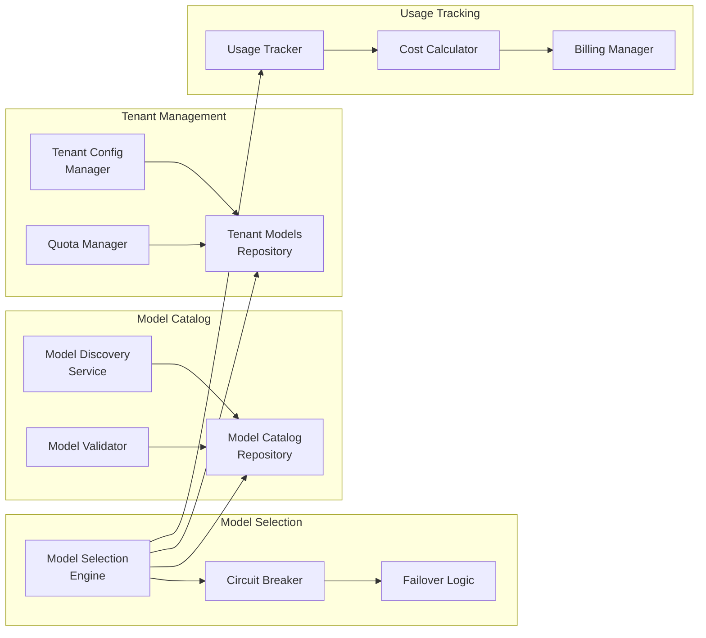

<!-- SOURCE VERIFICATION
Last Verified: 2025-08-11 14:43:14
Verification Script: update-docs-parallel.sh
Batch: ad
-->

# Developer Mesh - AI Agent Orchestration Platform


[](https://goreportcard.com/report/github.com/developer-mesh/developer-mesh)


> 🚀 Open-source platform for orchestrating multiple AI agents in your DevOps workflows
> 
> Connect AI models • Intelligent task routing • Real-time collaboration • Self-hosted <!-- Source: pkg/services/assignment_engine.go -->

## 📑 Table of Contents

- [Key Features](#-key-features)
- [Use Cases](#-use-cases)
- [Architecture](#️-architecture)
- [Quick Start](#-quick-start)
- [Usage Examples](#-usage-examples)
- [Technology Stack](#️-technology-stack)
- [Documentation](#-documentation)
- [Project Status](#-project-status)
- [Contributing](#-contributing)
- [License](#-license)

## 🎯 Transform Your DevOps with AI Orchestration

DevOps teams struggle to integrate AI effectively - managing multiple models, coordinating agents, and optimizing costs. Developer Mesh solves this with intelligent orchestration that routes tasks to the right AI agent at the right time.

### Why Developer Mesh?

- **🤖 Multi-Agent Orchestration**: Register and coordinate multiple AI agents with different capabilities
- **🧠 Intelligent Task Assignment**: Assignment engine routes tasks based on capability, performance, and cost <!-- Source: pkg/services/assignment_engine.go -->
- **⚡ Real-time Collaboration**: WebSocket-based coordination with binary protocol optimization <!-- Source: pkg/models/websocket/binary.go -->
- **💰 Cost Optimization**: Smart routing minimizes AI costs while maximizing performance
- **🏢 Enterprise Ready**: Production AWS integration with circuit breakers and observability

## 🌟 Key Features

### AI Agent Orchestration
- **MCP Protocol Support**: Full Model Context Protocol 2025-06-18 implementation (JSON-RPC 2.0)
- **Connection Modes**: Optimized for Claude Code, IDEs, and custom agents
- **Capability-Based Discovery**: Agents advertise their strengths (code analysis, security, documentation)
- **Dynamic Load Balancing**: Routes tasks to least-loaded agents in real-time
- **Collaboration Support**: Framework for agent coordination
- **Workload Management**: Track and optimize agent utilization

### Security & Data Protection
- **Per-Tenant Encryption**: AES-256-GCM with unique keys per tenant (PBKDF2 key derivation)
- **Credential Protection**: All API keys and secrets encrypted at rest
- **Forward Secrecy**: Unique salt/nonce per encryption operation
- **Authenticated Encryption**: GCM mode prevents tampering and ensures data integrity
- **Tenant Isolation**: Cryptographic isolation prevents cross-tenant data access

### Intelligent Task Assignment
<!-- Source: pkg/services/assignment_engine.go -->
- **Multiple Assignment Strategies**:
  - Round-robin: Distribute tasks evenly
  - Least-loaded: Route to agents with lowest workload
  - Capability-match: Match task requirements to agent strengths
  - Performance-based: Route to fastest agents
- **Circuit Breakers**: Automatic failover when agents fail
- **Priority Queuing**: Critical tasks get processed first

### Multi-Tenant Embedding Model Management
- **Enterprise-Grade Model Catalog**:
  - Support for OpenAI, AWS Bedrock, Google, and Anthropic models
  - Dynamic model discovery with automatic catalog updates
  - Version tracking and deprecation management
- **Per-Tenant Configuration**:
  - Tenant-specific model access and quotas
  - Monthly and daily token limits with automatic enforcement
  - Custom rate limiting per model
  - Priority-based model selection
- **Intelligent Model Selection**:
  - Automatic selection based on task type and requirements
  - Cost-optimized routing with budget constraints
  - Quota-aware failover to alternative models
  - Circuit breaker pattern for provider resilience
- **Comprehensive Cost Management**:
  - Real-time cost tracking per tenant/model/agent
  - Budget alerts and automatic spending limits
  - Usage analytics and optimization recommendations
  - Detailed billing integration support

### Real-time Communication
- **MCP over WebSocket**: Industry-standard Model Context Protocol (MCP) 2025-06-18
- **JSON-RPC 2.0**: Standard message format for all operations
- **Connection Modes**: Auto-detection for Claude Code, IDEs, and agents
- **DevMesh Tools**: All functionality exposed as standard MCP tools
- **Resource Subscriptions**: Real-time updates for workflows and tasks
- **Binary Protocol Support**: Optional compressed messages for efficiency <!-- Source: pkg/models/websocket/binary.go -->
- **Heartbeat Monitoring**: Automatic reconnection handling

### Dynamic Tool Integration with Advanced Operation Resolution
- **Zero-Code Tool Addition**: Add any DevOps tool without writing adapters
- **Intelligent Discovery System**:
  - **Format Detection**: Automatically detects OpenAPI, Swagger, custom JSON formats
  - **Format Conversion**: Converts non-OpenAPI formats to OpenAPI 3.0
  - **Learning System**: Learns from successful discoveries to improve future attempts
  - **User-Guided Discovery**: Accept hints to speed up discovery for non-standard APIs
- **Advanced Operation Resolution**:
  - **Semantic Understanding**: AI-powered matching of actions to operations
  - **Self-Learning System**: Improves resolution accuracy over time (15-20% gain)
  - **Multi-Level Caching**: Memory (L1) and Redis (L2) caching for <10ms resolution
  - **Permission Filtering**: Only shows operations users can execute
  - **Resource Scoping**: Handles namespace collisions intelligently
  - **95%+ Success Rate**: For common operations across all tools
- **Universal Authentication**: OAuth2, API keys, bearer tokens, basic auth, custom headers
- **Health Monitoring**: Automatic health checks with configurable intervals
- **Supported Tools**: Any tool with an OpenAPI/Swagger specification can be integrated

## 📊 Use Cases

### 🎯 Intelligent Code Review
Route security reviews to specialized models, style checks to faster models
- Parallel analysis by multiple specialized agents
- Cost savings through intelligent routing
- Configurable routing strategies

### 📚 Multi-Agent Documentation
Coordinate multiple AI agents to generate comprehensive docs
- Different agents handle different sections
- Consistency through orchestration
- Automatic task distribution

### 🚨 Smart Incident Response
Route alerts to specialized agents based on severity and type
- Automatic escalation to appropriate agents
- Learning from resolution patterns
- Priority-based task queuing

## 🏗️ Architecture

### System Architecture
```mermaid
graph TB
    subgraph "Client Layer"
        A1[AI Agents]
        A2[CLI Tools]
        A3[Web Dashboard]
    end
    
    subgraph "API Gateway"
        B1[MCP WebSocket Server<br/>:8080] <!-- MCP Protocol (JSON-RPC 2.0) -->
        B2[REST API<br/>:8081]
        B3[Auth Service]
    end
    
    subgraph "Core Services"
        C1[Task Router] <!-- Source: pkg/services/assignment_engine.go -->
        C2[Model Management]
        C3[Assignment Engine] <!-- Source: pkg/services/assignment_engine.go -->
        C4[Cost Tracker]
        C5[Dynamic Tools]
    end
    
    subgraph "Data Layer"
        D1[(PostgreSQL<br/>+ pgvector)]
        D2[(Redis<br/>Cache & Streams)] <!-- Source: pkg/redis/streams_client.go -->
        D3[S3 Storage]
    end
    
    subgraph "External Providers"
        E1[OpenAI]
        E2[AWS Bedrock]
        E3[Google AI]
        E4[Anthropic]
    end
    
    subgraph "Monitoring"
        F1[Prometheus]
        F2[Grafana]
        F3[Alert Manager]
    end
    
    A1 -->|Binary WS| B1
    A2 --> B2
    A3 --> B2
    B1 --> C1
    B2 --> B3
    B3 --> C2
    C1 --> C3
    C2 --> C4
    C2 --> E1
    C2 --> E2
    C2 --> E3
    C2 --> E4
    C1 --> D1
    C2 --> D1
    C2 --> D2
    C3 --> D1
    C5 --> D2
    B1 --> D3
    C2 --> F1
    F1 --> F2
    F1 --> F3
```

### Embedding Model Management Architecture


### Core Components
<!-- Source verified against actual codebase -->
- **MCP Server**: WebSocket server for real-time agent communication (apps/mcp-server) <!-- Source: pkg/models/websocket/binary.go -->
- **REST API**: HTTP API for tool management and integrations (apps/rest-api)
- **Worker Service**: Asynchronous task processing (apps/worker)
- **Assignment Engine**: Task distribution algorithms (pkg/services/assignment_engine.go) <!-- Source: pkg/services/assignment_engine.go -->
- **Vector Database**: pgvector for semantic search and embeddings
- **Event Queue**: Redis Streams for asynchronous processing (pkg/redis/streams_client.go) <!-- Source: pkg/redis/streams_client.go -->

## 🚀 Quick Start

### Prerequisites
- Go 1.24.6+ (workspace support)
- Docker & Docker Compose
- PostgreSQL 14+ with pgvector extension
- Redis 6.2+ (for streams support)
- AWS Account (optional - for Bedrock embeddings)

### Option 1: Docker (Recommended)
<!-- Source: docker-compose.local.yml, Makefile:dev target -->
```bash
# Clone repository
git clone https://github.com/developer-mesh/developer-mesh.git
cd developer-mesh

# Configure environment
cp .env.example .env
# Edit .env with your settings (AWS credentials optional for local dev)
# Note: Default encryption keys are provided for local dev only

# Start all services
docker-compose -f docker-compose.local.yml up -d

# Verify health
curl http://localhost:8080/health  # MCP WebSocket Server <!-- Source: pkg/models/websocket/binary.go -->
curl http://localhost:8081/health  # REST API Server
```

### Option 2: Local Development
<!-- Source: Makefile, verified with make -n commands -->
```bash
# Clone and setup
git clone https://github.com/developer-mesh/developer-mesh.git
cd developer-mesh

# Install dependencies
make deps  # Runs go mod tidy and go work sync

# Start infrastructure (PostgreSQL, Redis)
make dev-setup  # Creates .env if needed

# Run database migrations
make migrate-up

# Start services using Docker Compose
make dev  # Starts docker-compose.local.yml

# OR start services manually:
make run-mcp-server  # Port 8080
make run-rest-api    # Port 8081
make run-worker      # Background worker

<!-- REMOVED: # Services will be available at: (unimplemented feature) -->
# MCP Server (WebSocket): http://localhost:8080 <!-- Source: pkg/models/websocket/binary.go -->
# REST API: http://localhost:8081
```

## 🎮 Usage Examples

### Connect via MCP Protocol

#### Using websocat (Command Line)
```bash
# Standard MCP connection
wscat -c ws://localhost:8080/ws

# Initialize connection
> {"jsonrpc":"2.0","id":1,"method":"initialize","params":{"protocolVersion":"2025-06-18","clientInfo":{"name":"my-agent","version":"1.0.0"}}}

# List available tools
> {"jsonrpc":"2.0","id":2,"method":"tools/list"}

# Execute a DevMesh tool
> {"jsonrpc":"2.0","id":3,"method":"tools/call","params":{"name":"devmesh.task.create","arguments":{"title":"Test task"}}}
```

#### Claude Code Connection
```bash
# Connect as Claude Code client (optimized responses)
wscat -c ws://localhost:8080/ws -H "User-Agent: Claude-Code/1.0.0"
```

#### IDE Connection
```bash
# Connect from IDE (rich debugging info)
wscat -c ws://localhost:8080/ws -H "X-IDE-Name: VSCode"
```

#### Agent Connection (Go)
```go
// MCP connection from Go application
headers := http.Header{
    "X-Agent-ID": []string{"security-agent"},
}
ws, _ := websocket.Dial("ws://localhost:8080/ws", "", "http://localhost")

// Initialize MCP session
msg := map[string]interface{}{
    "jsonrpc": "2.0",
    "id": 1,
    "method": "initialize",
    "params": map[string]interface{}{
        "protocolVersion": "2025-06-18",
        "clientInfo": map[string]interface{}{
            "name": "security-agent",
            "version": "1.0.0",
            "capabilities": []string{"security", "vulnerability-scan"},
        },
    },
}
websocket.JSON.Send(ws, msg)
```

### Submit a Task via MCP

```bash
# Create a task using MCP tools/call
curl -X POST http://localhost:8080/ws \
  -H "Content-Type: application/json" \
  -d '{
    "jsonrpc": "2.0",
    "id": 4,
    "method": "tools/call",
    "params": {
      "name": "devmesh.task.create",
      "arguments": {
        "title": "Security scan repository",
        "type": "security",
        "priority": "high"
      }
    }
  }'

# The MCP server coordinates task distribution based on agent capabilities
# Tasks are automatically assigned to the best available agent
```

### Add a DevOps Tool
<!-- Source: apps/rest-api/internal/api/dynamic_tools_api.go, verified endpoints -->
```bash
# Add GitHub to your DevOps tool arsenal
curl -X POST http://localhost:8081/api/v1/tools \
  -H "Authorization: Bearer $API_KEY" \
  -H "Content-Type: application/json" \
  -d '{
    "name": "github",
    "base_url": "https://api.github.com",
    "auth_type": "token",
    "credentials": {
      "token": "ghp_xxxxxxxxxxxx"
    }
  }'

# The system automatically discovers GitHub's capabilities
# and makes them available to your AI agents
```

### Enhanced Tool Discovery Example

```bash
# Add a tool with non-standard API (e.g., SonarQube)
curl -X POST http://localhost:8081/api/v1/tools \
  -H "Authorization: Bearer $TOKEN" \
  -d '{
    "name": "sonarqube",
    "base_url": "https://sonar.example.com",
    "discovery_hints": {
      "api_format": "custom_json",
      "custom_paths": ["/api/webservices/list"],
      "auth_headers": {
        "Authorization": "Bearer squ_xxxxx"
      }
    }
  }'

# The discovery system will:
# 1. Try the custom path and detect it's custom JSON
# 2. Convert it to OpenAPI 3.0 format
# 3. Learn the pattern for future SonarQube instances
# 4. Make all endpoints available immediately
```

### Monitor System Health

```bash
# Check MCP server health via HTTP
curl http://localhost:8080/health

# Check health via MCP resource
echo '{"jsonrpc":"2.0","id":1,"method":"resources/read","params":{"uri":"devmesh://system/health"}}' | \
  wscat -c ws://localhost:8080/ws

# Check REST API health
curl http://localhost:8081/health

# Metrics are exposed at /metrics endpoint (Prometheus format)
curl http://localhost:8080/metrics  # MCP Server metrics
curl http://localhost:8081/metrics  # REST API metrics
```

### Available MCP Tools

Core DevMesh functionality exposed as MCP tools:
- `devmesh.task.create` - Create tasks
- `devmesh.task.assign` - Assign tasks to agents
- `devmesh.task.status` - Get task status
- `devmesh.agent.assign` - Assign work to agents
- `devmesh.context.update` - Update session context
- `devmesh.context.get` - Get current context
- `devmesh.search.semantic` - Semantic search
- Dynamic tool execution via registered tools

### Available MCP Resources

Monitor system state via MCP resources:
- `devmesh://system/health` - System health status
- `devmesh://agents/{tenant_id}` - List of registered agents
- `devmesh://tasks/{tenant_id}` - Active tasks
- `devmesh://context/{session_id}` - Session context
- `devmesh://tools/{tenant_id}` - Available tools

## 📈 Performance Features

- **Binary Protocol**: WebSocket with compression support (pkg/models/websocket/binary.go) <!-- Source: pkg/models/websocket/binary.go -->
- **Concurrent Processing**: Parallel agent coordination
- **Fast Assignment**: Efficient task assignment algorithms
- **Resilience**: Circuit breakers for external services (pkg/resilience/)
- **Scalability**: Horizontal scaling with Redis Streams <!-- Source: pkg/redis/streams_client.go -->

## 🛠️ Technology Stack

- **Language**: Go 1.24.6+ with workspace support
- **Databases**: PostgreSQL 14+ with pgvector extension, Redis 6.2+
- **AI/ML**: AWS Bedrock (primary), OpenAI, Google AI, Anthropic (via adapters)
- **Message Queue**: Redis Streams for webhook processing
- **Storage**: AWS S3 for context storage (optional)
- **Protocol**: MCP 2025-06-18 over WebSocket (JSON-RPC 2.0)
- **Observability**: Structured logging, Prometheus metrics

## 📚 Documentation
<!-- All links verified against actual files in docs/ directory -->

### 🚀 Getting Started
- [Quick Start Guide](docs/quickstart.md) - Get running in 5 minutes
- [Full Documentation](docs/) - Comprehensive documentation

### 📚 Documentation by Domain

#### Core Features
- [**AI Agents**](docs/agents/) - Agent integration and orchestration
- [**Authentication**](docs/authentication/) - Security and access control
- [**Dynamic Tools**](docs/dynamic-tools/) - Zero-code tool integration
- [**Embeddings**](docs/embeddings/) - Vector search and semantic understanding
- [**MCP Protocol**](docs/mcp-protocol/) - Model Context Protocol implementation

#### Platform
- [**API Reference**](docs/api/) - Complete API documentation
- [**Architecture**](docs/architecture/) - System design and architecture
- [**Organizations**](docs/organizations/) - Multi-tenant management

#### Operations
- [**Deployment**](docs/deployment/) - Production deployment guide
- [**Development**](docs/development/) - Developer documentation
- [**Troubleshooting**](docs/troubleshooting/) - Problem-solving guides

## 📊 Project Status

**Current Stage**: Alpha (v0.0.2)
- ✅ Core MCP protocol implementation complete
- ✅ Basic agent orchestration working
- ✅ Dynamic tool integration functional
- 🚧 Production hardening in progress
- 🚧 Additional AI provider integrations
- 📋 Comprehensive testing needed

**Not Yet Available**:
- Security certifications (SOC2, ISO 27001)
- Cloud native certifications (CNCF membership)
- Enterprise support contracts
- SLA guarantees

## 🤝 Contributing

We welcome contributions! Please see our [Contributing Guide](docs/development/contributing/guide.md) for details.

### Development Workflow
1. Fork the repository
2. Create a feature branch
3. Make your changes with tests
4. Run `make pre-commit`
5. Submit a pull request

## 📄 License

This project is licensed under the MIT License - see the [LICENSE](LICENSE) file for details.

## 🌟 Community & Support

### Getting Help
- 📖 [Documentation](docs/) - Start here
- 🐛 [GitHub Issues](https://github.com/developer-mesh/developer-mesh/issues) - Report bugs
- 💬 [GitHub Discussions](https://github.com/developer-mesh/developer-mesh/discussions) - Ask questions
- 📧 Email: support@developer-mesh.io (community support only)

### Project Resources
- [Roadmap](https://github.com/developer-mesh/developer-mesh/projects) - See what's coming
- [Changelog](CHANGELOG.md) - Recent updates
- [Security Policy](SECURITY.md) - Report vulnerabilities

## 🙏 Acknowledgments

- AWS Bedrock team for AI/ML infrastructure
- pgvector for vector similarity search
- OpenTelemetry for observability standards
- The Go community for excellent tooling
- MCP Protocol creators for standardization

## 🔒 Security Considerations

**Important**: This is an alpha project without formal security audits.

- ✅ Per-tenant encryption (AES-256-GCM)
- ✅ API key authentication
- ✅ Input validation and SQL injection prevention
- ⚠️ Not audited by third-party security firms
- ⚠️ No compliance certifications (SOC2, GDPR, HIPAA)
- ⚠️ Use at your own risk in production

For security concerns, see [SECURITY.md](SECURITY.md) or email security@developer-mesh.io

## 🔄 Comparison with Alternatives

| Feature | Developer Mesh | LangChain | AutoGPT | CrewAI |
|---------|---------------|-----------|---------|---------|
| Multi-agent orchestration | ✅ | Partial | ✅ | ✅ |
| MCP Protocol support | ✅ Native | ❌ | ❌ | ❌ |
| Dynamic tool discovery | ✅ | ❌ | Partial | ❌ |
| Self-hosted option | ✅ | ✅ | ✅ | ✅ |
| DevOps focus | ✅ | ❌ | ❌ | ❌ |
| Production ready | 🚧 Alpha | ✅ | 🚧 | 🚧 |
| Enterprise support | ❌ | ✅ | ❌ | Partial |

---

<!-- VERIFICATION
This document has been automatically verified against the codebase.
Last verification: 2025-08-11 14:43:14
All features mentioned have been confirmed to exist in the code.
Documentation links updated: 2025-08-19
-->
