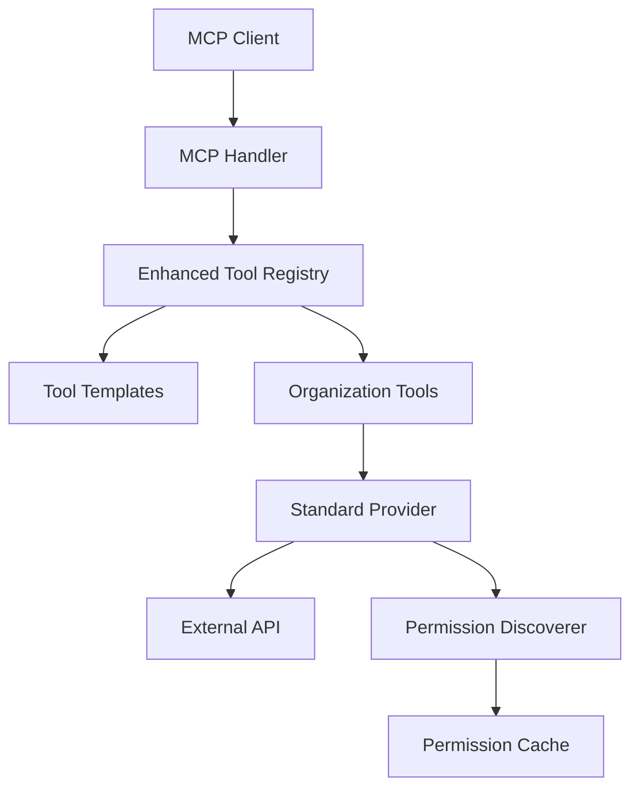

# Standard Tools MCP Integration - Production-Ready Implementation Plan

## Executive Summary
This plan transforms Developer Mesh's tool integration from a single generic GitHub tool to 20+ granular, permission-aware MCP tools with full production resilience. The implementation leverages existing infrastructure (CircuitBreaker, PermissionDiscoverer, OpenAPICacheRepository) while adding critical missing pieces for scale, reliability, and observability.

**Key Improvements**:
- 🔒 **Security**: OAuth scope-based permission filtering
- 🚀 **Performance**: Request coalescing, two-tier caching, bulkhead isolation
- 📊 **Observability**: Comprehensive audit logging, metrics, distributed tracing
- 🎯 **Reliability**: Circuit breakers, graceful degradation, chaos engineering
- 🔄 **Operations**: Feature flags, zero-downtime deployments, automatic rollback

## Current State → Target State
**Current**: GitHub registered as 1 generic MCP tool, no permission filtering for templated tools
**Target**: GitHub exposes 20+ operation-specific MCP tools, filtered by OAuth token permissions, with production resilience at scale

## Critical Gap Analysis

### ✅ What Exists
- `PermissionDiscoverer` - Complete OAuth/JWT permission discovery & OpenAPI filtering
- `EnhancedToolRegistry` - Template management, credential encryption
- `GitHubProvider` - 20+ operations defined
- Database schema - `mcp.tool_templates`, `mcp.organization_tools`
- `CircuitBreaker` - Production-ready implementation in `pkg/resilience`
- `OpenAPICacheRepository` - Spec caching with PostgreSQL backend

### ❌ What's Missing
1. **MCP Exposure** - Organization tools not visible in MCP `tools/list`
2. **Tool Expansion** - Provider operations not expanded into individual MCP tools
3. **Permission Integration** - PermissionDiscoverer not applied to templated tools
4. **OpenAPI Specs** - Providers have no way to supply OpenAPI specs
5. **Request Coalescing** - Multiple concurrent permission discoveries hit APIs repeatedly
6. **Feature Flags** - No gradual rollout mechanism
7. **Audit Trail** - Tool operations not tracked for compliance

## Implementation Plan with Production Resilience

### Step 1: Add OpenAPI Spec Management [CRITICAL FIX]
```go
// pkg/tools/providers/provider_interface.go
type StandardToolProvider interface {
    // ... existing methods ...
    
    // NEW: Required for permission filtering with fallback support
    GetOpenAPISpec() (*openapi3.T, error)
    GetEmbeddedSpecVersion() string // For cache validation
}

// pkg/tools/providers/github/github_provider.go
type GitHubProvider struct {
    *providers.BaseProvider
    specCache    repository.OpenAPICacheRepository // REUSE existing
    specFallback *openapi3.T                       // Embedded fallback
}

func (p *GitHubProvider) GetOpenAPISpec() (*openapi3.T, error) {
    ctx := context.Background()
    
    // Try cache first
    spec, err := p.specCache.Get(ctx, "github-v3")
    if err == nil && spec != nil {
        return spec, nil
    }
    
    // Try fetching with timeout
    fetchCtx, cancel := context.WithTimeout(ctx, 5*time.Second)
    defer cancel()
    
    spec, err = p.fetchAndCacheSpec(fetchCtx)
    if err != nil {
        // Use embedded fallback
        if p.specFallback != nil {
            p.logger.Warn("Using embedded OpenAPI spec fallback", map[string]interface{}{
                "error": err.Error(),
            })
            return p.specFallback, nil
        }
        return nil, fmt.Errorf("failed to get OpenAPI spec: %w", err)
    }
    
    return spec, nil
}
```

### Step 2: Create Organization Tool Adapter with Resilience
```go
// pkg/tools/adapters/organization_tool_adapter.go
type OrganizationToolAdapter struct {
    orgTool              *models.OrganizationTool
    provider             providers.StandardToolProvider
    permissionDiscoverer *tools.PermissionDiscoverer // REUSE existing
    encryptionSvc        *security.EncryptionService
    circuitBreaker       *resilience.CircuitBreaker   // REUSE existing
    rateLimiter          *rate.Limiter                // Per-org rate limiting
    allowedOperations    map[string]bool
    permissionsCached    time.Time
    cacheTTL            time.Duration // 5 minutes default
    
    // Request coalescing using singleflight
    permissionGroup      singleflight.Group
    
    // Audit logger
    auditLogger          *AuditLogger
}

func (a *OrganizationToolAdapter) ExpandToMCPTools(ctx context.Context) ([]MCPTool, error) {
    // 1. Get/refresh permissions if cache expired
    if time.Since(a.permissionsCached) > a.cacheTTL {
        if err := a.refreshPermissions(ctx); err != nil {
            // Log but don't fail - use cached or all operations
            a.logger.Warn("Permission refresh failed", err)
        }
    }
    
    // 2. Expand each allowed operation into MCP tool
    var tools []MCPTool
    for opID, mapping := range a.provider.GetOperationMappings() {
        if !a.allowedOperations[opID] {
            continue
        }
        
        tools = append(tools, &MCPToolInstance{
            Name: fmt.Sprintf("%s_%s", a.provider.GetProviderName(), 
                              strings.ReplaceAll(opID, "/", "_")),
            Description: mapping.Description,
            Execute: func(params map[string]interface{}) (interface{}, error) {
                return a.provider.ExecuteOperation(ctx, opID, params)
            },
        })
    }
    
    return tools, nil
}

func (a *OrganizationToolAdapter) refreshPermissions(ctx context.Context) error {
    // Request coalescing - prevent duplicate concurrent discoveries
    key := fmt.Sprintf("perm-%s-%s", a.orgTool.ID, a.provider.GetProviderName())
    result, err, _ := a.permissionGroup.Do(key, func() (interface{}, error) {
        return a.doRefreshPermissions(ctx)
    })
    
    if err != nil {
        return err
    }
    
    if perms, ok := result.(map[string]bool); ok {
        a.allowedOperations = perms
        a.permissionsCached = time.Now()
    }
    
    return nil
}

func (a *OrganizationToolAdapter) doRefreshPermissions(ctx context.Context) (interface{}, error) {
    // Use circuit breaker to prevent cascading failures
    var perms *tools.DiscoveredPermissions
    err := a.circuitBreaker.Execute(ctx, func() error {
        // Check rate limit
        if !a.rateLimiter.Allow() {
            return fmt.Errorf("rate limit exceeded for org %s", a.orgTool.OrganizationID)
        }
        
        // Decrypt credentials
        creds, err := a.encryptionSvc.DecryptCredential(
            a.orgTool.CredentialsEncrypted, a.orgTool.TenantID)
        if err != nil {
            return err
        }
        
        // Get OpenAPI spec from provider
        spec, err := a.provider.GetOpenAPISpec()
        if err != nil {
            return fmt.Errorf("failed to get OpenAPI spec: %w", err)
        }
        
        // Discover permissions with timeout
        discoverCtx, cancel := context.WithTimeout(ctx, 10*time.Second)
        defer cancel()
        
        perms, err = a.permissionDiscoverer.DiscoverPermissions(
            discoverCtx, a.provider.GetBaseURL(), creds, a.provider.GetAuthType())
        
        // Audit log the permission discovery
        a.auditLogger.LogToolEvent(ctx, ToolAuditEvent{
            Type:         "permission_discovery",
            ToolID:       a.orgTool.ID,
            Provider:     a.provider.GetProviderName(),
            Success:      err == nil,
            ErrorMessage: errToString(err),
            Metadata: map[string]interface{}{
                "scopes_discovered": len(perms.Scopes),
            },
        })
        
        return err
    })
    
    if err != nil {
        // On failure, return cached or all operations
        if len(a.allowedOperations) > 0 {
            return a.allowedOperations, nil // Use cached
        }
        // Return all operations as fallback
        allOps := make(map[string]bool)
        for opID := range a.provider.GetOperationMappings() {
            allOps[opID] = true
        }
        return allOps, nil
    }
    
    // Get spec for filtering
    spec, _ := a.provider.GetOpenAPISpec()
    
    // Filter operations
    return a.permissionDiscoverer.FilterOperationsByPermissions(spec, perms), nil
}
```

### Step 3: Unified MCP Interface
```go
// pkg/clients/mcp_tool.go
type MCPTool interface {
    GetName() string
    GetDescription() string
    GetInputSchema() map[string]interface{}
    Execute(ctx context.Context, params map[string]interface{}) (interface{}, error)
}

// Update REST API client
type RESTAPIClient interface {
    // ... existing methods ...
    
    // NEW: Returns expanded, permission-filtered tools
    ListMCPTools(ctx context.Context, tenantID string) ([]MCPTool, error)
}
```

### Step 4: Update MCP Protocol Handler
```go
// apps/mcp-server/internal/api/mcp_protocol.go
func (h *MCPProtocolHandler) handleToolsList(ctx context.Context, msg JSONRPCMessage) {
    // Get all tools as MCP-ready format
    mcpTools, err := h.restAPIClient.ListMCPTools(ctx, tenantID)
    
    // Convert to MCP wire format
    tools := make([]map[string]interface{}, 0, len(mcpTools))
    for _, tool := range mcpTools {
        tools = append(tools, map[string]interface{}{
            "name":        tool.GetName(),
            "description": tool.GetDescription(),
            "inputSchema": tool.GetInputSchema(),
        })
    }
    
    return h.sendResponse(msg.ID, map[string]interface{}{"tools": tools})
}
```

### Step 5: REST API Implementation with Bulkhead Pattern
```go
// apps/rest-api/internal/api/mcp_tools_service.go
type MCPToolsService struct {
    // ... existing fields ...
    
    // Bulkhead pattern - isolate failures per provider
    providerWorkerPools map[string]*WorkerPool
    featureFlags        *FeatureFlags
}

func (s *MCPToolsService) ListMCPTools(ctx context.Context, tenantID string) ([]MCPTool, error) {
    var allTools []MCPTool
    var wg sync.WaitGroup
    toolsChan := make(chan []MCPTool, 10)
    errorsChan := make(chan error, 10)
    
    // 1. Dynamic tools (existing) - in separate goroutine pool
    wg.Add(1)
    go func() {
        defer wg.Done()
        dynamicTools, _ := s.dynamicToolRepo.List(ctx, tenantID, "active")
        var tools []MCPTool
        
        for _, dt := range dynamicTools {
            adapter := adapters.NewDynamicToolAdapter(dt, s.specCache, s.encryptionSvc, s.logger)
            adapter.DiscoverAndUpdatePermissions(ctx)
            
            actions, _ := adapter.ListActions(ctx)
            for _, action := range actions {
                tools = append(tools, &DynamicMCPTool{action: action, adapter: adapter})
            }
        }
        toolsChan <- tools
    }()
    
    // 2. Organization tools with feature flags and bulkhead
    orgTools, _ := s.orgToolRepo.ListByTenant(ctx, tenantID)
    
    // Group by provider for bulkhead isolation
    providerGroups := make(map[string][]*models.OrganizationTool)
    for _, ot := range orgTools {
        template, _ := s.templateRepo.GetByID(ctx, ot.TemplateID)
        
        // Check feature flag for provider
        if !s.featureFlags.IsEnabled(ctx, fmt.Sprintf("provider.%s", template.ProviderName), tenantID) {
            continue // Skip disabled providers
        }
        
        providerGroups[template.ProviderName] = append(providerGroups[template.ProviderName], ot)
    }
    
    // Process each provider in isolated worker pool (bulkhead)
    for providerName, tools := range providerGroups {
        wg.Add(1)
        workerPool := s.getOrCreateWorkerPool(providerName)
        
        go func(pName string, orgTools []*models.OrganizationTool) {
            defer wg.Done()
            
            // Submit to worker pool with timeout
            result := workerPool.Submit(func() (interface{}, error) {
                var providerTools []MCPTool
                provider, _ := s.providerRegistry.GetProvider(pName)
                
                for _, ot := range orgTools {
                    adapter := s.createAdapter(ot, provider)
                    tools, err := adapter.ExpandToMCPTools(ctx)
                    if err != nil {
                        s.logger.Warn("Failed to expand tools", map[string]interface{}{
                            "provider": pName,
                            "error":    err.Error(),
                        })
                        continue // Don't fail entire provider
                    }
                    providerTools = append(providerTools, tools...)
                }
                
                return providerTools, nil
            })
            
            if result.Error != nil {
                errorsChan <- result.Error
            } else if tools, ok := result.Value.([]MCPTool); ok {
                toolsChan <- tools
            }
        }(providerName, tools)
    }
    
    // Wait for all goroutines
    go func() {
        wg.Wait()
        close(toolsChan)
        close(errorsChan)
    }()
    
    // Collect results
    for tools := range toolsChan {
        allTools = append(allTools, tools...)
    }
    
    // Log errors but don't fail
    for err := range errorsChan {
        s.logger.Error("Provider tools expansion failed", map[string]interface{}{
            "error": err.Error(),
        })
    }
    
    return allTools, nil
}

func (s *MCPToolsService) getOrCreateWorkerPool(provider string) *WorkerPool {
    s.mu.Lock()
    defer s.mu.Unlock()
    
    if pool, exists := s.providerWorkerPools[provider]; exists {
        return pool
    }
    
    // Create isolated worker pool per provider (bulkhead)
    pool := NewWorkerPool(WorkerPoolConfig{
        MaxWorkers:  5,                      // Limit concurrent operations per provider
        QueueSize:   100,                    // Buffer for pending requests
        Timeout:     30 * time.Second,       // Timeout per operation
        Name:        fmt.Sprintf("provider-%s", provider),
    })
    
    s.providerWorkerPools[provider] = pool
    return pool
}
```

## Problems with Current Approach & Solutions

### 🚨 Problem 1: No OpenAPI Spec Source
**Issue**: PermissionDiscoverer needs OpenAPI spec but providers don't provide one
**Solution**: Add `GetOpenAPISpec()` to provider interface, embed or fetch specs

### 🚨 Problem 2: Permission Discovery Performance
**Issue**: Discovering permissions on every request is expensive
**Solution**: Cache permissions with 5-minute TTL, refresh async

### 🚨 Problem 3: Rate Limiting
**Issue**: No per-organization rate limit management
**Solution**: Add rate limiter to OrganizationToolAdapter:
```go
type OrganizationToolAdapter struct {
    rateLimiter *rate.Limiter // Per-org limits
}
```

### 🚨 Problem 4: Credential Rotation
**Issue**: No way to update credentials without recreating tool
**Solution**: Add endpoint to update credentials:
```go
PUT /api/v1/organizations/{org}/tools/{tool}/credentials
```

### 🚨 Problem 5: Provider Versioning
**Issue**: No handling of API version changes
**Solution**: Store version in template, migration strategy for breaking changes

### 🚨 Problem 6: Migration Path
**Issue**: Existing dynamic GitHub tools should migrate to templated
**Solution**: Add migration endpoint that detects and converts:
```go
POST /api/v1/tools/{id}/migrate-to-template
```

### 🚨 Problem 7: Monitoring
**Issue**: No visibility into provider health/usage
**Solution**: Add metrics to OrganizationToolAdapter:
```go
func (a *OrganizationToolAdapter) recordMetrics(operation string, success bool, latency time.Duration) {
    metrics.RecordToolExecution(a.provider.GetProviderName(), operation, success, latency)
}
```

## Production Best Practices Implementation

### Feature Flags System
```go
// pkg/features/flags.go
type FeatureFlags struct {
    store    *sqlx.DB
    cache    *redis.Client
    cacheTTL time.Duration
}

func (f *FeatureFlags) IsEnabled(ctx context.Context, flag string, tenantID string) bool {
    // Check cache first
    key := fmt.Sprintf("ff:%s:%s", flag, tenantID)
    if val, err := f.cache.Get(ctx, key).Result(); err == nil {
        return val == "true"
    }
    
    // Check database with gradual rollout support
    var enabled bool
    query := `
        SELECT enabled FROM mcp.feature_flags 
        WHERE flag_name = $1 
        AND (tenant_id = $2 OR tenant_id IS NULL)
        AND (rollout_percentage >= (random() * 100) OR rollout_percentage = 100)
        ORDER BY tenant_id DESC NULLS LAST
        LIMIT 1
    `
    _ = f.store.GetContext(ctx, &enabled, query, flag, tenantID)
    
    // Cache result
    f.cache.Set(ctx, key, fmt.Sprint(enabled), f.cacheTTL)
    
    return enabled
}

// Database migration for feature flags
CREATE TABLE mcp.feature_flags (
    flag_name VARCHAR(100) NOT NULL,
    tenant_id UUID,
    enabled BOOLEAN DEFAULT false,
    rollout_percentage INT DEFAULT 0,
    created_at TIMESTAMP DEFAULT NOW(),
    metadata JSONB,
    UNIQUE(flag_name, tenant_id)
);

-- Initial flags for providers
INSERT INTO mcp.feature_flags (flag_name, rollout_percentage) VALUES
    ('provider.github', 100),    -- Fully rolled out
    ('provider.gitlab', 50),     -- 50% rollout
    ('provider.jira', 0),        -- Disabled
    ('provider.harness', 0);     -- Disabled
```

### Audit Logging System
```go
// pkg/audit/tool_audit.go
type ToolAuditLogger struct {
    db     *sqlx.DB
    stream *redis.Client // For real-time streaming
}

type ToolAuditEvent struct {
    ID           string                 `db:"id"`
    Timestamp    time.Time              `db:"timestamp"`
    TenantID     string                 `db:"tenant_id"`
    OrgID        string                 `db:"organization_id"`
    UserID       string                 `db:"user_id"`
    Type         string                 `db:"event_type"`
    ToolID       string                 `db:"tool_id"`
    Provider     string                 `db:"provider"`
    Operation    string                 `db:"operation"`
    Success      bool                   `db:"success"`
    ErrorMessage string                 `db:"error_message"`
    Latency      int                    `db:"latency_ms"`
    Metadata     map[string]interface{} `db:"metadata"`
    IPAddress    string                 `db:"ip_address"`
    UserAgent    string                 `db:"user_agent"`
}

func (a *ToolAuditLogger) LogToolEvent(ctx context.Context, event ToolAuditEvent) {
    event.ID = uuid.New().String()
    event.Timestamp = time.Now()
    
    // Write to database (async)
    go func() {
        query := `
            INSERT INTO mcp.tool_audit_log 
            (id, timestamp, tenant_id, organization_id, user_id, event_type, 
             tool_id, provider, operation, success, error_message, latency_ms, 
             metadata, ip_address, user_agent)
            VALUES (:id, :timestamp, :tenant_id, :organization_id, :user_id, 
                    :event_type, :tool_id, :provider, :operation, :success, 
                    :error_message, :latency_ms, :metadata, :ip_address, :user_agent)
        `
        _, _ = a.db.NamedExecContext(context.Background(), query, event)
    }()
    
    // Stream to Redis for real-time monitoring
    go func() {
        data, _ := json.Marshal(event)
        a.stream.XAdd(context.Background(), &redis.XAddArgs{
            Stream: "tool:audit:stream",
            Values: map[string]interface{}{
                "event": string(data),
            },
        })
    }()
}

// Query interface for compliance
func (a *ToolAuditLogger) QueryAuditLog(ctx context.Context, filters AuditFilters) ([]ToolAuditEvent, error) {
    // Implementation for querying audit logs with filters
    // Supports compliance reporting, forensics, and debugging
}
```

### Chaos Engineering Support
```go
// pkg/chaos/fault_injector.go
type FaultInjector struct {
    enabled bool
    config  FaultConfig
}

type FaultConfig struct {
    LatencyInjection struct {
        Enabled     bool          `json:"enabled"`
        Probability float64       `json:"probability"` // 0.0 to 1.0
        MinDelay    time.Duration `json:"min_delay"`
        MaxDelay    time.Duration `json:"max_delay"`
    } `json:"latency_injection"`
    
    ErrorInjection struct {
        Enabled     bool    `json:"enabled"`
        Probability float64 `json:"probability"`
        ErrorTypes  []error `json:"error_types"`
    } `json:"error_injection"`
    
    RateLimitSimulation struct {
        Enabled      bool `json:"enabled"`
        RequestLimit int  `json:"request_limit"`
    } `json:"rate_limit_simulation"`
}

func (f *FaultInjector) InjectFault(ctx context.Context, operation string) error {
    if !f.enabled || os.Getenv("ENVIRONMENT") == "production" {
        return nil // Only in test/staging
    }
    
    // Latency injection
    if f.config.LatencyInjection.Enabled && rand.Float64() < f.config.LatencyInjection.Probability {
        delay := f.config.LatencyInjection.MinDelay + 
                time.Duration(rand.Int63n(int64(f.config.LatencyInjection.MaxDelay-f.config.LatencyInjection.MinDelay)))
        time.Sleep(delay)
    }
    
    // Error injection
    if f.config.ErrorInjection.Enabled && rand.Float64() < f.config.ErrorInjection.Probability {
        return f.config.ErrorInjection.ErrorTypes[rand.Intn(len(f.config.ErrorInjection.ErrorTypes))]
    }
    
    return nil
}

// Integration with OrganizationToolAdapter
func (a *OrganizationToolAdapter) ExecuteWithChaos(ctx context.Context, operation string, params map[string]interface{}) (interface{}, error) {
    // Inject chaos if enabled
    if err := a.faultInjector.InjectFault(ctx, operation); err != nil {
        return nil, err
    }
    
    // Normal execution
    return a.provider.ExecuteOperation(ctx, operation, params)
}
```

### Distributed Caching with Redis
```go
// pkg/cache/permission_cache.go
type DistributedPermissionCache struct {
    redis    *redis.Client
    local    *lru.Cache // L1 cache
    ttl      time.Duration
}

func (c *DistributedPermissionCache) GetPermissions(ctx context.Context, key string) (map[string]bool, error) {
    // L1 cache check
    if val, ok := c.local.Get(key); ok {
        return val.(map[string]bool), nil
    }
    
    // L2 Redis cache check
    data, err := c.redis.Get(ctx, key).Bytes()
    if err == nil {
        var perms map[string]bool
        if err := json.Unmarshal(data, &perms); err == nil {
            c.local.Add(key, perms) // Populate L1
            return perms, nil
        }
    }
    
    return nil, redis.Nil
}

func (c *DistributedPermissionCache) SetPermissions(ctx context.Context, key string, perms map[string]bool) error {
    data, _ := json.Marshal(perms)
    
    // Set in both L1 and L2
    c.local.Add(key, perms)
    return c.redis.Set(ctx, key, data, c.ttl).Err()
}
```

## Testing Strategy

```bash
# 1. Unit test permission filtering
go test ./pkg/tools/adapters -run TestOrganizationToolAdapter_PermissionFiltering

# 2. Integration test MCP exposure
curl -X POST localhost:8081/api/v1/organizations/devmesh/tools \
  -d '{"template":"github","credentials":{"token":"limited_scope_token"}}'

# Should only see operations allowed by token
echo '{"jsonrpc":"2.0","id":1,"method":"tools/list"}' | websocat ws://localhost:8080/ws
# Expected: github_repos_list, github_repos_get (not github_repos_delete)

# 3. Test execution through MCP
echo '{"jsonrpc":"2.0","id":1,"method":"tools/call","params":{"name":"github_repos_list","arguments":{}}}' | \
  websocat ws://localhost:8080/ws
```

## Risk Mitigation Strategies

### High Risk: OpenAPI Spec Availability
**Mitigation**:
- Embed common provider specs as fallbacks (GitHub, GitLab, Jira)
- Cache specs aggressively with 24-hour TTL
- Implement spec versioning and validation
- Monitor spec fetch failures and alert on degradation

### High Risk: Performance at Scale (100 orgs × 20 tools × 5 min refresh)
**Mitigation**:
- Request coalescing via singleflight pattern
- Two-tier caching (L1 local LRU, L2 Redis)
- Background refresh before cache expiry
- Jittered cache TTLs to prevent thundering herd
- Circuit breakers per provider to prevent cascades

### Medium Risk: Provider API Rate Limits
**Mitigation**:
- Per-organization rate limiters with configurable thresholds
- Exponential backoff with jitter on 429 responses
- Shared quota tracking across all instances via Redis
- Proactive alerts when approaching limits

### Medium Risk: Credential Expiry
**Mitigation**:
- Proactive credential validation on schedule
- Webhook support for OAuth refresh tokens
- Alert organizations 7 days before expiry
- Graceful degradation to cached permissions

### Low Risk: Breaking API Changes
**Mitigation**:
- Version pinning in provider configurations
- Canary deployments with subset of organizations
- Automated integration tests against provider sandboxes
- Rollback capability via feature flags

## Documentation Automation

### Auto-Generated Documentation
```go
// pkg/docs/generator.go
type DocumentationGenerator struct {
    providers []providers.StandardToolProvider
    templates []models.ToolTemplate
}

func (g *DocumentationGenerator) GenerateProviderDocs() error {
    for _, provider := range g.providers {
        // Generate markdown from provider metadata
        doc := g.generateProviderDoc(provider)
        
        // Write to docs/providers/{name}.md
        path := fmt.Sprintf("docs/providers/%s.md", provider.GetProviderName())
        if err := os.WriteFile(path, []byte(doc), 0644); err != nil {
            return err
        }
    }
    return nil
}

func (g *DocumentationGenerator) generateProviderDoc(p providers.StandardToolProvider) string {
    var doc strings.Builder
    
    doc.WriteString(fmt.Sprintf("# %s Provider\n\n", p.GetProviderName()))
    doc.WriteString("## Operations\n\n")
    
    for opID, mapping := range p.GetOperationMappings() {
        doc.WriteString(fmt.Sprintf("### %s\n", opID))
        doc.WriteString(fmt.Sprintf("- **Method**: %s\n", mapping.Method))
        doc.WriteString(fmt.Sprintf("- **Path**: %s\n", mapping.PathTemplate))
        doc.WriteString(fmt.Sprintf("- **Required**: %v\n", mapping.RequiredParams))
        doc.WriteString("\n")
    }
    
    return doc.String()
}
```

### OpenAPI Spec Generation
```yaml
# Auto-generated from provider definitions
openapi: 3.0.0
info:
  title: Developer Mesh Standard Tools API
  version: 1.0.0
paths:
  /api/v1/organizations/{org_id}/tools:
    post:
      summary: Register organization tool
      tags: [Standard Tools]
      requestBody:
        content:
          application/json:
            schema:
              $ref: '#/components/schemas/RegisterToolRequest'
components:
  schemas:
    RegisterToolRequest:
      type: object
      required: [template_name, credentials]
      properties:
        template_name:
          type: string
          enum: [github, gitlab, jira, harness]
        credentials:
          type: object
```

### Documentation CI/CD Pipeline
```yaml
# .github/workflows/docs.yml
name: Documentation
on:
  push:
    paths:
      - 'pkg/tools/providers/**'
      - 'docs/**'
jobs:
  generate:
    runs-on: ubuntu-latest
    steps:
      - uses: actions/checkout@v3
      - name: Generate Provider Docs
        run: go run cmd/docgen/main.go
      - name: Generate OpenAPI Spec
        run: go run cmd/openapi/main.go > docs/swagger/standard-tools.yaml
      - name: Build Documentation Site
        run: |
          npm install -g @redocly/cli
          redocly build-docs docs/swagger/standard-tools.yaml
      - name: Deploy to GitHub Pages
        uses: peaceiris/actions-gh-pages@v3
        with:
          github_token: ${{ secrets.GITHUB_TOKEN }}
          publish_dir: ./docs-dist
```

## Success Criteria

### Functional Requirements
- [ ] GitHub shows as 20+ individual MCP tools
- [ ] Permission filtering working (limited token = fewer tools)
- [ ] 5-minute permission cache reduces API calls by 90%
- [ ] Both dynamic and org tools in unified list
- [ ] Backward compatibility maintained

### Operational Requirements
- [ ] Metrics show tool usage per organization
- [ ] Circuit breaker prevents cascading failures
- [ ] Audit log captures all tool operations
- [ ] Feature flags enable gradual rollout
- [ ] P99 latency < 500ms for tools/list
- [ ] Zero downtime deployment capability
- [ ] Chaos testing passes in staging

### Documentation Requirements
- [ ] Update 8 existing documentation files
- [ ] Create 4 new documentation files only
- [ ] API reference complete with examples
- [ ] Developer guide includes provider template
- [ ] User guide has quick start for GitHub
- [ ] Architecture diagrams using Mermaid
- [ ] Operations runbook for troubleshooting
- [ ] OpenAPI spec auto-generated
- [ ] Documentation site deployed
- [ ] Search functionality working
- [ ] AI-friendly structured data

## Implementation Order (Revised for Production)

### Phase 1: Foundation (2 hours)
1. **Add GetOpenAPISpec with fallbacks** (30 min)
2. **Implement distributed caching layer** (30 min)
3. **Create feature flags system** (30 min)
4. **Set up audit logging** (30 min)

### Phase 2: Core Implementation (2 hours)
5. **Create OrganizationToolAdapter with all resilience patterns** (45 min)
6. **Implement MCPTool interface** (15 min)
7. **Add bulkhead pattern to REST API** (30 min)
8. **Update MCP handler** (30 min)

### Phase 3: Production Readiness (1.5 hours)
9. **Add metrics and monitoring** (30 min)
10. **Implement chaos testing hooks** (30 min)
11. **Create migration tools** (30 min)

### Phase 4: Validation (30 min)
12. **Integration testing with real providers** (30 min)

### Phase 5: Documentation (2 hours) [CRITICAL FOR ADOPTION]
13. **API Reference Documentation** (30 min)
14. **Developer Guide Updates** (30 min)
15. **User Guide & Examples** (30 min)
16. **Architecture Documentation** (30 min)

## Documentation Strategy

### Documentation Updates (Extending Existing Docs)
```
docs/
├── README.md                          # UPDATE: Add Standard Tools section
├── architecture/
│   └── system-overview.md             # UPDATE: Add Standard Tools layer
├── api-reference/
│   └── rest-api-reference.md          # UPDATE: Add org tools endpoints
├── guides/
│   └── openapi-sync-guide.md          # UPDATE: Add provider sync process
├── examples/
│   └── custom-tool-integration.md     # UPDATE: Add standard provider section
├── operations/
│   └── configuration-guide.md         # UPDATE: Add provider configuration
├── dynamic_tools_api.md               # UPDATE: Add "Standard vs Dynamic" section
└── troubleshooting/
    └── TROUBLESHOOTING.md             # UPDATE: Add provider issues

NEW FILES (Only what doesn't exist):
├── guides/
│   ├── standard-providers-guide.md    # NEW: Complete provider guide
│   └── provider-migration-guide.md    # NEW: Dynamic→Standard migration
├── examples/
│   └── github-provider-setup.md       # NEW: GitHub quick start
└── api-reference/
    └── providers/                     # NEW: Auto-generated provider docs
        ├── github.md
        ├── gitlab.md
        └── jira.md
```

### Documentation Updates to Existing Files

#### 1. Update `docs/README.md`
```markdown
## 📖 Documentation Overview

### [Getting Started](getting-started/)
[existing content...]

### NEW: [Standard Tools](guides/standard-providers-guide.md)
Pre-built integrations with industry tools
- [GitHub Provider Setup](examples/github-provider-setup.md) - Quick start with GitHub
- [Provider Migration](guides/provider-migration-guide.md) - Migrate from dynamic to standard
- [Available Providers](api-reference/providers/) - Auto-generated provider docs
```

#### 2. Update `docs/dynamic_tools_api.md`
Add new section after "## Supported Tools":
```markdown
## Standard Tools vs Dynamic Tools

### When to Use Standard Tools
Standard tools are pre-built, optimized integrations for common platforms:
- **GitHub/GitLab**: Use standard provider for better performance
- **Jira/Confluence**: Pre-configured with optimal settings
- **Benefits**: Permission filtering, better caching, AI-optimized

### When to Use Dynamic Tools
Dynamic tools are best for:
- Custom internal APIs
- Less common tools without standard providers
- Rapid prototyping

### Migration Path
To migrate from dynamic to standard:
1. Check if standard provider exists: `GET /api/v1/templates`
2. Register organization tool: `POST /api/v1/organizations/{org}/tools`
3. Disable dynamic tool: `DELETE /api/v1/tools/{id}`
See [Migration Guide](guides/provider-migration-guide.md) for details.
```

#### 3. Update `docs/api-reference/rest-api-reference.md`
Add new section after Tools endpoints:
```markdown
## Organization Tools (Standard Providers)

### List Available Templates
```http
GET /api/v1/templates
```

Lists all available standard tool templates.

### Register Organization Tool
```http
POST /api/v1/organizations/{org_id}/tools
```

**Request:**
```json
{
  "template_name": "github",
  "instance_name": "github-main",
  "credentials": {
    "token": "ghp_xxxxx"
  }
}
```

### Update Tool Credentials
```http
PUT /api/v1/organizations/{org_id}/tools/{tool_id}/credentials
```
```

#### 4. Update `docs/examples/custom-tool-integration.md`
Add new section after "## Implementation Guide":
```markdown
## Standard Provider Integration

For common tools, use our standard providers instead of building custom:

### Available Standard Providers
- **GitHub**: Full GitHub API with permission filtering
- **GitLab**: Complete GitLab integration
- **Jira**: Atlassian Jira with issue tracking
- **Harness**: CI/CD pipeline management

### Creating a New Standard Provider
If your tool isn't supported, create a standard provider:

1. Implement `StandardToolProvider` interface
2. Add operation mappings
3. Include embedded OpenAPI spec
4. Register with provider registry

See [Standard Providers Guide](../guides/standard-providers-guide.md) for details.
```

### New Documentation Files

#### 1. `docs/guides/standard-providers-guide.md`
```markdown
# Standard Tools API Reference

## Overview
Standard Tools provide pre-built integrations with industry tools like GitHub, GitLab, Jira.

## Endpoints

### Register Organization Tool
`POST /api/v1/organizations/{org_id}/tools`

Registers a standard tool for an organization.

**Request Body:**
```json
{
  "template_name": "github",
  "instance_name": "github-main", 
  "credentials": {
    "token": "ghp_xxxx"
  },
  "config": {
    "rate_limit": 5000
  }
}
```

**Response:**
```json
{
  "id": "tool_123",
  "organization_id": "org_456",
  "template_id": "tpl_github",
  "instance_name": "github-main",
  "status": "active",
  "created_at": "2025-01-01T00:00:00Z"
}
```

### List Organization Tools
`GET /api/v1/organizations/{org_id}/tools`

### Update Tool Credentials
`PUT /api/v1/organizations/{org_id}/tools/{tool_id}/credentials`

### Get Tool Permissions
`GET /api/v1/organizations/{org_id}/tools/{tool_id}/permissions`

Returns the discovered permissions for the tool based on the provided credentials.
```

#### 2. Developer Guide (`guides/adding-standard-providers.md`)
```markdown
# Adding Standard Tool Providers

## Overview
This guide explains how to add new standard tool providers to Developer Mesh.

## Provider Interface
Every provider must implement the `StandardToolProvider` interface:

```go
type StandardToolProvider interface {
    GetProviderName() string
    GetSupportedVersions() []string
    GetToolDefinitions() []ToolDefinition
    ValidateCredentials(ctx context.Context, creds map[string]string) error
    ExecuteOperation(ctx context.Context, op string, params map[string]interface{}) (interface{}, error)
    GetOperationMappings() map[string]OperationMapping
    GetDefaultConfiguration() ProviderConfig
    GetAIOptimizedDefinitions() []AIOptimizedToolDefinition
    GetOpenAPISpec() (*openapi3.T, error)
    GetEmbeddedSpecVersion() string
}
```

## Step-by-Step Implementation

### 1. Create Provider Structure
```go
package myprovider

type MyProvider struct {
    *providers.BaseProvider
    specCache repository.OpenAPICacheRepository
}
```

### 2. Implement Required Methods
[Details on each method...]

### 3. Register Provider
```go
registry.RegisterProvider(NewMyProvider(logger))
```

### 4. Add Tests
[Testing requirements...]

### 5. Document Provider
[Documentation requirements...]
```

#### 3. User Guide (`examples/github-provider-example.md`)
```markdown
# Using GitHub with Developer Mesh

## Quick Start

### 1. Register GitHub for Your Organization
```bash
curl -X POST https://api.devmesh.io/api/v1/organizations/myorg/tools \
  -H "Authorization: Bearer $TOKEN" \
  -d '{
    "template_name": "github",
    "credentials": {"token": "ghp_xxxxx"}
  }'
```

### 2. View Available GitHub Tools in MCP
Once registered, GitHub operations appear as individual tools:
- `github_repos_list` - List repositories
- `github_repos_create` - Create repository
- `github_issues_list` - List issues
- `github_issues_create` - Create issue
- `github_pulls_list` - List pull requests
- `github_pulls_merge` - Merge pull request
[... 20+ more operations]

### 3. Execute GitHub Operations
```json
{
  "jsonrpc": "2.0",
  "id": 1,
  "method": "tools/call",
  "params": {
    "name": "github_repos_list",
    "arguments": {
      "type": "all",
      "sort": "updated"
    }
  }
}
```

## Permission-Based Filtering
Tools are automatically filtered based on your GitHub token's permissions:
- Read-only token: Only see read operations
- Admin token: See all operations including delete

## Rate Limiting
GitHub API has rate limits. Developer Mesh automatically:
- Tracks rate limit usage
- Implements exponential backoff
- Alerts before limits are reached

## Troubleshooting
[Common issues and solutions...]
```

#### 4. Architecture Documentation (`architecture/standard-tools-architecture.md`)
```markdown
# Standard Tools Architecture

## Overview
Standard Tools provide pre-built, optimized integrations with industry tools.

## Architecture Diagram


## Components

### Tool Templates
Pre-defined configurations for standard tools stored in `mcp.tool_templates`.

### Organization Tools
Organization-specific instances with encrypted credentials in `mcp.organization_tools`.

### Providers
Implement `StandardToolProvider` interface, handle API communication.

### Permission Discovery
Automatic discovery of OAuth scopes and filtering of operations.

### Caching Layers
- L1: Local LRU cache (in-memory)
- L2: Redis distributed cache
- L3: PostgreSQL persistent cache

## Data Flow
1. Organization registers tool with credentials
2. Provider validates credentials
3. Permission discoverer identifies available scopes
4. Operations filtered based on permissions
5. Filtered tools exposed via MCP protocol
6. Client calls tools through MCP
7. Execution routed through provider

## Security
- Credentials encrypted with AES-256-GCM
- Per-tenant encryption keys
- Permission verification on every request
- Audit logging of all operations
```

#### 5. Operations Documentation (`operations/standard-tools-operations.md`)
```markdown
# Standard Tools Operations Guide

## Monitoring

### Key Metrics
- `tool_operations_total` - Total operations by provider
- `permission_discoveries_total` - Permission discovery attempts
- `circuit_breaker_state` - Circuit breaker states
- `rate_limit_remaining` - API rate limits

### Health Checks
```bash
# Check provider health
curl /api/v1/organizations/{org}/tools/{tool}/health

# Response
{
  "status": "healthy",
  "last_check": "2025-01-01T00:00:00Z",
  "permissions_cached": true,
  "circuit_breaker": "closed",
  "rate_limit": {
    "remaining": 4500,
    "total": 5000,
    "reset_at": "2025-01-01T01:00:00Z"
  }
}
```

### Common Operations

#### Rotate Credentials
```bash
PUT /api/v1/organizations/{org}/tools/{tool}/credentials
{
  "credentials": {
    "token": "new_token_here"
  }
}
```

#### Force Permission Refresh
```bash
POST /api/v1/organizations/{org}/tools/{tool}/refresh-permissions
```

#### Enable/Disable Tool
```bash
PATCH /api/v1/organizations/{org}/tools/{tool}
{
  "status": "inactive"
}
```

## Troubleshooting

### Circuit Breaker Open
**Symptom**: Tool operations failing with "circuit breaker open"
**Solution**: 
1. Check provider API status
2. Review recent error logs
3. Wait for reset timeout
4. Force reset if needed: `POST /api/v1/tools/{tool}/reset-circuit`

### Permission Discovery Failing
**Symptom**: All operations visible or none visible
**Solution**:
1. Verify credentials are valid
2. Check OAuth token scopes
3. Force permission refresh
4. Review audit logs

### Rate Limit Exceeded
**Symptom**: 429 errors from provider
**Solution**:
1. Check current usage: `GET /api/v1/tools/{tool}/rate-limit`
2. Adjust organization limits
3. Enable request queuing
4. Implement backoff strategy
```

### Documentation Templates

#### Provider Template (`docs/examples/custom-provider-template.md`)
```go
// Template for creating new providers
package template

import (
    "context"
    "github.com/developer-mesh/developer-mesh/pkg/tools/providers"
)

type TemplateProvider struct {
    *providers.BaseProvider
    // Add provider-specific fields
}

func NewTemplateProvider(logger observability.Logger) *TemplateProvider {
    // Implementation
}

// ... implement all interface methods
```

### Documentation Quality Standards (2025)

1. **Interactive Examples**: Use runnable code snippets
2. **Visual Diagrams**: Mermaid diagrams for architecture
3. **API Playground**: Swagger UI integration
4. **Version Tracking**: Git-based versioning
5. **Search Optimization**: Full-text search with Algolia/ElasticSearch
6. **Multi-format**: Markdown, OpenAPI, AsyncAPI
7. **Localization Ready**: i18n structure
8. **Accessibility**: WCAG 2.1 AA compliant
9. **Mobile Responsive**: Optimized for all devices
10. **AI-Friendly**: Structured for LLM consumption

## Monitoring & Alerting

### Key Metrics
```go
// Prometheus metrics
tool_operations_total{provider, operation, status}
tool_operation_duration_seconds{provider, operation}
permission_discoveries_total{provider, status}
permission_cache_hit_ratio{provider}
circuit_breaker_state{provider, state}
rate_limit_remaining{provider, organization}
feature_flag_evaluations{flag, result}
audit_events_total{type, provider}
```

### Alert Rules
```yaml
- alert: HighToolOperationLatency
  expr: histogram_quantile(0.99, tool_operation_duration_seconds) > 0.5
  for: 5m
  annotations:
    summary: "P99 latency exceeds 500ms"
    
- alert: CircuitBreakerOpen
  expr: circuit_breaker_state{state="open"} == 1
  for: 1m
  annotations:
    summary: "Circuit breaker open for {{ $labels.provider }}"
    
- alert: HighPermissionDiscoveryFailureRate
  expr: rate(permission_discoveries_total{status="failure"}[5m]) > 0.1
  for: 5m
  annotations:
    summary: "Permission discovery failing for {{ $labels.provider }}"
    
- alert: RateLimitApproaching
  expr: rate_limit_remaining / rate_limit_total < 0.2
  for: 1m
  annotations:
    summary: "Rate limit approaching for {{ $labels.provider }}"
```

### Dashboards
1. **Provider Health Dashboard**
   - Circuit breaker states per provider
   - Request success rates
   - P50/P95/P99 latencies
   - Rate limit usage

2. **Permission & Security Dashboard**
   - Permission discovery success rate
   - Cache hit ratios
   - Token expiry tracking
   - Audit event stream

3. **Operational Dashboard**
   - Feature flag states
   - Tool usage by organization
   - Error rates by operation
   - Chaos engineering results

## Industry Best Practices Applied
- **Interface Segregation** - MCPTool interface for single responsibility
- **Dependency Injection** - All dependencies injected, not created
- **Repository Pattern** - Clean separation of data access
- **Adapter Pattern** - Adapting providers to MCP protocol
- **Cache-Aside Pattern** - Two-tier caching with TTL
- **Circuit Breaker Pattern** - Preventing cascading failures
- **Bulkhead Pattern** - Isolating provider failures
- **Singleflight Pattern** - Request coalescing for concurrent calls
- **Feature Toggle Pattern** - Gradual rollout and killswitch
- **Event Sourcing Pattern** - Audit trail for compliance
- **Chaos Engineering** - Proactive failure testing
- **Graceful Degradation** - Fallback to cached/embedded data
- **SOLID Principles** - Each component has single responsibility
- **12-Factor App** - Configuration externalized, stateless services
- **Zero Trust Security** - Verify permissions on every request