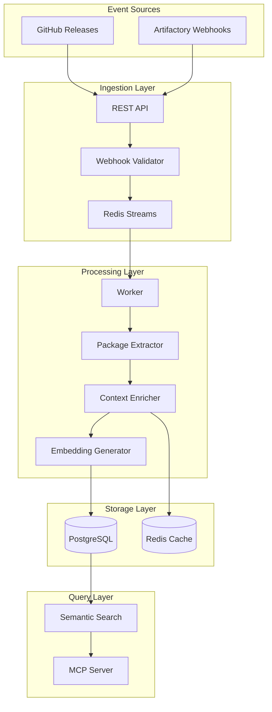

# Webhook Enhancement Plan: GitHub Releases & Artifactory Integration

## Executive Summary

This document outlines the technical plan for enhancing webhook processing to capture and index meaningful information from GitHub releases and JFrog Artifactory package publications. The goal is to ensure AI assistants (Claude Code, Cursor, etc.) have immediate, comprehensive knowledge of internal package releases and their contents.

## Current State Analysis

### Existing Capabilities
- Basic GitHub webhook reception and processing
- Redis Streams for event queuing
- Context storage with embedding generation (AWS Bedrock Titan)
- Semantic search capabilities via pgvector

### Critical Gaps
1. **GitHub Release Events**: Currently only logs events without extracting meaningful data
2. **No Artifactory Integration**: No webhook support for Artifactory events
3. **Limited Context Extraction**: Missing package metadata, API signatures, dependencies
4. **No Cross-Reference**: Cannot link GitHub releases to Artifactory packages

## Architecture Overview



## Phase 1: Enhanced GitHub Release Processing

### 1.1 Data Model Extensions

```sql
-- New table for package releases
CREATE TABLE mcp.package_releases (
    id UUID PRIMARY KEY DEFAULT gen_random_uuid(),
    tenant_id UUID NOT NULL,
    repository_name TEXT NOT NULL,
    package_name TEXT NOT NULL,
    version TEXT NOT NULL,
    version_major INTEGER,
    version_minor INTEGER,
    version_patch INTEGER,
    prerelease TEXT,
    is_breaking_change BOOLEAN DEFAULT FALSE,
    release_notes TEXT,
    changelog TEXT,
    published_at TIMESTAMP WITH TIME ZONE NOT NULL,
    author_login TEXT,
    github_release_id BIGINT,
    artifactory_path TEXT,
    created_at TIMESTAMP WITH TIME ZONE DEFAULT CURRENT_TIMESTAMP,
    updated_at TIMESTAMP WITH TIME ZONE DEFAULT CURRENT_TIMESTAMP,
    UNIQUE(tenant_id, repository_name, version)
);

-- Package assets/artifacts
CREATE TABLE mcp.package_assets (
    id UUID PRIMARY KEY DEFAULT gen_random_uuid(),
    release_id UUID REFERENCES mcp.package_releases(id) ON DELETE CASCADE,
    name TEXT NOT NULL,
    content_type TEXT,
    size_bytes BIGINT,
    download_url TEXT,
    artifactory_url TEXT,
    sha256_checksum TEXT,
    metadata JSONB,
    created_at TIMESTAMP WITH TIME ZONE DEFAULT CURRENT_TIMESTAMP
);

-- API/Interface changes tracking
CREATE TABLE mcp.package_api_changes (
    id UUID PRIMARY KEY DEFAULT gen_random_uuid(),
    release_id UUID REFERENCES mcp.package_releases(id) ON DELETE CASCADE,
    change_type TEXT NOT NULL, -- 'added', 'modified', 'deprecated', 'removed'
    api_signature TEXT NOT NULL,
    description TEXT,
    breaking BOOLEAN DEFAULT FALSE,
    migration_guide TEXT,
    created_at TIMESTAMP WITH TIME ZONE DEFAULT CURRENT_TIMESTAMP
);

-- Package dependencies
CREATE TABLE mcp.package_dependencies (
    id UUID PRIMARY KEY DEFAULT gen_random_uuid(),
    release_id UUID REFERENCES mcp.package_releases(id) ON DELETE CASCADE,
    dependency_name TEXT NOT NULL,
    version_constraint TEXT,
    dependency_type TEXT, -- 'runtime', 'dev', 'peer', 'optional'
    repository_url TEXT,
    created_at TIMESTAMP WITH TIME ZONE DEFAULT CURRENT_TIMESTAMP
);

-- Index for faster queries
CREATE INDEX idx_package_releases_name_version ON mcp.package_releases(package_name, version);
CREATE INDEX idx_package_releases_published_at ON mcp.package_releases(published_at DESC);
CREATE INDEX idx_package_api_changes_release ON mcp.package_api_changes(release_id);
CREATE INDEX idx_package_dependencies_release ON mcp.package_dependencies(release_id);
```

### 1.2 Enhanced Release Event Handler

```go
// pkg/webhook/handlers/github_release_handler.go
package handlers

import (
    "context"
    "encoding/json"
    "fmt"
    "regexp"
    "strings"
)

type GitHubReleaseHandler struct {
    packageExtractor *PackageExtractor
    contextBuilder   *ContextBuilder
    artifactoryClient *ArtifactoryClient
    storage          *ReleaseStorage
    logger           observability.Logger
}

type ReleasePayload struct {
    Action  string `json:"action"`
    Release struct {
        ID              int64  `json:"id"`
        TagName         string `json:"tag_name"`
        Name            string `json:"name"`
        Body            string `json:"body"`
        Draft           bool   `json:"draft"`
        Prerelease      bool   `json:"prerelease"`
        CreatedAt       string `json:"created_at"`
        PublishedAt     string `json:"published_at"`
        Author          User   `json:"author"`
        Assets          []Asset `json:"assets"`
        TarballURL      string `json:"tarball_url"`
        ZipballURL      string `json:"zipball_url"`
    } `json:"release"`
    Repository Repository `json:"repository"`
}

func (h *GitHubReleaseHandler) Handle(ctx context.Context, event WebhookEvent) error {
    // Only process published releases
    if event.Payload["action"] != "published" {
        return nil
    }

    var payload ReleasePayload
    if err := json.Unmarshal(event.RawPayload, &payload); err != nil {
        return fmt.Errorf("failed to parse release payload: %w", err)
    }

    // Extract version information
    version := h.extractVersion(payload.Release.TagName)

    // Detect package type and extract metadata
    packageInfo, err := h.packageExtractor.ExtractFromRepository(
        ctx,
        payload.Repository.FullName,
        payload.Release.TagName,
    )
    if err != nil {
        h.logger.Warn("Failed to extract package info", map[string]interface{}{
            "error": err.Error(),
            "repo":  payload.Repository.FullName,
        })
    }

    // Parse release notes for important information
    releaseData := h.parseReleaseNotes(payload.Release.Body)

    // Check Artifactory for published packages
    artifactoryPackages := h.checkArtifactoryPackages(ctx, packageInfo, version)

    // Build enriched context
    context := h.contextBuilder.BuildReleaseContext(
        payload,
        packageInfo,
        releaseData,
        artifactoryPackages,
    )

    // Store release information
    if err := h.storage.StoreRelease(ctx, context); err != nil {
        return fmt.Errorf("failed to store release: %w", err)
    }

    return nil
}

func (h *GitHubReleaseHandler) extractVersion(tag string) *Version {
    // Remove common prefixes
    tag = strings.TrimPrefix(tag, "v")
    tag = strings.TrimPrefix(tag, "release-")

    // Parse semantic version
    semverRegex := regexp.MustCompile(`^(\d+)\.(\d+)\.(\d+)(?:-(.+))?`)
    matches := semverRegex.FindStringSubmatch(tag)

    if len(matches) > 0 {
        return &Version{
            Major:      parseInt(matches[1]),
            Minor:      parseInt(matches[2]),
            Patch:      parseInt(matches[3]),
            Prerelease: matches[4],
            Raw:        tag,
        }
    }

    return &Version{Raw: tag}
}

func (h *GitHubReleaseHandler) parseReleaseNotes(body string) *ReleaseData {
    data := &ReleaseData{
        RawNotes: body,
    }

    // Extract breaking changes
    if strings.Contains(strings.ToLower(body), "breaking") {
        data.HasBreakingChanges = true
        data.BreakingChanges = h.extractSection(body, "breaking changes")
    }

    // Extract new features
    data.NewFeatures = h.extractSection(body, "features", "new features", "what's new")

    // Extract bug fixes
    data.BugFixes = h.extractSection(body, "fixes", "bug fixes", "fixed")

    // Extract dependencies
    data.Dependencies = h.extractDependencies(body)

    // Extract migration guide
    data.MigrationGuide = h.extractSection(body, "migration", "upgrade guide")

    return data
}
```

### 1.3 Package Type Detection and Extraction

```go
// pkg/webhook/extractors/package_extractor.go
package extractors

type PackageExtractor struct {
    githubClient *github.Client
    cache        *redis.Client
}

type PackageInfo struct {
    Type         PackageType
    Name         string
    Description  string
    MainFile     string
    Dependencies map[string]string
    DevDependencies map[string]string
    Exports      []string // For JS/TS
    Classes      []string // For Java
    Modules      []string // For Python
    Packages     []string // For Go
}

func (e *PackageExtractor) ExtractFromRepository(ctx context.Context, repo, ref string) (*PackageInfo, error) {
    // Check cache first
    cacheKey := fmt.Sprintf("package:%s:%s", repo, ref)
    if cached, err := e.cache.Get(ctx, cacheKey).Result(); err == nil {
        var info PackageInfo
        json.Unmarshal([]byte(cached), &info)
        return &info, nil
    }

    // Detect package type by checking for manifest files
    packageType := e.detectPackageType(ctx, repo, ref)

    switch packageType {
    case PackageTypeNPM:
        return e.extractNPMPackage(ctx, repo, ref)
    case PackageTypeMaven:
        return e.extractMavenPackage(ctx, repo, ref)
    case PackageTypePython:
        return e.extractPythonPackage(ctx, repo, ref)
    case PackageTypeGo:
        return e.extractGoPackage(ctx, repo, ref)
    case PackageTypeDocker:
        return e.extractDockerPackage(ctx, repo, ref)
    default:
        return e.extractGenericPackage(ctx, repo, ref)
    }
}

func (e *PackageExtractor) extractNPMPackage(ctx context.Context, repo, ref string) (*PackageInfo, error) {
    // Fetch package.json
    content, err := e.githubClient.GetFileContent(ctx, repo, "package.json", ref)
    if err != nil {
        return nil, err
    }

    var packageJSON map[string]interface{}
    json.Unmarshal(content, &packageJSON)

    info := &PackageInfo{
        Type:         PackageTypeNPM,
        Name:         packageJSON["name"].(string),
        Description:  getStringOrDefault(packageJSON, "description", ""),
        MainFile:     getStringOrDefault(packageJSON, "main", "index.js"),
        Dependencies: extractDependencies(packageJSON, "dependencies"),
        DevDependencies: extractDependencies(packageJSON, "devDependencies"),
    }

    // Extract exports for modern packages
    if exports, ok := packageJSON["exports"]; ok {
        info.Exports = parseExports(exports)
    }

    // Check for TypeScript definitions
    if types := getStringOrDefault(packageJSON, "types", ""); types != "" {
        info.Exports = append(info.Exports, e.extractTypeScriptExports(ctx, repo, ref, types)...)
    }

    return info, nil
}

func (e *PackageExtractor) extractMavenPackage(ctx context.Context, repo, ref string) (*PackageInfo, error) {
    // Fetch pom.xml
    content, err := e.githubClient.GetFileContent(ctx, repo, "pom.xml", ref)
    if err != nil {
        return nil, err
    }

    // Parse POM file
    pom := parsePOM(content)

    info := &PackageInfo{
        Type:        PackageTypeMaven,
        Name:        fmt.Sprintf("%s:%s", pom.GroupID, pom.ArtifactID),
        Description: pom.Description,
        Dependencies: extractMavenDependencies(pom),
    }

    // Extract Java classes from src/main/java
    info.Classes = e.extractJavaClasses(ctx, repo, ref)

    return info, nil
}
```

## Phase 2: JFrog Artifactory Integration

### 2.1 Artifactory Webhook Receiver

```go
// pkg/webhook/handlers/artifactory_handler.go
package handlers

type ArtifactoryWebhookHandler struct {
    storage         *ReleaseStorage
    contextBuilder  *ContextBuilder
    githubMatcher   *GitHubReleaseMatcher
    logger          observability.Logger
}

type ArtifactoryEvent struct {
    Domain    string `json:"domain"`
    EventType string `json:"event_type"`
    Data      struct {
        RepoPath   string                 `json:"repo_path"`
        Name       string                 `json:"name"`
        Path       string                 `json:"path"`
        Properties map[string]interface{} `json:"properties"`
        Size       int64                  `json:"size"`
        Created    int64                  `json:"created"`
        CreatedBy  string                 `json:"created_by"`
        ModifiedBy string                 `json:"modified_by"`
        Updated    int64                  `json:"updated"`
    } `json:"data"`
}

func (h *ArtifactoryWebhookHandler) Handle(ctx context.Context, event WebhookEvent) error {
    var payload ArtifactoryEvent
    if err := json.Unmarshal(event.RawPayload, &payload); err != nil {
        return fmt.Errorf("failed to parse Artifactory payload: %w", err)
    }

    // Only process artifact deployed events
    if payload.EventType != "deployed" {
        return nil
    }

    // Extract package information from path
    packageInfo := h.parseArtifactPath(payload.Data.Path)

    // Try to match with GitHub release
    githubRelease := h.githubMatcher.FindRelease(ctx, packageInfo)

    // Fetch artifact metadata
    metadata, err := h.fetchArtifactMetadata(ctx, payload.Data.RepoPath)
    if err != nil {
        h.logger.Warn("Failed to fetch artifact metadata", map[string]interface{}{
            "error": err.Error(),
            "path":  payload.Data.RepoPath,
        })
    }

    // Build context
    context := h.contextBuilder.BuildArtifactoryContext(
        payload,
        packageInfo,
        metadata,
        githubRelease,
    )

    // Store artifact information
    if err := h.storage.StoreArtifact(ctx, context); err != nil {
        return fmt.Errorf("failed to store artifact: %w", err)
    }

    return nil
}

func (h *ArtifactoryWebhookHandler) parseArtifactPath(path string) *PackageInfo {
    // Parse different repository layouts
    // Maven: /com/example/package/1.0.0/package-1.0.0.jar
    // NPM: /package/-/package-1.0.0.tgz
    // Docker: /docker-local/myimage/1.0.0/manifest.json

    parts := strings.Split(path, "/")

    // Detect package type from extension
    ext := filepath.Ext(path)

    switch ext {
    case ".jar", ".war", ".pom":
        return h.parseMavenPath(parts)
    case ".tgz", ".tar.gz":
        if strings.Contains(path, "/-/") {
            return h.parseNPMPath(parts)
        }
        return h.parseGenericPath(parts)
    case ".whl", ".egg":
        return h.parsePythonPath(parts)
    default:
        return h.parseGenericPath(parts)
    }
}
```

### 2.2 Artifactory REST API Client

```go
// pkg/clients/artifactory/client.go
package artifactory

type Client struct {
    baseURL    string
    apiKey     string
    httpClient *http.Client
    cache      *redis.Client
}

func (c *Client) GetArtifactProperties(ctx context.Context, repoPath string) (map[string]interface{}, error) {
    url := fmt.Sprintf("%s/api/storage/%s?properties", c.baseURL, repoPath)

    req, err := http.NewRequestWithContext(ctx, "GET", url, nil)
    if err != nil {
        return nil, err
    }

    req.Header.Set("X-JFrog-Art-Api", c.apiKey)

    resp, err := c.httpClient.Do(req)
    if err != nil {
        return nil, err
    }
    defer resp.Body.Close()

    var result map[string]interface{}
    if err := json.NewDecoder(resp.Body).Decode(&result); err != nil {
        return nil, err
    }

    return result["properties"].(map[string]interface{}), nil
}

func (c *Client) GetBuildInfo(ctx context.Context, buildName, buildNumber string) (*BuildInfo, error) {
    url := fmt.Sprintf("%s/api/build/%s/%s", c.baseURL, buildName, buildNumber)

    // Implementation details...
}

func (c *Client) SearchArtifacts(ctx context.Context, query AQLQuery) ([]Artifact, error) {
    // Use Artifactory Query Language (AQL) for advanced searches
    url := fmt.Sprintf("%s/api/search/aql", c.baseURL)

    // Implementation details...
}
```

## Phase 3: Context Enrichment and Storage

### 3.1 Enhanced Context Builder

```go
// pkg/webhook/context/builder.go
package context

type ContextBuilder struct {
    embedder       *EmbeddingService
    summarizer     *SummarizationService
    codeAnalyzer   *CodeAnalyzer
}

type EnrichedContext struct {
    // Core Information
    PackageName     string    `json:"package_name"`
    Version         string    `json:"version"`
    PackageType     string    `json:"package_type"`
    ReleaseDate     time.Time `json:"release_date"`
    Repository      string    `json:"repository"`

    // Release Information
    ReleaseNotes    string   `json:"release_notes"`
    Changelog       string   `json:"changelog"`
    BreakingChanges []string `json:"breaking_changes"`
    NewFeatures     []string `json:"new_features"`
    BugFixes        []string `json:"bug_fixes"`

    // Package Metadata
    Description     string              `json:"description"`
    Author          string              `json:"author"`
    License         string              `json:"license"`
    Homepage        string              `json:"homepage"`
    Documentation   string              `json:"documentation"`

    // Dependencies
    Dependencies    []Dependency        `json:"dependencies"`
    PeerDeps       []Dependency        `json:"peer_dependencies"`
    DevDeps        []Dependency        `json:"dev_dependencies"`

    // API Information
    ExportedAPIs    []APISignature     `json:"exported_apis"`
    AddedAPIs       []APISignature     `json:"added_apis"`
    ModifiedAPIs    []APISignature     `json:"modified_apis"`
    DeprecatedAPIs  []APISignature     `json:"deprecated_apis"`
    RemovedAPIs     []APISignature     `json:"removed_apis"`

    // Artifactory Information
    ArtifactoryURL  string             `json:"artifactory_url"`
    ArtifactSize    int64              `json:"artifact_size"`
    Checksums       map[string]string  `json:"checksums"`
    BuildInfo       *BuildInfo         `json:"build_info"`

    // Search Optimization
    Keywords        []string           `json:"keywords"`
    Categories      []string           `json:"categories"`
    SearchableText  string             `json:"searchable_text"`

    // Embeddings
    Embedding       []float32          `json:"embedding"`
    EmbeddingModel  string            `json:"embedding_model"`
}

func (b *ContextBuilder) BuildReleaseContext(
    release ReleasePayload,
    packageInfo *PackageInfo,
    releaseData *ReleaseData,
    artifactoryPackages []ArtifactPackage,
) (*EnrichedContext, error) {
    context := &EnrichedContext{
        PackageName:  packageInfo.Name,
        Version:      release.Release.TagName,
        PackageType:  string(packageInfo.Type),
        ReleaseDate:  parseTime(release.Release.PublishedAt),
        Repository:   release.Repository.FullName,

        // Copy release information
        ReleaseNotes:    releaseData.RawNotes,
        Changelog:       releaseData.Changelog,
        BreakingChanges: releaseData.BreakingChanges,
        NewFeatures:     releaseData.NewFeatures,
        BugFixes:        releaseData.BugFixes,

        // Package metadata
        Description:   packageInfo.Description,
        Author:        release.Release.Author.Login,
        License:       packageInfo.License,
        Homepage:      release.Repository.Homepage,
        Documentation: packageInfo.Documentation,

        // Dependencies
        Dependencies: convertDependencies(packageInfo.Dependencies),
        DevDeps:     convertDependencies(packageInfo.DevDependencies),
    }

    // Analyze code changes to identify API modifications
    if len(release.Release.TagName) > 0 {
        apiChanges, err := b.codeAnalyzer.AnalyzeAPIChanges(
            context.Repository,
            release.Release.TagName,
        )
        if err == nil {
            context.ExportedAPIs = apiChanges.Exported
            context.AddedAPIs = apiChanges.Added
            context.ModifiedAPIs = apiChanges.Modified
            context.DeprecatedAPIs = apiChanges.Deprecated
            context.RemovedAPIs = apiChanges.Removed
        }
    }

    // Link Artifactory packages
    if len(artifactoryPackages) > 0 {
        primary := artifactoryPackages[0]
        context.ArtifactoryURL = primary.URL
        context.ArtifactSize = primary.Size
        context.Checksums = primary.Checksums
        context.BuildInfo = primary.BuildInfo
    }

    // Generate searchable content
    context.SearchableText = b.generateSearchableText(context)
    context.Keywords = b.extractKeywords(context)
    context.Categories = b.categorizePackage(context)

    // Generate embedding
    embedding, err := b.embedder.GenerateEmbedding(
        context.SearchableText,
    )
    if err == nil {
        context.Embedding = embedding
        context.EmbeddingModel = b.embedder.GetModel()
    }

    return context, nil
}

func (b *ContextBuilder) generateSearchableText(ctx *EnrichedContext) string {
    parts := []string{
        fmt.Sprintf("Package: %s version %s", ctx.PackageName, ctx.Version),
        fmt.Sprintf("Type: %s", ctx.PackageType),
        ctx.Description,
    }

    if len(ctx.ReleaseNotes) > 0 {
        parts = append(parts, "Release Notes:", ctx.ReleaseNotes)
    }

    if len(ctx.NewFeatures) > 0 {
        parts = append(parts, "New Features:", strings.Join(ctx.NewFeatures, ", "))
    }

    if len(ctx.BreakingChanges) > 0 {
        parts = append(parts, "BREAKING CHANGES:", strings.Join(ctx.BreakingChanges, ", "))
    }

    // Add API signatures for better search
    if len(ctx.ExportedAPIs) > 0 {
        apis := []string{"APIs:"}
        for _, api := range ctx.ExportedAPIs {
            apis = append(apis, api.Signature)
        }
        parts = append(parts, strings.Join(apis, "\n"))
    }

    // Add dependencies for discovery
    if len(ctx.Dependencies) > 0 {
        deps := []string{"Dependencies:"}
        for _, dep := range ctx.Dependencies {
            deps = append(deps, fmt.Sprintf("%s@%s", dep.Name, dep.Version))
        }
        parts = append(parts, strings.Join(deps, ", "))
    }

    return strings.Join(parts, "\n\n")
}
```

## Phase 4: Search and Retrieval Enhancement

### 4.1 Package-Aware Search

```go
// pkg/search/package_search.go
package search

type PackageSearchService struct {
    db           *sql.DB
    embedder     *EmbeddingService
    ranker       *RelevanceRanker
}

type PackageSearchQuery struct {
    Query           string
    PackageTypes    []string
    Repositories    []string
    VersionRange    string
    IncludeBreaking bool
    OnlyLatest      bool
    Limit          int
}

func (s *PackageSearchService) Search(ctx context.Context, query PackageSearchQuery) ([]SearchResult, error) {
    // Generate embedding for query
    queryEmbedding, err := s.embedder.GenerateEmbedding(query.Query)
    if err != nil {
        return nil, err
    }

    // Build SQL query with filters
    sqlQuery := `
        SELECT
            pr.id,
            pr.package_name,
            pr.version,
            pr.repository_name,
            pr.release_notes,
            pr.published_at,
            ce.embedding <=> $1 AS distance
        FROM mcp.package_releases pr
        JOIN mcp.context_embeddings ce ON ce.context_id = pr.id
        WHERE 1=1
    `

    params := []interface{}{pgvector.NewVector(queryEmbedding)}
    paramIdx := 2

    if len(query.PackageTypes) > 0 {
        sqlQuery += fmt.Sprintf(" AND pr.package_type = ANY($%d)", paramIdx)
        params = append(params, pq.Array(query.PackageTypes))
        paramIdx++
    }

    if query.OnlyLatest {
        sqlQuery += `
            AND pr.version = (
                SELECT MAX(version)
                FROM mcp.package_releases pr2
                WHERE pr2.package_name = pr.package_name
            )
        `
    }

    sqlQuery += " ORDER BY distance ASC"

    if query.Limit > 0 {
        sqlQuery += fmt.Sprintf(" LIMIT %d", query.Limit)
    }

    // Execute search
    rows, err := s.db.QueryContext(ctx, sqlQuery, params...)
    if err != nil {
        return nil, err
    }
    defer rows.Close()

    // Process results
    var results []SearchResult
    for rows.Next() {
        var result SearchResult
        if err := rows.Scan(
            &result.ID,
            &result.PackageName,
            &result.Version,
            &result.Repository,
            &result.ReleaseNotes,
            &result.PublishedAt,
            &result.Distance,
        ); err != nil {
            continue
        }

        // Re-rank based on additional factors
        result.Score = s.ranker.Rank(query.Query, result)
        results = append(results, result)
    }

    // Sort by final score
    sort.Slice(results, func(i, j int) bool {
        return results[i].Score > results[j].Score
    })

    return results, nil
}

func (s *PackageSearchService) GetPackageHistory(ctx context.Context, packageName string) ([]PackageVersion, error) {
    query := `
        SELECT
            version,
            published_at,
            is_breaking_change,
            release_notes,
            changelog
        FROM mcp.package_releases
        WHERE package_name = $1
        ORDER BY published_at DESC
    `

    // Implementation...
}

func (s *PackageSearchService) GetDependencyGraph(ctx context.Context, packageName, version string) (*DependencyGraph, error) {
    // Recursively build dependency graph
    // Implementation...
}
```

## Implementation Timeline

### Week 1: Foundation
- [ ] Create database migrations for new tables
- [ ] Implement enhanced GitHub release handler
- [ ] Add package type detection logic
- [ ] Create basic context builder

### Week 2: Artifactory Integration
- [ ] Set up Artifactory webhook endpoints
- [ ] Implement Artifactory client
- [ ] Add artifact-to-release matching logic
- [ ] Create Artifactory context builder

### Week 3: Context Enrichment
- [ ] Implement code analysis for API changes
- [ ] Add dependency extraction
- [ ] Create comprehensive search text generation
- [ ] Enhance embedding generation

### Week 4: Search & Testing
- [ ] Implement package-aware search
- [ ] Add dependency graph queries
- [ ] Create integration tests
- [ ] Performance optimization
- [ ] Documentation

## Configuration Requirements

### Environment Variables
```env
# Artifactory Configuration
ARTIFACTORY_URL=https://artifactory.company.com
ARTIFACTORY_API_KEY=${ARTIFACTORY_API_KEY}
ARTIFACTORY_WEBHOOK_SECRET=${ARTIFACTORY_WEBHOOK_SECRET}

# GitHub Configuration (existing)
GITHUB_TOKEN=${GITHUB_TOKEN}
GITHUB_WEBHOOK_SECRET=${GITHUB_WEBHOOK_SECRET}

# Feature Flags
ENABLE_PACKAGE_TRACKING=true
ENABLE_ARTIFACTORY_INTEGRATION=true
ENABLE_API_ANALYSIS=true
```

### Webhook Configuration

#### GitHub Webhook
```json
{
  "url": "https://api.devmesh.com/webhooks/github",
  "content_type": "json",
  "events": [
    "release",
    "package",
    "registry_package"
  ],
  "active": true
}
```

#### Artifactory Webhook
```json
{
  "url": "https://api.devmesh.com/webhooks/artifactory",
  "event_types": [
    "deployed",
    "deleted",
    "promoted"
  ],
  "repositories": ["*"],
  "include_patterns": ["**/*"],
  "exclude_patterns": ["**/*.sha1", "**/*.md5"]
}
```

## Success Metrics

1. **Coverage Metrics**
   - Percentage of releases captured
   - Percentage of Artifactory deployments linked to GitHub
   - API coverage per package

2. **Quality Metrics**
   - Search relevance score
   - Context completeness score
   - Embedding quality (cosine similarity)

3. **Performance Metrics**
   - Webhook processing latency < 500ms
   - Search query response time < 100ms
   - Embedding generation time < 200ms

4. **Usage Metrics**
   - Number of package searches per day
   - Context retrievals per session
   - AI assistant accuracy improvements

## Security Considerations

1. **Webhook Validation**
   - Verify GitHub signatures
   - Validate Artifactory webhook tokens
   - IP allowlisting for webhook sources

2. **Data Privacy**
   - Encrypt sensitive package metadata
   - Tenant isolation for multi-tenant deployments
   - Audit logging for all package access

3. **Access Control**
   - RBAC for package information
   - API key rotation for Artifactory
   - Rate limiting per tenant

## Conclusion

This enhanced webhook processing system will provide AI assistants with comprehensive, real-time knowledge of internal package releases. By integrating GitHub releases with Artifactory deployments and extracting rich metadata, we enable accurate, context-aware assistance for developers working with internal codebases.

The system will automatically capture and index:
- Package releases and versions
- API changes and signatures
- Dependencies and compatibility
- Breaking changes and migration guides
- Artifactory deployment information

This ensures that AI assistants always have the latest information about internal packages, significantly improving their ability to assist with development tasks.